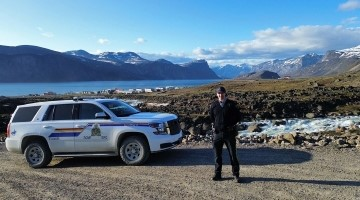
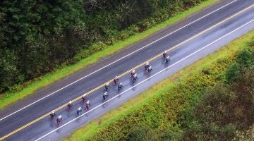
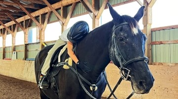
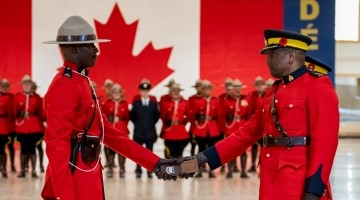
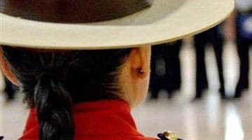
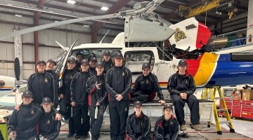

<main class="brdr-tp-0 mrgn-bttm-0">
  <!-- Nav bar -->
  

    

      <nav class="careers-nav hidden-xs">
        <a class="nav-link active" id="header-police-nav" onclick="headernav('header-police')">Police officer</a> <a class="nav-link" id="header-civilian-nav" onclick="headernav('header-civilian')">Civilian employees</a> <a class="nav-link" id="header-more-nav" onclick="headernav('header-more')">More opportunities</a> <button class="btn btn-careers">Apply now</button>
      </nav>
    

  
<!-- Mobile nav -->
  <nav class="careers-nav-sm hidden-sm hidden-md hidden-lg hidden-xl">
    

      <button aria-controls="careers-nav-sm-collapse" aria-expanded="false" class="careers-nav-toggle" id="careers-nav-sm-toggle" onclick="navcollapse()"></button> <button class="btn btn-careers">Apply now</button>
      

        <ul class="navbar-nav mrgn-bttm-sm">
          <li class="nav-link active">
            <a href="#police-officer">Police officer</a>
          </li>
          <li class="nav-link">
            <a href="#civilian-employees">Civilian employees</a>
          </li>
          <li class="nav-link">
            <a href="#more-opportunities">More opportunities</a>
          </li>
        </ul>
      

    

  </nav>
  <h1 class="visually-hidden"><abbr>RCMP</abbr> careers</h1>
  <section id="careers-page">
    

      <!-- Desktop Headers -->
      <section class="hidden-xs hidden-sm" id="header-lg">
        

          <!-- Police Officer Header -->
          

            

              
Welcome to <abbr>RCMP</abbr> careers

              <h2 class="oswald-500 uppercase">Police officer 
              careers</h2>
              
There's a uniform with your name on it. Serve boldly.
<a class="btn btn-careers" href="/careers-carrieres/police-officer">More information about police officer careers</a>
            

          
<!-- Civilian Header -->
          

            

              <h2 class="oswald-500 uppercase">Civilian 
              careers</h2>
              
Your skills. Our mission. Roles with impact.
<button class="btn btn-careers">More information about civilian careers</button>
            

          
<!-- More Opportunities Header -->
          

            

              <h2 class="oswald-500 uppercase">More opportunities</h2>
              <section class="c-grid-container">
                

                  

                    
                    

                      <h3 class="h5">Community constables</h3>
                      
Build trust and help to reduce crime in your own community.
<button class="btn btn-careers-outline mrgn-tp-md">More information about community constables</button>
                    

                  

                  

                    
                    

                      <h3 class="h5"><abbr>RCMP</abbr> Reserve program</h3>
                      
Continue to serve the community after retirement or leaving the service.
<button class="btn btn-careers-outline mrgn-tp-md">More information about the <abbr>RCMP</abbr> reserve program</button>
                    

                  

                  

                    
                    

                      <h3 class="h5">Volunteer programs</h3>
                      
Support local detachments as a community partner and help to tell the <abbr>RCMP</abbr> story across Canada.
<button class="btn btn-careers-outline mrgn-tp-md">More information about volunteer programs</button>
                    

                  

                  

                    
                    

                      <h3 class="h5">Diverse and Inclusive Pre-Cadet Experience</h3>
                      
Get a firsthand look into policing before you apply. Designed to support racialized and unrepresented communities.
<button class="btn btn-careers-outline mrgn-tp-md">More information</button>
                    

                  

                  

                    
                    

                      <h3 class="h5">Indigenous recruitment</h3>
                      
Discover programs that support Indigenous applicants considering a career in policing.
<button class="btn btn-careers-outline mrgn-tp-md">More information</button>
                    

                  

                  

                    
                    

                      <h3 class="h5">Student jobs</h3>
                      
Start your career with purpose and drive national impact while you study.
<button class="btn btn-careers-outline mrgn-tp-md">More information</button>
                    

                  

                

              </section>
            

          

        
<!-- Navigation Arrows -->
         <button class="arrow-prev hidden" id="arrow-prev" onclick="arrow('left')"> </button> <button class="arrow-next active" id="arrow-next" onclick="arrow('right')"> Civilian careers</button>
      </section><!-- Mobile Headers -->
      <section class="visible-xs visible-sm" id="header-police-xs">
        

          

            <h2 class="oswald-500 uppercase">Police officer 
            careers</h2>
            
There's a uniform with your name on it. 
            Serve boldly.
<button class="btn btn-careers">More information about police officer careers</button>
          

        

      </section>
      <section class="visible-xs visible-sm" id="header-civilian-xs">
        

          

            <h2 class="oswald-500 uppercase">Civilian 
            careers</h2>
            
Your skills. Our mission. Roles with impact.
<button class="btn btn-careers">More information about civilian careers</button>
          

        

      </section>
      <section class="visible-xs visible-sm" id="header-more-xs">
        

          

            <h2 class="oswald-500 uppercase">More 
            opportunities</h2>
            <section class="c-grid-container">
              

                

                  
                  

                    <h3 class="h5">Community constables</h3>
                    
Build trust and help to reduce crime in your own community.
<button class="btn btn-careers-outline mrgn-tp-md">More information about community constables</button>
                  

                

                

                  
                  

                    <h3 class="h5"><abbr>RCMP</abbr> Reserve program</h3>
                    
Continue to serve the community after retirement or leaving the service.
<button class="btn btn-careers-outline mrgn-tp-md">More information about the <abbr>RCMP</abbr> reserve program</button>
                  

                

                

                  
                  

                    <h3 class="h5">Volunteer programs</h3>
                    
Support local detachments as a community partner and help to tell the <abbr>RCMP</abbr> story across Canada.
<button class="btn btn-careers-outline mrgn-tp-md">More information about volunteer programs</button>
                  

                

                

                  
                  

                    <h3 class="h5">Diverse and Inclusive Pre-Cadet Experience</h3>
                    
Get a firsthand look into policing before you apply. Designed to support racialized and unrepresented communities.
<button class="btn btn-careers-outline mrgn-tp-md">More information</button>
                  

                

                

                  
                  

                    <h3 class="h5">Indigenous recruitment</h3>
                    
Discover programs that support Indigenous applicants considering a career in policing.
<button class="btn btn-careers-outline mrgn-tp-md">More information</button>
                  

                

                

                  
                  

                    <h3 class="h5">Student jobs</h3>
                    
Start your career with purpose and drive national impact while you study.
<button class="btn btn-careers-outline mrgn-tp-md">More information</button>
                  

                

              

            </section>
          

        

      </section>
    

  </section>
</main>
