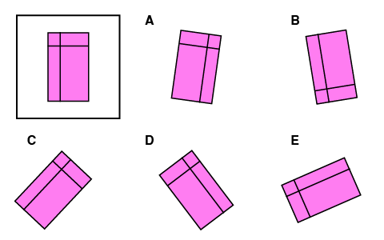
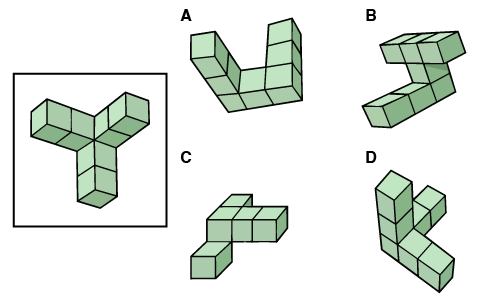
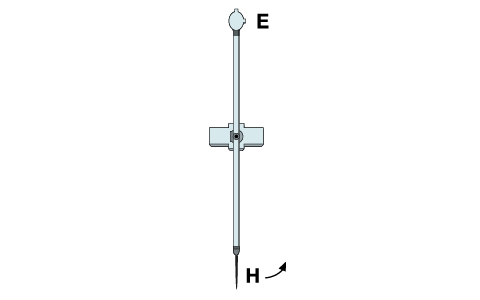
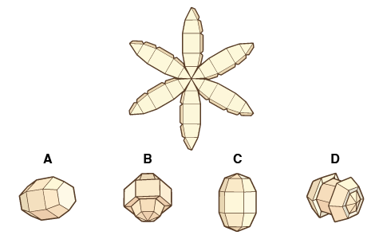

<nav aria-label="Application process steps" class="gc-subway" data-sections-title="Steps">
  <h2>Police officer application process</h2>
  <ul>
    <li><a href="application-candidature-1-en.html">Submit an online application</a></li>
    <li><a href="application-candidature-2-en.html">Online career presentation and entrance assessment</a>
<ul class="noline"> 
  <li><a class="active" href="application-candidature-2-1-en.html">RCMP Online Assessment Preparatory Guide</a></li>
</ul>
</li>
    <li><a href="application-candidature-3-en.html">Submit the required forms and documents</a>
      <ul class="noline">
        <li><a href="application-candidature-3-1-en.html">How to complete the forms</a></li>
      </ul>
    </li>
    <li><a href="application-candidature-4-en.html">Complete a suitability interview</a></li>
    <li><a href="application-candidature-5-en.html">Complete psychological and medical suitability assessments</a>
      <ul class="noline">
        <li><a href="application-candidature-5-1-en.html">Health conditions that could impact your suitability to become a police officer</a></li>
      </ul>
    </li>
    <li><a href="application-candidature-6-en.html">Complete a field investigation and security assessment</a></li>
  </ul>
</nav>
<nav aria-labelledby="on-this-page">
  <h2 id="on-this-page">On this page</h2>
  <ul>
    <li><a href="#s1">Introduction</a></li>
    <li><a href="#s2">Section&nbsp;1: Workstyle preference</a></li>
    <li><a href="#s3">Section&nbsp;2: Language comprehension</a></li>
    <li><a href="#s4">Section&nbsp;3: Numerical skills</a></li>
    <li><a href="#s5">Section&nbsp;4: Spatial skills</a></li>
    <li><a href="#s6">Section&nbsp;5: Memory quotient </a></li>
    <li><a href="#s7">Section&nbsp;6: Business reasoning</a></li>
  </ul>
</nav>
<section id="s1">
  <h2>Introduction</h2>
  
The RCMP Online Entrance Assessment was designed as a biased-free tool to assess applicants for the RCMP police officer recruiting process. The RCMP Online Entrance Assessment consists of six&nbsp;sections:

<ul>
<li>Section&nbsp;1: Workstyle preference</li>
<li>Section&nbsp;2: Language comprehension</li>
<li>Section&nbsp;3: Numerical skills</li>
<li>Section&nbsp;4: Spatial skills</li>
<li>Section&nbsp;5: Memory quotient</li>
<li>Section&nbsp;6: Business reasoning</li>
</ul>

The assessment should take approximately 55 to 70&nbsp;minutes to complete. There are several timed portions. It is recommended that you complete the entire assessment in one&nbsp;session.

Please ensure that you complete the assessment in a quiet environment where you can focus and avoid interruptions or distractions. We recommend that you complete the assessment on a laptop or desktop computer. You will want to ensure you have a stable Wi-Fi&nbsp;connection and power source to ensure you do not lose your progress during the assessment.

</section>
<section id="s2">
  <h2>Section&nbsp;1: Workstyle preference</h2>
      <ul>
        <li>This section consists of a series of statements to which you must respond on a scale from strongly disagree to strongly agree</li>
        <li>Respond from a workplace perspective</li>
        <li>Answer quickly, do not overthink</li>
        <li>There are no “right” or “wrong” answers</li>
        <li>Answer truthfully. Non-truthful answers can impact the validity and accuracy of your results</li>
        <li>Results are automatically generated</li>
      </ul>
</section>
<section id="s3">
  <h2>Section&nbsp;2: Language comprehension</h2>
 <ul>
 <li>This section consists of two components: word meanings and word relationships</li>
 <li>You will have 5&nbsp;minutes to complete each component</li>
 <li>You will receive 1&nbsp;point for each correct answer</li>
 <li>You may skip questions. If you do not know the answer, please select "I don't know."</li>
 <li>There is a timer at the bottom of the page</li>
</ul>
  <section id="s3-1">
   <h3>Part&nbsp;A – Word meanings</h3>
  

  <header class="panel-heading">
   <h4 class="panel-title">Sample question</h4>
  </header>
  

  
Read the first word, then identify the word with the closest meaning to: <strong>Glad</strong>

  
The answer options are:
 
  
A. Recite. B. Happy, C. Hopeless, D. Inappropriate or I don't know 

     

      
View the correct answer

      
The correct answer is <strong>B. Happy</strong>.

    

  

</section>
  <section id="s3-2">
   <h3>Part&nbsp;B – Word relationships</h3>
    
Note the relationship between the first pair of words. Example: Tie - Rope. Identify the option that forms a similar relationship. 

     

  <header class="panel-heading">
   <h4 class="panel-title">Sample question</h4>
  </header>
  

    
Identify the word that forms a relationship with: 
    <strong>Cut</strong>

    
The answer options are:
 
    
A. Needle, B. Repair, C. Saw or D. Broken

     

      
View the correct answer

    
The correct answer is <strong>C. Saw</strong>. You tie with a rope; you cut with a saw.

     

  

     

</section>
</section>
<section id="s4">
  <h2>Section&nbsp;3: Numerical skills</h2>
  <ul>
    <li>This section requires making numerical calculations and consists of two components: Level&nbsp;1 calculations and Level&nbsp;2 calculations</li>
    <li>Please complete as many questions as you can</li>
    <li>Answer each question to the best of your abilities</li>
    <li>You will receive 1&nbsp;point for each correct answer</li>
    <li>You may skip questions. If you do not know the answer, please select "I don't know."</li>
    <li>Use only your knowledge, pen and paper when completing these questions. The use of calculators, computer software or input from others is not permitted</li>
    <li>There is a timer at the bottom of the page</li>
  </ul> 
   <section id="s4-1">
   <h3>Part&nbsp;A – Level&nbsp;1 calculations</h3>
     
This part of the assessment draws on your addition and multiplication skills. You have 3&nbsp;minutes to complete the set of questions.

  

  <header class="panel-heading">
   <h4 class="panel-title">Sample question 1</h4>
  </header>
  

     
8 + 7 = 

    
The answer options are:  
    A. 12, B. 13, C. 15, D. 16 or I don't know

      

      
View the correct answer

     
The correct answer is <strong>C. 15</strong>.

     

  

  

   

  <header class="panel-heading">
   <h4 class="panel-title">Sample question 2</h4>
  </header>
  
    
    
5 x 5 =

    
The answer options are:  
   A. 10, B. 25, C. 36, D. 50 or I don't know

      

      
View the correct answer

     
The correct answer is <strong>B. 25</strong>.

     

  
   
  

   </section>
  <section id="s4-2">
   <h3>Part&nbsp;B – Level&nbsp;2 calculations</h3>
     
This part of the assessment draws on multiple skills, including addition, subtraction, multiplication and division. You will have 3&nbsp;minutes to complete the set of questions.

     

  <header class="panel-heading">
   <h4 class="panel-title">Sample question</h4>
  </header>
  
  
     
2 + 2 x 1 =

    
The answer options are:  
A. 2, B. 3, C. 4, D. 0 or I don't know

     

      
View the correct answer

     
The correct answer is <strong>C. 4</strong>.

     

  

     

   </section>
</section>
<section id="s5">
  <h2>Section&nbsp;4: Spatial skills</h2>
  <ul>
    <li>This section consists of four components: rotating 2D&nbsp;shapes; 3D&nbsp;shapes; mechanical problems and cubes and folding shapes</li>
    <li>Please complete as many questions as you can</li>
    <li>You will receive 1&nbsp;point for each correct answer</li>
    <li>You can skip questions – please choose "I don't know" if you do not know the answer</li>
    <li>There is a timer at the bottom of the page</li>
  </ul>
   <section id="s5-1">
   <h3>Part&nbsp;A – Rotating 2D&nbsp;shapes</h3>
     
You will be asked a series of questions related to 2D&nbsp;shapes. For each question, match the 2D shape with the outlined shape. You have 3&nbsp;minutes to complete the set of questions.

  

  <header class="panel-heading">
   <h4 class="panel-title">Sample question</h4>
  </header>
  

  

  

 
Using the following image, which one of the 2D shapes A to E matches the outlined shape?
     

The answer options are:  
A, B, C, D, E or I don't know

  

  
  
    <figure>
      
    </figure>
  
   

    

      
View the correct answer

      
The correct answer is <strong>C. shape&nbsp;C</strong>.

    

  

  

       

  
   </section>
  <section id="s5-2">
   <h3>Part&nbsp;B – 3D&nbsp;shapes</h3>
    
You will be asked a series of questions related to 3D&nbsp;shapes. For each question, match the 3D shape with the outlined shape. You have 3&nbsp;minutes to complete the set of questions.

    

  <header class="panel-heading">
   <h4 class="panel-title">Sample question</h4>
  </header>
  

  

  

 
Using the following image, which one of the 3D shapes A to E matches the outlined shape?
     

The answer options are:  A, B, C, D or I don't know

  

  
  
    <figure>
      
    </figure>
  
   

    

      
View the correct answer

      
The correct answer is <strong>D. shape&nbsp;D</strong>.

    

  

  

       

  
  </section>
  <section id="s5-3">
   <h3>Part&nbsp;C – Mechanical problems</h3>
    
You will be asked a series of questions related to mechanical problems. You have 4&nbsp;minutes to complete the set of questions.

    

  <header class="panel-heading">
   <h4 class="panel-title">Sample question</h4>
  </header>
  

  

  

 
Using the following image, when handle&nbsp;H is pulled to the right, end&nbsp;E will:
   

The answer options are:  A. Move to the left, B. Move to the right, C. Move back and forth, D. Stay in the same position or I don't know

  

  
  
    <figure>
      
    </figure>
  
   

    

      
View the correct answer

      
The correct answer is <strong>A. Move to the left</strong>.

    

  

  

       

  
</section>
  <section id="s5-4">
   <h3>Part&nbsp;D – Cubes and folding shapes</h3>
    
You will be asked a series of questions related to cubes and folding shapes. You will have 5&nbsp;minutes to complete the set of questions.

    

  <header class="panel-heading">
   <h4 class="panel-title">Sample question</h4>
  </header>
    

  

  

 
Using the following image, which one of the folded shapes A to D represents the unfolded shape?
   

The answer options are:  A, B, C, D or I don't know

  

  
  
    <figure>
      
    </figure>
  
   
 

    

      
View the correct answer

      
The correct answer is <strong>C. shape&nbsp;C</strong>.

    
   
    

    

       

  
</section>
</section>
<section id="s6">
  <h2>Section&nbsp;5: Memory quotient</h2>
  <ul>
    <li>You will have a limited amount of time to view an image, list of numbers, or written text. You will then be asked to answer questions using your memory</li>
    <li>This section should take you approximately 25&nbsp;minutes</li>
    <li>This section must be completed in one&nbsp;session</li>
    <li>Please ensure that you complete the assessment in a quiet environment where you can focus and avoid interruptions or distractions</li>
    <li>Answer each question to the best of your abilities. Use of external resources or input from others is not permitted</li>
    <li>You will have 1&nbsp;minute to review an image on the page. After reviewing the image, you will then proceed to a series of questions regarding the image you just saw</li>
    <li>You will have 45&nbsp;seconds to answer the associated questions</li>
    <li>You will receive 1&nbsp;point for each correct answer</li>
    <li>You can skip questions. If you do not know the answer, please select "I don't know."</li>
    <li>Once the time limit has run out, you will advance to the next question automatically</li>
    <li>You may choose to proceed to the next section before the time limit is up</li>
  </ul>
  

  <header class="panel-heading">
   <h4 class="panel-title">Sample question&nbsp;1</h4>
  </header>
      

  

  

    
Study this group of objects; you have a 30-second time limit.

    
Usig the following image, what is the colour of the circle?

    
The anser options are: A. Red, B. Green, C. Black, D. Orange or E. Blue

     

  
  
        <figure>
      
    </figure>
     

 

    

      
View the correct answer

      
The correct answer is <strong>C. Black</strong>.

    
   
    

    

       

 
  
Read the weather report carefully; you have a 1-minute time limit.

  
The forecast calls for cloudy skies today with a high of 35&nbsp;degrees and light winds from the southwest. Clearing overnight with a low of 23&nbsp;degrees.

  
After the time limit has elapsed, the screen will advance to a set of questions about the text. You will have 45&nbsp;seconds to answer the questions.

  

  <header class="panel-heading">
   <h4 class="panel-title">Sample question&nbsp;2a</h4>
  </header>
  

     
Which direction is the wind coming from?

    
The answer options are:  
     A. Northeast, B. Northwest, C. Southeast, D. Southwest or E. The wind direction was not provided

     

      
View the correct answer

     
The correct answer is <strong>D. Southwest</strong>.

     

  

  
 
   

  <header class="panel-heading">
   <h4 class="panel-title">Sample question&nbsp;2b</h4>
  </header>
  
  
         
What overnight temperature is predicted?

    
The answer options are:   
     A. 22&nbsp;degrees, B. 23&nbsp;degrees, C. 25&nbsp;degrees, D. 26&nbsp;degrees or E. 2&nbsp;degrees

    

      
View the correct answer

     
The correct answer is <strong>B. 23&nbsp;degrees</strong>.

    

  

   

</section>
<section id="s7">
  <h2>Section&nbsp;6: Business reasoning</h2>
  <ul>
    <li>Answer each question to the best of your abilities</li>
    <li>This section should take 20-25&nbsp;minutes to complete</li>
    <li>If you do not know the answer, please select "I don't know"</li>
    <li>Use only your knowledge, paper and pen when completing these questions. The use of calculators, computer software or input from others is not permitted</li>
  </ul>
  
There is a timer at the bottom of the page.

   <section id="s7-1">
   <h3>Part&nbsp;A – Verbal reasoning</h3>
     
Identify the word that best relates to the word provided. Look at the first pair of words to see how they relate to each other and then identify the word that makes the second pair of words related in the same way.

 

  <header class="panel-heading">
   <h4 class="panel-title">Sample question&nbsp;1</h4>
  </header>
  
  
    
Example: Up - Down

    
Left - 

    
The snswer options are:  
     A. High, B. Right, C. Low or D. Above

    

      
View the correct answer

     
The correct answer is <strong>B. Right</strong>. In the example, “Up” and “Down” are opposites, so the correct answer is the opposite of “Left”, which is “Right”.

    

  

   

  

  <header class="panel-heading">
   <h4 class="panel-title">Sample question&nbsp;2</h4>
  </header>
    
  
    
A company policy states that all people at the factory must wear safety goggles. Visitors to the factory on Wednesday were not wearing safety goggles. Was the company policy broken on Wednesday?

    
The answer options are:   
    A. Yes, B. It cannot be determined or C. No

    

      
View the correct answer

     
The correct answer is <strong>A. Yes</strong>.

    

  

   

   </section>
  <section id="s7-2">
   <h3>Part&nbsp;B – Numerical reasoning</h3>
     
This section consists of math word problems. Complete the questions by selecting the answer you think is correct

      

  <header class="panel-heading">
   <h4 class="panel-title">Sample question</h4>
  </header>
    
  
    
John made one sale of $100 and Betty made one sale of $200. What was the difference in sale between John and Betty?

    
The answer options are:  
    A. $300, B. $100, C. $200 or D. None of the above

    

      
View the correct answer

     

The correct answer is <strong>B. $100</strong>.

    

  

   

  </section>
</section>
<nav aria-label="Pagination" class="rcmp-content-page rcmp-content-page--block" id="rcmp-content-page" style="display: block;">
  

    <a aria-label="Previous page: Submit an online application" class="rcmp-content-page__link" href="application-candidature-2-en.html" id="mp-prev"><i aria-hidden="true" class="rcmp-content-page__icon fa-solid fa-chevron-left"></i> Previous page : Online career presentation and entrance assessment</a>
  

  

    <a aria-label="Next page: Submit the required forms and documents" class="rcmp-content-page__link" href="application-candidature-3-en.html" id="mp-next"><i aria-hidden="true" class="rcmp-content-page__icon fa-solid fa-chevron-right"></i> Next page : Submit the required forms and documents</a>
  

</nav>

