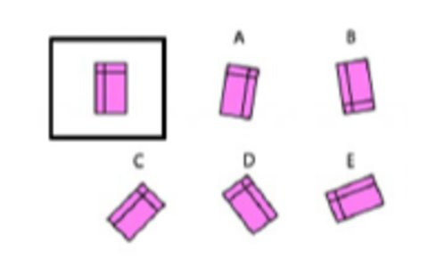
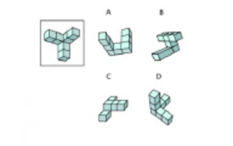
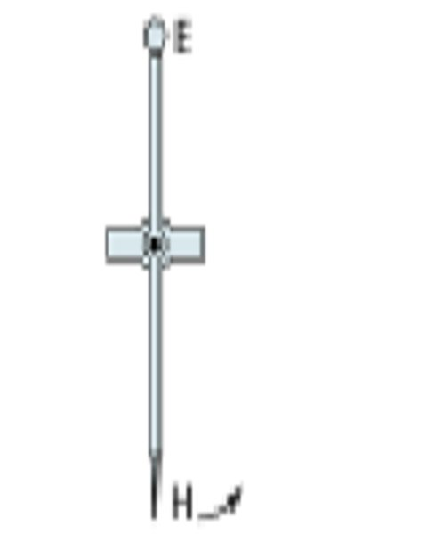
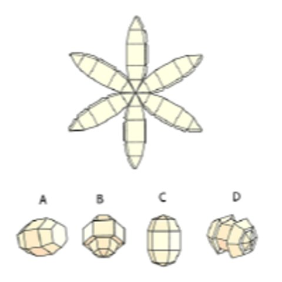
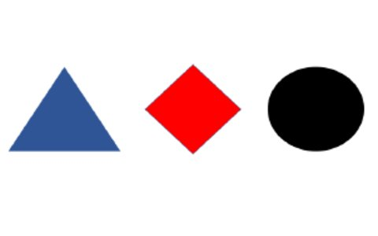

<nav aria-label="Étapes du processus de recrutement" class="gc-subway" data-sections-title="Étapes">
  <h2>Processus de recrutement des policiers et policières</h2>
  <ul>
    <li><a href="application-candidature-1-fr.html">Posez votre candidature en ligne</a></li>
    <li><a href="application-candidature-2-fr.html">Exposé sur les carrières et évaluation d'entrée en ligne</a>
      <ul class="noline">
        <li><a class="active" href="application-candidature-2-1-fr.html">Évaluation en ligne de la GRC Guide Préparatoire</a></li>
      </ul> 
    </li>
    <li><a href="application-candidature-3-fr.html">Transmettez les formulaires et les documents requis</a>
      <ul class="noline">
        <li><a href="application-candidature-3-1-fr.html">Marche à suivre pour remplir les formulaires</a></li>
      </ul>
    </li>
    <li><a href="application-candidature-4-fr.html">Passez une entrevue d'admissibilité</a></li>
    <li><a href="application-candidature-5-fr.html">Soumettez-vous à une évaluation médicale et une évaluation de l'aptitude psychologique</a>
      <ul class="noline">
        <li><a href="application-candidature-5-1-fr.html">Problèmes de santé qui pourraient avoir une incidence sur votre aptitude à devenir policier ou policière</a></li>
      </ul>
    </li>
    <li><a href="application-candidature-6-fr.html">Passez une enquête sur les antécédents et une évaluation de sécurité</a></li>
  </ul>
</nav>

<nav aria-labelledby="on-this-page-heading">
  <h2 id="on-this-page-heading">Sur cette page</h2>
  <ul>
    <li><a href="#s1">Introduction</a></li>
    <li><a href="#s2">Section&nbsp;1&nbsp;: Préférence de style de travail</a></li>
    <li><a href="#s3">Section&nbsp;2&nbsp;: Compréhension de la langue</a></li>
    <li><a href="#s4">Section&nbsp;3&nbsp;: Compétences en calcul</a></li>
    <li><a href="#s5">Section&nbsp;4&nbsp;: Habiletés spatiales</a></li>
    <li><a href="#s6">Section&nbsp;5&nbsp;: Quotient de mémoire</a></li>
    <li><a href="#s7">Section&nbsp;6&nbsp;: Raisonnement</a></li>
  </ul>
</nav>

<section id="s1">
  <h2>Introduction</h2>
  
L'examen d'entrée en ligne de la GRC a été conçu de façon à permettre l'évaluation impartiale des candidats dans le cadre du processus de recrutement des policiers de la GRC. L'examen comprend six&nbsp;sections&nbsp;:

<ul>
<li>Section&nbsp;1&nbsp;: Préférence de style de travail</li>
<li>Section&nbsp;2&nbsp;: Compréhension de la langue</li>
<li>Section&nbsp;3&nbsp;: Compétences en calcul</li>
<li>Section&nbsp;4&nbsp;: Habiletés spatiales</li>
<li>Section&nbsp;5&nbsp;: Quotient de mémoire</li>
<li>Section&nbsp;6&nbsp;: Raisonnement</li>
</ul>

L'examen devrait durer de 55 à 70&nbsp;minutes environ. Plusieurs parties de l'examen doivent être faites dans un laps de temps limité. Nous vous recommandons de faire l'examen au complet en une&nbsp;seule fois.

Pour faire l'examen, installez-vous dans un endroit silencieux où vous pourrez vous concentrer, sans interruption et sans source de distraction. Nous vous recommandons de faire l'examen à l'aide d'un ordinateur portatif ou d'un ordinateur de bureau. Assurez-vous d'avoir une connexion Wi-Fi et une alimentation électrique stables pour éviter de perdre vos données en cours de route.

</section>
<section id="s2">
  <h2>Section&nbsp;1&nbsp;: Préférence de style de travail</h2>
      <ul>
        <li>Cette section renferme une série d'énoncés avec lesquels vous devrez vous dire entièrement en désaccord, en désaccord, neutre, d'accord ou entièrement d'accord</li>
        <li>Répondez du point de vue des conditions de travail</li>
        <li>Répondez rapidement, sans trop réfléchir</li>
        <li>Il n'y a pas de bonnes ni de mauvaises réponses</li>
        <li>Répondez avec franchise. Sinon, vos réponses pourraient remettre en cause la validité et l'exactitude de vos résultats</li>
        <li>Les résultats seront générés automatiquement</li>
      </ul>
</section>
<section id="s3">
  <h2>Section&nbsp;2&nbsp;: Compréhension de la langue</h2>
 <ul>
 <li>Cette section se divise en deux volets, l'un sur le sens des mots, l'autre sur les liens entre les mots</li>
 <li>Vous aurez 5&nbsp;minutes pour faire chaque volet</li>
 <li>Vous obtiendrez 1&nbsp;point par bonne réponse</li>
 <li>Vous pouvez passer des questions. Si vous ne connaissez pas la réponse à une question, veuillez sélectionner la réponse «&nbsp;Je ne sais pas&nbsp;»</li>
 <li>Il y aura un compte à rebours au bas de la page</li>
</ul>
  <section id="s3-1">
   <h3>Partie&nbsp;A – Sens des mots</h3>
    
Lisez le premier mot, puis choisissez l’option dont le sens est le plus proche.

  
<strong>Exemple&nbsp;: </strong>

    
RaviRéciter

    <ol class="lst-lwr-alph">
      <li>Heureux</li>
      <li>Désespéré</li>
      <li>Inapproprié</li>
      <li>Inappropriate</li>
      <li>Je ne sais pas</li>
    </ol>
    
La bonne réponse est <strong>b. Heureux</strong>.

</section>
  <section id="s3-2">
   <h3>Part&nbsp;B – Word relationships</h3>
    
Note the relationship between the first pair of words. Select the option that forms a similar relationship to fill the blank. 

    
<strong>Example: </strong>

    
Tie: Rope

    
Cut:

    <ol class="lst-lwr-alph">
      <li>Needle</li>
      <li>Repair</li>
      <li>Saw</li>
      <li>Broken</li>
    </ol>
    
The correct answer is <strong>c. Saw</strong>. You tie with a rope; you cut with a saw.

</section>
</section>
<section id="s4">
  <h2>Section&nbsp;3: Numerical skills</h2>
  <ul>
    <li>This section requires making numerical calculations and consists of two components: Level&nbsp;1 calculations and Level&nbsp;2 calculations</li>
    <li>Please complete as many questions as you can</li>
    <li>Answer each question to the best of your abilities</li>
    <li>You will receive 1&nbsp;point for each correct answer</li>
    <li>You may skip questions. If you do not know the answer, please select "I don't know."</li>
    <li>Use only your knowledge, pen and paper when completing these questions. The use of calculators, computer software or input from others is not permitted</li>
    <li>There is a timer at the bottom of the page</li>
  </ul>
   <section id="s4-1">
   <h3>Part&nbsp;A – Level&nbsp;1 calculations</h3>
     
This part of the assessment draws on your addition and multiplication skills. You have 3&nbsp;minutes to complete the set of questions.

     
<strong>Example&nbsp;1</strong>:

     
8 + 7 =

     <ol class="lst-lwr-alph">
      <li>12</li>
      <li>13</li>
      <li>15</li>
      <li>16</li>
      <li>I don't know</li>
    </ol>
     
The correct answer is <strong>c. 15</strong>.

     
<strong>Example&nbsp;2</strong>:

     
5 x 5 =

      <ol class="lst-lwr-alph">
      <li>10</li>
      <li>25</li>
      <li>36</li>
      <li>50</li>
      <li>I don't know</li>
    </ol>
     
The correct answer is <strong>b. 25</strong>.

   </section>
  <section id="s4-2">
   <h3>Part&nbsp;B – Level&nbsp;2 calculations</h3>
     
This part of the assessment draws on multiple skills, including addition, subtraction, multiplication and division. You will have 3&nbsp;minutes to complete the set of questions.

     
<strong>Example</strong>:

     
2 + 2 x 1 =

     <ol class="lst-lwr-alph">
      <li>2</li>
      <li>3</li>
      <li>4</li>
      <li>0</li>
      <li>I don't know</li>
    </ol>
     
The correct answer is <strong>c. 4</strong>.

   </section>
</section>
<section id="s5">
  <h2>Section&nbsp;4: Spatial skills</h2>
  <ul>
    <li>This section consists of four components: rotating 2D&nbsp;shapes; 3D&nbsp;shapes; mechanical problems and cubes and folding shapes</li>
    <li>Please complete as many questions as you can</li>
    <li>You will receive 1&nbsp;point for each correct answer</li>
    <li>You can skip questions –please choose "I don't know" if you do not know the answer</li>
    <li>There is a timer at the bottom of the page</li>
  </ul>
   <section id="s5-1">
   <h3>Part&nbsp;A – Rotating 2D&nbsp;shapes</h3>
     
You will be asked a series of questions related to 2D&nbsp;shapes. For each question, choose the letter that matches the shape displayed in the box. You have 3&nbsp;minutes to complete the set of questions.

     
<strong>Example</strong>:

      

        <figure>
      
    </figure>
  

     <ol class="lst-lwr-alph">
      <li>A</li>
      <li>B</li>
      <li>C</li>
      <li>D</li>
      <li>E</li>
      <li>F</li>
    </ol>
     
The correct answer is <strong>c. shape C</strong>.

   </section>
  <section id="s5-2">
   <h3>Part&nbsp;B – 3D&nbsp;shapes</h3>
    
You will be asked a series of questions related to 3D&nbsp;shapes. For each question, choose the letter that matches the shape displayed in the box. You have 3&nbsp;minutes to complete the set of questions.

     
<strong>Example</strong>:

      

        <figure>
      
    </figure>
      

     <ol class="lst-lwr-alph">
      <li>A</li>
      <li>B</li>
      <li>C</li>
      <li>D</li>
      <li>I don't know</li>
    </ol>
     
The correct answer is <strong>d. shape D</strong>.

  </section>
  <section id="s5-3">
   <h3>Part&nbsp;C – Mechanical problems</h3>
    
You will be asked a series of questions related to mechanical problems. You have 4&nbsp;minutes to complete the set of questions.

       
<strong>Example</strong>:

     

        <figure>
      
    </figure>
      

    
When handle&nbsp;H is pulled to the right, as shown by the arrow, end E will:

     <ol class="lst-lwr-alph">
      <li>Move to the left</li>
      <li>Move to the right</li>
      <li>Move back and forth</li>
      <li>Stay in the same position</li>
      <li>I don't know</li>
    </ol>
     
The correct answer is <strong>a. Move to the left</strong>.

</section>
  <section id="s5-4">
   <h3>Part&nbsp;D – Cubes and folding shapes</h3>
    
You will be asked a series of questions related to cubes and folding shapes. You will have 5&nbsp;minutes to complete the set of questions.

       
<strong>Example</strong>:

      

        <figure>
      
    </figure>
      

    
Which of the folded shapes represents the unfolded image?

     <ol class="lst-lwr-alph">
      <li>A</li>
      <li>B</li>
      <li>C</li>
      <li>D</li>
      <li>I don't know</li>
    </ol>
     
The correct answer is <strong>c. shape C</strong>.

</section>
</section>
<section id="s6">
  <h2>Section&nbsp;5: Memory quotient</h2>
  <ul>
    <li>You will have a limited amount of time to view an image, list of numbers, or written text. You will then be asked to answer questions using your memory</li>
    <li>This section should take you approximately 25&nbsp;minutes</li>
    <li>This section must be completed in one&nbsp;session</li>
    <li>Please ensure that you complete the assessment in a quiet environment where you can focus and avoid interruptions or distractions</li>
    <li>Answer each question to the best of your abilities. Use of external resources or input from others is not permitted</li>
    <li>You will have 1&nbsp;minute to review an image on the page. After reviewing the image, you will then proceed to a series of questions regarding the image you just saw</li>
    <li>You will have 45&nbsp;seconds to answer the associated questions</li>
    <li>You will receive 1&nbsp;point for each correct answer</li>
    <li>You can skip questions. If you do not know the answer, please select "I don't know."</li>
    <li>Once the time limit has run out, you will advance to the next question automatically</li>
    <li>You may choose to proceed to the next section before the time limit is up</li>
  </ul>
   
<strong>Example&nbsp;1</strong>:

     

        <figure>
      
    </figure>
     

    
Study this group of objects; you have a 30-second time limit.

     <ol class="lst-lwr-alph">
      <li>Red</li>
      <li>Green</li>
      <li>Black</li>
      <li>Orange</li>
      <li>Blue</li>
    </ol>
     
The correct answer is <strong>c. Black</strong>.

  
<strong>Example&nbsp;2</strong>:

  
Read the weather report carefully; you have a 1-minute time limit

  
The forecast calls for cloudy skies today with a high of 35&nbsp;degrees and light winds from the southwest. Clearing overnight with a low of 23&nbsp;degrees.

  
After the time limit has elapsed, the screen will advance to a set of questions about the text. You will have 45&nbsp;seconds to answer the questions.

  
Which direction is the wind coming from?

     <ol class="lst-lwr-alph">
      <li>Northeast</li>
      <li>Northwest</li>
      <li>Southeast</li>
      <li>Southwest</li>
      <li>The wind direction was not provided</li>
    </ol>
     
The correct answer is <strong>d. Southwest</strong>.

     
What overnight temperature is predicted?

     <ol class="lst-lwr-alph">
      <li>22&nbsp;degrees</li>
      <li>23&nbsp;degrees</li>
      <li>25&nbsp;degrees</li>
      <li>26&nbsp;degrees</li>
      <li>32&nbsp;degrees</li>
    </ol>
     
The correct answer is <strong>b. 23&nbsp;degrees</strong>.

</section>
<section id="s7">
  <h2>Section&nbsp;6: Business reasoning</h2>
  <ul>
    <li>Answer each question to the best of your abilities</li>
    <li>This section should take 20-25&nbsp;minutes to complete</li>
    <li>If you do not know the answer, please select "I don't know"</li>
    <li>Use only your knowledge, paper and pen when completing these questions. The use of calculators, computer software or input from others is not permitted</li>
  </ul>
  
There is a timer at the bottom of the page.

   <section id="s7-1">
   <h3>Part&nbsp;A – Verbal reasoning</h3>
     
Choose the word that best fits the blank. Look at the first pair of words to see how they relate to each other and then choose the word that makes the second pair of words related in the same way.

     
<strong>Example&nbsp;1</strong>:

     
Up: Down

      
Left:

     <ol class="lst-lwr-alph">
      <li>High</li>
      <li>Right</li>
      <li>Low</li>
      <li>Above</li>
    </ol>
     
The correct answer is <strong>b. Right</strong>. In the example, “Up” and “Down” are opposites, so the correct answer is the opposite of “Left”, which is “Right”.

     
<strong>Example&nbsp;2</strong>

     
A company policy states that all people at the factory must wear safety goggles. Visitors to the factory on Wednesday were not wearing safety goggles. Was the company policy broken on Wednesday?

     <ol class="lst-lwr-alph">
      <li>Yes</li>
      <li>It cannot be determined</li>
      <li>No</li>
    </ol>
     
The correct answer is <strong>a. Yes</strong>.

   </section>
  <section id="s7-2">
   <h3>Part&nbsp;B – Numerical reasoning</h3>
     
This section consists of math word problems. Complete the questions by selecting the answer you think is correct

      
<strong>Example</strong>:

     
John made one sale of $100 and Betty made one sale of $200. What was the difference in sale between John and Betty?

     <ol class="lst-lwr-alph">
      <li>$300</li>
      <li>$100</li>
      <li>$200</li>
      <li>None of the above</li>
    </ol>
     
The correct answer is <strong>b. $100</strong>.

  </section>
</section>

<nav aria-label="Pagination" class="rcmp-content-page rcmp-content-page--block" id="rcmp-content-page" style="display: block;">
  

    <a aria-label="Previous page: Submit an online application" class="rcmp-content-page__link" href="application-candidature-2-en.html" id="mp-prev"><i aria-hidden="true" class="rcmp-content-page__icon fa-solid fa-chevron-left"></i> Previous page : Online career presentation and entrance assessment</a>
  

  

    <a aria-label="Next page: Submit the required forms and documents" class="rcmp-content-page__link" href="application-candidature-3-en.html" id="mp-next"><i aria-hidden="true" class="rcmp-content-page__icon fa-solid fa-chevron-right"></i> Next page : Submit the required forms and documents</a>
  

</nav>

