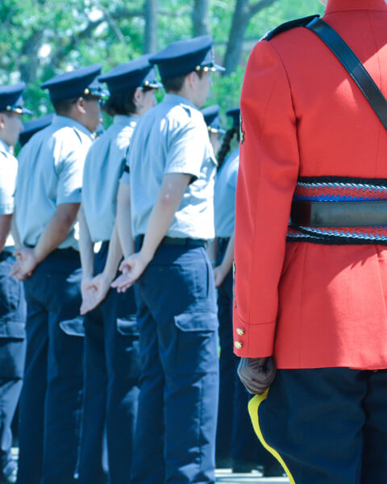
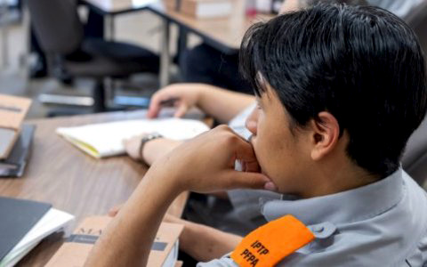
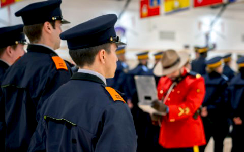
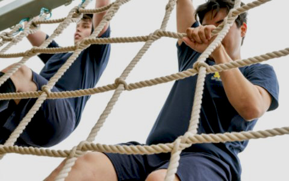

<section class="alert alert-info">
  <h2 class="h3">Note</h2>
  
There are two Indigenous Pre-Cadet Training Program (IPTP) sessions scheduled for 2026:

  <ul>
    <li>June&nbsp;24 to July&nbsp;14</li>
    <li>October&nbsp;7 to October&nbsp;27</li>
  </ul>
  
Apply today!

</section>
<nav aria-labelledby="on-this-page-heading">
  <h2 id="on-this-page-heading">On this page</h2>
  <ul>
    <li>
      <a href="#s1">Basic requirements</a>
    </li>
    <li>
      <a href="#s2">Cost</a>
    </li>
    <li>
      <a href="#s3">Candidate experiences</a>
    </li>
    <li>
      <a href="#s4">Learn how to apply</a>
    </li>
  </ul>
</nav>

  

    
The Indigenous Pre-Cadet Training Program (IPTP) is a three-week training session that offers Canadian Indigenous Peoples a first-hand opportunity to explore a career in policing. The training takes place at the RCMP Academy (Depot) in Regina, Saskatchewan.

    
Candidates will learn:

    <ul>
      <li>How to work as part of a policing team</li>
      <li>An introduction to the Criminal Code and RCMP policy</li>
      <li>Physical fitness and drill</li>
      <li>Skills to help prepare you to apply to be a police officer</li>
    </ul>
    
While at Depot, Indigenous RCMP police officers serve as mentors to the program participants. Upon completion of the program, those who chose to apply to join the RCMP will continue to receive support and guidance throughout the application process.

  

  

    

      <figure>
        
        <figcaption>
          Candidates working on drill with their instructors at the RCMP Academy in Regina, Saskatchewan, spring&#160;2022 session.
        </figcaption>
      </figure>
    

  

<section id="s1">
  <h2>Basic requirements</h2>
  
To apply you must:

  <ul>
    <li>Be of First Nations, Inuit or Métis descent</li>
    <li>Be 19&nbsp;years of age or older</li>
    <li>Be a Canadian citizen</li>
    <li>Be able to pass an enhanced reliability security check</li>
    <li>Be in good physical condition</li>
    <li>Possess a Canadian high school diploma or equivalent at time of program participation</li>
  </ul>
</section>
<section id="s2">
  <h2>Cost</h2>
  
The RCMP covers all program-related costs, including travel, uniforms, meals, and accommodations.

</section>

<section id="s3">
  <h2>Candidate experiences</h2>
  

    

      <blockquote class="mrgn-bttm-md">
        
"There are other people just like us out here, from Indigenous communities - yes, we can be RCMP members."

        <footer>Anna V, Manitoba</footer>
      </blockquote>
      <blockquote class="mrgn-bttm-md">
        
"If you ever have the opportunity, just do it - no questions asked. It will set you up for the future."

        <footer>John B, British Columbia</footer>
      </blockquote>
      <blockquote class="mrgn-bttm-md">
        
"I hope to accomplish a better outlook on RCMP officers within not just my community but all across Canada."

        <footer>Keenan A, Alberta</footer>
      </blockquote>
      <blockquote class="mrgn-bttm-md">
        
"It gives you really good insight into what the RCMP is and how they've changed over the years. It can help you push yourself because sometimes you don't realize what you are capable of until you put yourself in a situation that's uncomfortable."

        <footer>Kayla-Marie O, British Columbia</footer>
      </blockquote>
      <blockquote class="mrgn-bttm-md">
        
"When people say it's a family - you take it with a grain of salt. But you don't realize how bonded everyone becomes with their own troop and just within each other. It is its own little community and I think it's awesome!"

        <footer>Jillian G, Alberta</footer>
      </blockquote>
    

    

      

        <figure>
          
          <figcaption>
            Participants in the IPTP program attend classroom-based learning sessions as part of their training.
          </figcaption>
        </figure>
      

      

        <figure>
          
          <figcaption>
            IPTP participants take part in structured exercises.
          </figcaption>
        </figure>
      

      

        <figure>
          
          <figcaption>
            A participant takes part in physical training as part of their IPTP experience.
          </figcaption>
        </figure>
      

    

  

</section>

<section id="s4">
  <h2>Learn how to apply</h2>
  
For more information or to learn how to apply, please email us at <a
      href="mailto:iptp-pfpa@rcmp-grc.gc.ca">iptp-pfpa@rcmp-grc.gc.ca</a>.

</section>
