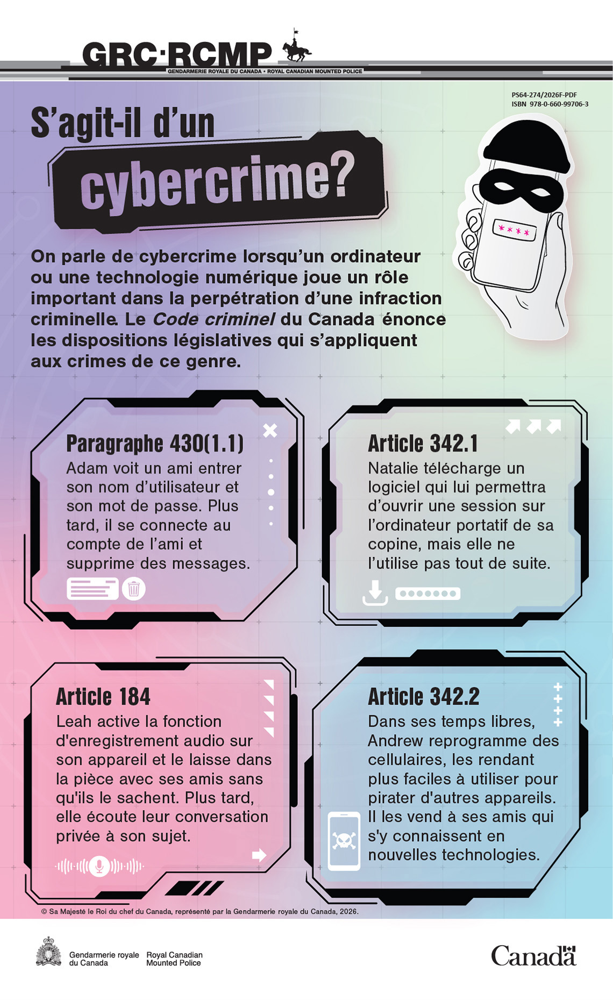

  <ul aria-label="Thèmes abordés sur cette page" class="list-inline">
    <li>Cybercriminalité</li>
    <li>Jeunesse</li>
    <li>Code criminel</li>
  </ul>

Un délit peut être qualifié de cybercriminalité lorsqu'un ordinateur ou toute autre technologie numérique joue un rôle important dans la commission de l'infraction. Cette infographie explique comment le <cite>Code criminel du Canada</cite> définit ce type de délits, à l'aide de situations de la vie quotidienne.

<figure>
  
  <figcaption class="mrgn-tp-md">
    

      

        Description&#160;: S'agit-il d'un cybercrime?
      

      

        
On parle de cybercrime lorsqu'un ordinateur ou une technologie numérique joue un rôle important dans la perpétration d'une infraction criminelle. Le <cite>Code criminel du Canada</cite> énonce les dispositions législatives qui s'appliquent aux crimes de ce genre&#160;:

        <dl class="mrgn-bttm-0">
          <dt>Paragraphe 430 (1.1)</dt>
          <dd>Adam voit un ami entrer son nom d'utilisateur et son mot de passe. Plus tard, il se connecte au compte de l'ami et supprime des messages.</dd>
          <dt>Article 342.1</dt>
          <dd>Natalie télécharge un logiciel qui lui permettra d'ouvrir une session sur l'ordinateur portatif de sa copine, mais elle ne l'utilise pas tout de suite.</dd>
          <dt>Article 184</dt>
          <dd>Leah active la fonction d'enregistrement audio sur son appareil et le laisse dans la pièce avec ses amis sans qu'ils le sachent. Plus tard, elle écoute leur conversation privée à son sujet.</dd>
          <dt>Article 342.2</dt>
          <dd>Dans ses temps libres, Andrew reprogramme des cellulaires, les rendant plus faciles à utiliser pour pirater d'autres appareils. Il les vend à ses amis qui s'y connaissent en nouvelles technologies.</dd>
        </dl>
      

    

    

      

        Renseignements sur la publication
      

      

        <dl class="dl-horizontal mrgn-bttm-0">
          <dt>Titre</dt>
          <dd>S'agit-il d'un cybercrime?</dd>
          <dt>Droit d'auteurs</dt>
          <dd>© Sa Majesté le Roi du chef du Canada, représenté par la Gendarmerie royale du Canada, 2026.</dd>
          <dt>Numéro de catalogue</dt>
          <dd>PS64-274/2026E-PDF</dd>
          <dt>ISBN</dt>
          <dd>978-0-660-99705-6</dd>
        </dl>
      

    

    
<a aria-label="Télécharger S'agit-il d'un cybercrime? infographie (format PNG, 889 ko)" class="btn btn-call-to-action" href="cyberchoix-infographie-fra.png" download target="_blank"> Télécharger S'agit-il d'un cybercrime? infographie</a> format PNG • 889&nbsp;ko

  </figcaption>
</figure>
