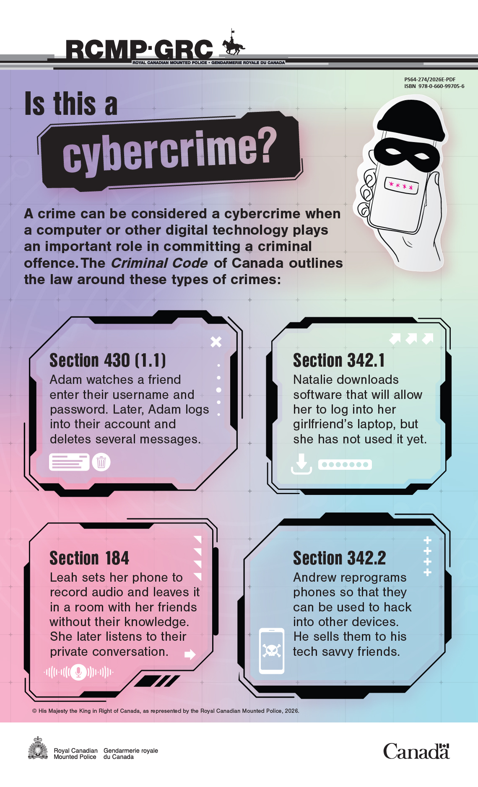

  <ul aria-label="Topics covered by this page" class="list-inline">
    <li>Cybercrime</li>
    <li>Youth</li>
    <li>Criminal Code</li>
  </ul>

A crime can be considered a cybercrime when a computer or other digital technology plays an important role in committing a criminal offence. This infographic explains how the <cite>Criminal Code of Canada</cite> defines these types of crimes, using everyday scenarios.

<figure>
  
  <figcaption class="mrgn-tp-md">
    

      

        Description: Is this a cybercrime?
      

      

        
A crime can be considered a cybercrime when a computer or other digital technology plays an important role in committing a criminal offence. The <cite>Criminal Code of Canada</cite> outlines the law around these types of crimes:

        <dl class="mrgn-bttm-0">
          <dt>Section 430 (1.1)</dt>
          <dd>Adam watches a friend enter their username and password. Later, Adam logs into his friend's account without their permission and deletes several messages.</dd>
          <dt>Section 342.1</dt>
          <dd>Natalie downloads software that will allow her to log into her girlfriend's laptop, but she has not used it yet.</dd>
          <dt>Section 184</dt>
          <dd>Leah sets her phone to record audio and leaves it in a room with her friends without their knowledge. She later listens to their private conversation.</dd>
          <dt>Section 342.2</dt>
          <dd>Andrew reprograms phones so that they can be used to hack into other devices. He sells them to his tech savvy friends.</dd>
        </dl>
      

    

    

      

        Publication information
      

      

        <dl class="dl-horizontal mrgn-bttm-0">
          <dt>Title</dt>
          <dd>Is this a cybercrime?</dd>
          <dt>Copyright</dt>
          <dd>© His Majesty the King in Right of Canada, as represented by the Royal Canadian Mounted Police, 2026</dd>
          <dt>Catalogue number</dt>
          <dd>PS64-274/2026E-PDF</dd>
          <dt>ISBN</dt>
          <dd>978-0-660-99705-6</dd>
        </dl>
      

    

    
<a aria-label="Download Is this a cybercrime? infographic (PNG, 889 KB)" class="btn btn-call-to-action" href="cyberchoices-infographic-eng.png" download target="_blank"> Download Is this a cybercrime? infographic</a> PNG format • 889&nbsp;KB

  </figcaption>
</figure>
