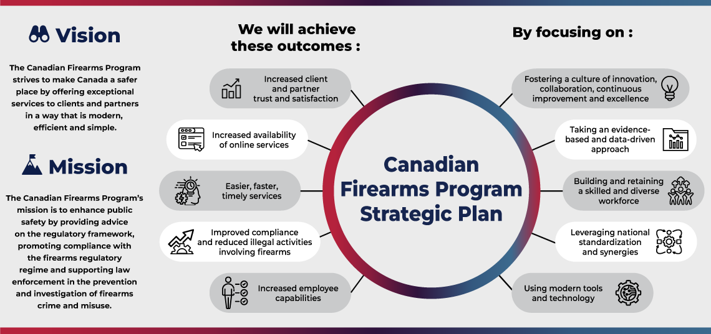

<section>
  <h2>On this page</h2>
  <ul class="mrgn-bttm-lg">
  <li><a href="#s1">Message from the Commissioner</a></li>
  <li><a href="#s2">Message from the Director General of the Canadian Firearms Program</a></li>
  <li><a href="#s3">2025 in numbers</a></li>
  <li><a href="#s4">The Canadian Firearms Program</a></li>
  <li><a href="#s5">Noteworthy in 2025</a></li>
  <li><a href="#s6">Promoting compliance with the firearms regulatory regime</a></li>
  <li><a href="#s7">Supporting law enforcement agencies</a></li>
  <li><a href="#s8">Looking ahead</a></li>
  </ul>
  </section>
  
  

  
Publication information<!-- and alternate formats-->

  
2025 Commissioner of Firearms Report

  
© His Majesty the King in Right of Canada, as represented by the Royal Canadian Mounted Police, 2026

  <ul class="small">
  <li>Catalogue number PS96E-PDF</li>
  <li>ISSN 1927-6923</li>
  </ul>
  <!-- 
<a href="/sites/default/files/doc/FILE.pdf">2025 Commissioner of Firearms Report (PDF, XXX&#160;KB)</a>
 -->
  <!-- 
<a href="https://publications.gc.ca/site/eng/9.949188/publication.html">Available from GC&nbsp;Publications</a>
 -->
  <!-- 
<a href="https://">Available from the Open Government Portal</a>
 -->
  

  
  

  
List of charts

  <ul>
  <li><a href="#c1">Chart 1: Firearms licence renewals, 2021 to 2025</a></li>
  <li><a href="#c2">Chart 2: Individual licence renewal with restricted and prohibited privileges and in possession of a registered firearm, 2021 to 2025</a></li>
  <li><a href="#c3">Chart 3: Individuals prohibited from possessing firearms, 2021 to 2025</a></li>
  </ul>
  

  
  

  
List of figures

  <ul>
  <li><a href="#f1">Figure 1: Canadian Firearms Program strategic plan</a></li>
  </ul>
  

  
  

  
List of tables

  <ul>
  <li><a href="#t1">Table 1: Individual firearms licences by type and province or territory, 2025</a></li>
  <li><a href="#t2">Table 2: Possession and Acquisition Licence holders and Minor's Licence holders, 2021 to 2025</a></li>
  <li><a href="#t3">Table 3: Individual licences issued (including new and renewals), 2025</a></li>
  <li><a href="#t4">Table 4: Possession and Acquisition Licences and Minor’s Licences by province or territory, 2025</a></li>
  <li><a href="#t5">Table 5: Possession and Acquisition Licence privileges by province or territory, 2025</a></li>
  <li><a href="#t6">Table 6: Firearms licence application refusals, 2021 to 2025</a></li>
  <li><a href="#t7">Table 7: Reasons for firearms licence application refusals, 2025</a></li>
  <li><a href="#t8">Table 8: Firearms licence revocations, 2021 to 2025</a></li>
  <li><a href="#t9">Table 9: Reasons for firearms licence revocations, 2025</a></li>
  <li><a href="#t10">Table 10: Firearms registered to individuals and businesses, by class, 2021 to 2025</a></li>
  <li><a href="#t11">Table 11: Firearms registered to individuals and businesses in Canada by class and province or territory in 2025</a></li>
  <li><a href="#t12">Table 12: Registration refusals and revocations, 2021 to 2025</a></li>
  <li><a href="#t13">Table 13: Licence verification, 2025</a></li>
  <li><a href="#t14">Table 14: Authorizations to Transport, 2025</a></li>
  <li><a href="#t15">Table 15: Valid firearms business licences, 2021 to 2025</a></li>
  <li><a href="#t16">Table 16: Shooting range facilities and clubs, 2025</a></li>
  </ul>
  

  
  

  
Contact information

  <dl>
  <dt>RCMP Canadian Firearms Program</dt>
  <dd>
  Ottawa, ON&nbsp; K1A&nbsp;0R2 
  1-800-731-4000 (toll-free) 
  <a href="mailto:cfp-pcaf@rcmp-grc.gc.ca">cfp-pcaf@rcmp-grc.gc.ca</a> 
  <a href="/en/firearms">Firearms – RCMP.ca</a>
  </dd>
  <dt>RCMP Media Relations</dt>
  <dd>
  1-613-843-5999 
  <a href="mailto:rcmp.hqmediarelations-dgrelationsmedias.grc@rcmp-grc.gc.ca">rcmp.hqmediarelations-dgrelationsmedias.grc@rcmp-grc.gc.ca</a>
  </dd>
  </dl>
  

  
  <section id="s1">
  <h2>Message from the Commissioner</h2>
  
  

  

  <figure>
  
  <figcaption>
  <b>Mike Duheme</b> 
  Commissioner of the RCMP and the Commissioner of Firearms
  </figcaption>
  </figure>
  

  

  
  
I am pleased to share the Commissioner of Firearms Report for 2025. This annual report provides an overview of the Canadian Firearms Program's efforts relating to firearms licensing and registration, and its support to clients and partners.

  
The Canadian Firearms Program plays a critical role in Canada's firearms regime. It administers the <cite>Firearms Act</cite> and regulations, delivers specialized support services to law enforcement, and promotes firearms safety.

  
This year, the Canadian Firearms Program deepened its focus on training, collaboration and identifying opportunities to strengthen its services. It conducted a survey of Canadian policing partners and co-delivered an integrated firearms working group conference for law enforcement officers and Crown attorneys from across Canada, focussing on firearm trafficking and importation. It strengthened assistance to domestic and foreign law enforcement agencies to combat firearm trafficking by providing firearm tracing services that identified the origin and lineage of seized firearms. The Canadian Firearms Program also supported provincial and territorial Chief Firearms Officers with the implementation of new legislative tools, including temporary licence suspension laws and enhanced licence revocation and refusal authorities.

  
In May&nbsp;2025, the Canadian Firearms Program's Director General, Kellie Paquette, was invested into the Order of Merit of the Police Forces by the Governor General of Canada in recognition of her exceptional contributions to policing, community safety and development. Under her leadership, the Canadian Firearms Program continues to support police services to better detect and target firearms crimes and reduce illegal activities involving firearms.

  
Together, we remain steadfast in our commitment to making Canada a safer place.

  </section>
  
  <section id="s2">
  <h2>Message from the Director General of the Canadian Firearms Program</h2>
  

  

  <figure>
  
  <figcaption>
  <b>Kellie Paquette</b> 
  Director General, Canadian Firearms Program
  </figcaption>
  </figure>
  

  

  
  
This report details the outstanding work accomplished by the Canadian Firearms Program working with its federal, provincial, territorial, Indigenous and international partners in 2025.

  
Our goal is to provide exceptional services to our clients and partners in a way that is modern, efficient and simple. In 2025, the Canadian Firearms Program continued to modernize client services, with heightened efforts to expand automation and increase digital services as part of a regulatory red tape reduction initiative.

  
Chief Firearms Officers are working daily in communities across Canada to provide resources and information to the public to promote firearms safety. Instructors deliver comprehensive firearms safety training to those seeking a firearms licence. We have expanded our focus on training with consideration for accessibility, Indigenous Peoples, mental health concerns and legislative changes involving intimate partner violence. Our efforts are aligned to help reduce risks associated with firearms in cases of domestic violence and to help keep our communities and vulnerable populations safe from firearms violence.

  
I am truly proud of the collaboration between the Chief Firearms Officers, Registrar of Firearms, law enforcement officers, and the efforts of all Canadian Firearms Program employees as we work together to innovate and improve how we administer the <cite>Firearms Act</cite> and enhance public safety for all Canadians.

  </section>
  
  <section id="s3">
  <h2>2025 in numbers</h2>
  
  <section id="s3-1">
  <h3>Licensing and registration</h3>
  
There were <b>2,473,661</b> firearms licence holders.

  <ul>
  <li><b>1,626,754</b> non-restricted licence holders</li>
  <li><b>14,984</b> Minor's Licence holders</li>
  <li><b>794,768</b> licence holders with restricted privileges</li>
  <li><b>37,155</b> licence holders with prohibited privileges</li>
  </ul>
  
There were <b>3,766</b> licensed firearms businesses, not including museums.

  
There were <b>269</b> licensed carriers.

  
There were <b>1,253,010</b> registered firearms.

  
There were <b>421,022</b> reference numbers requested for the transfer of non-restricted firearms, of which <b>417,748</b> were issued and <b>3,274</b> were not issued.

  </section>
  
  <section id="s3-2">
  <h3>Firearms Reference Table</h3>
  
The <a href="/en/firearms/firearms-reference-table#s2">Firearms Reference Table</a> has more than <b>211,000</b> individual records.

  
<b>3,382</b> new records were added and <b>1,491</b> records were updated.

  </section>
  
  <section id="s3-3">
  <h3>Law enforcement support</h3>
  
There were <b>6,826</b> firearms traced and <b>3,885</b> crime guns identified.

  
Canadian Firearms Registry Online queries per day: <b>25,780</b>

  </section>
  
  <section id="s3-4">
  <h3>Public information support</h3>
  
Secure messages exchanged with clients via MyCFP portal:

  <ul>
  <li><b>134,643</b> messages sent</li>
  <li><b>46,644</b> messages received</li>
  </ul>
  
Notification updates to clients: <b>1,327,512</b>

  
Incoming mail and inquiries by email:

  <ul>
  <li><b>266,692</b> pieces of incoming mail</li>
  <li><b>18,238 </b>email inquiries received</li>
  </ul>
  
Phone calls received by the Canadian Firearms Program: <b>911,203</b>

  
Canadian Firearms Program website — English:

  <ul>
  <li>Number of overall views: <b>12,567,885</b></li>
  <li>Number of active users: <b>2,002,458</b></li>
  </ul>
  
Canadian Firearms Program website — French:

  <ul>
  <li>Number of overall views: <b>2,455,935</b></li>
  <li>Number of active users: <b>364,534</b></li>
  </ul>
  
MyCFP authenticated users: <b>518,100</b>

  
Individual Web Services:

  <ul>
  <li>Number of overall views: <b>2.8 million</b></li>
  <li>Number of active users: <b>471,120</b></li>
  </ul>
  
Business Web Services:

  <ul>
  <li>Number of users who logged in: <b>321,571</b></li>
  <li>Number of active users: <b>1,182</b></li>
  </ul>
  
Firearms Reference Table — English website:

  <ul>
  <li>Number of overall views: <b>165,715</b></li>
  <li>Number of active users: <b>50,803</b></li>
  </ul>
  
Firearms Reference Table — French website:

  <ul>
  <li>Number of overall views: <b>21,466</b></li>
  <li>Number of active users: <b>5,821</b></li>
  </ul>
  </section>
  </section>
  
  <section id="s4">
  <h2>The Canadian Firearms Program</h2>
  
The Canadian Firearms Program's mission is to enhance public safety by providing advice on the regulatory framework, promoting compliance with the firearms regulatory regime and supporting law enforcement in the prevention and investigation of firearms crime and misuse.

  
In pursuit of its mission, the Canadian Firearms Program:

  <ul>
  <li>supports the lawful ownership and use of firearms in Canada by regulating firearms licensing and registration, and providing firearms owners with quality service, fair treatment, and protection of confidential information</li>
  <li>recognizes that the involvement of firearms owners and users, firearms businesses, law enforcement agencies, the provinces, the territories, federal agencies, Indigenous communities, safety instructors, and firearms verifiers is essential for effective program and service delivery</li>
  <li>commits to ongoing improvement and innovation to achieve the highest levels of service and user experience</li>
  <li>engages its clients and stakeholders to review and develop policies, and to communicate critical information on program requirements and results</li>
  <li>manages its resources efficiently to provide good value for money</li>
  <li>provides clear and accurate reporting of program performance and resource management</li>
  </ul>
  
  <section id="s4-1">
  <h3>Our vision</h3>
  
The Canadian Firearms Program strives to make Canada a safer place by offering exceptional services to clients and partners in a way that is modern, efficient and simple.

  
  <figure id="f1" class="panel panel-default mrgn-bttm-lg">
  <figcaption class="panel-heading">Figure 1 <b>Canadian Firearms Program strategic plan</b></figcaption>
  

  
  

  <footer class="panel-footer">
  

  
Text version

  
The graphic presents the Canadian Firearms Program's strategic plan. It displays the program's mission and vision, followed by the areas the program will focus on and the outcomes it expects to achieve.

  <section>
  <h4>Vision</h4>
  
The Canadian Firearms Program strives to make Canada a safer place by offering exceptional services to clients and partners in a way that is modern, efficient and simple.

  </section>
  <section>
  <h4>Mission</h4>
  
The Canadian Firearms Program's mission is to enhance public safety by providing advice on the regulatory framework, promoting compliance with the firearms regulatory regime and supporting law enforcement in the prevention and investigation of firearms crime and misuse.

  </section>
  <section>
  <h4>Focus areas</h4>
  
The graphic lists five areas the program will focus on:

  <ul>
  <li>fostering a culture of innovation, collaboration, continuous improvement and excellence</li>
  <li>taking an evidence-based and data-driven approach</li>
  <li>building and retaining a skilled and diverse workforce</li>
  <li>leveraging national standardization and synergies</li>
  <li>using modern tools and technology</li>
  </ul>
  </section>
  <section>
  <h4>Outcomes</h4>
  
The graphic lists the outcomes the program expects to achieve:

  <ul>
  <li>increased client and partner trust and satisfaction</li>
  <li>increased availability of online services</li>
  <li>easier, faster, timely services</li>
  <li>improved compliance and reduced illegal activities involving firearms</li>
  <li>increased employee capabilities</li>
  </ul>
  </section>
  

  </footer>
  </figure>
  </section>
  
  <section id="4-2">
  <h3>Working with partners</h3>
  
The Canadian Firearms Program works with various domestic and international partners, including:

  <ul>
  <li><b>Public Safety Canada</b> by providing firearms-related policy support and technical information</li>
  <li><b>Canada Border Services Agency and Global Affairs Canada</b> by providing technical guidance on firearms-related questions for international and cross- border issues</li>
  <li><b>Department of Justice and Public Safety Canada</b> by supporting legal policy development in firearms-related law</li>
  <li><b>Crown-Indigenous Relations and Northern Affairs Canada, and Indigenous Services Canada</b> by supporting firearms legislation and related issues that are of particular interest to Indigenous Peoples</li>
  <li><b>Municipal, provincial and territorial law enforcement agencies</b> by providing support to law enforcement on investigations leading to prosecution of individuals involved in the smuggling, trafficking and criminal use of firearms</li>
  <li><b>International partners</b> by working with law enforcement agencies from the United States and INTERPOL to help reduce the illegal movement of firearms across borders and sharing of the Firearms Reference Table with 196 countries</li>
  </ul>
  </section>
  </section>
  
  <section id="s5">
  <h2>Noteworthy in 2025</h2>
  
  <section id="s5-1">
  <h3>MyCFP online services</h3>
  
As a <a href="https://www.publicsafety.gc.ca/cnt/trnsprnc/cts-rgltns/rgltry-rd-tp-rdctn/prgrss-rprt-en.aspx#a4.1">regulatory red tape reduction initiative</a>, the Canadian Firearms Digital Services Solution is enhancing service delivery to clients and reducing administrative burden, while strengthening compliance and public safety outcomes.

  
The Canadian Firearms Program is continuing to migrate more paper-based applications online. The use of our online services continued to grow steadily in 2025 helping us to successfully pivot from the Canada Post labour disruption. New Possession and Acquisition Licence applications submitted by mail have declined 60% since 2022. 56.4% of new Possession and Acquisition Licence applications were submitted online in 2025. Reduced mail helps the Canadian Firearms Program to achieve its sustainability objectives and results in operational efficiencies and lower costs.

  
Since 2021, we have launched 16 online services through <a href="https://firearms-armes-a-feu.rcmp-grc.ca/en/">MyCFP</a>. User feedback has been positive — in a recent survey, 81% of survey respondents rated MyCFP services as very positive or positive.

  
Clients can now “self-serve” by going online to complete the following transactions:

  <ul>
  <li>Possession and Acquisition Licence application (first-time applicants)</li>
  <li>Business Licence application (first-time applicants)</li>
  <li>Carrier Licence application (first-time applicants)</li>
  <li>Minor's Licence application (first-time applicants)</li>
  <li>applications under the <cite>Aboriginal Peoples of Canada Adaptations Regulations (Firearms)</cite></li>
  <li>Non-resident Temporary Borrowing Licence application</li>
  <li>shooting club approval application</li>
  <li>shooting range approval application</li>
  <li>application to be a firearms instructor</li>
  <li>application to be a firearms verifier</li>
  <li>submission of Canadian Firearms Safety Course and Canadian Restricted Firearms Safety Course reports</li>
  <li>submission of proof of employment with licence application</li>
  <li>firearms licence fee waiver request</li>
  <li>photo exemption declaration</li>
  <li>services for safety training service delivery agencies</li>
  <li>MyCFP two-way secure messaging</li>
  </ul>
  
Online applications improve accuracy, reduce client follow-up and are processed faster than paper submissions. We encourage firearms owners to “save time, go online” to access our many programs and services.

  
The Canadian Firearms Program is also advancing the development of artificial intelligence-powered tools to reduce manual data entry and increase productivity by automating the intake of court orders.

  </section>
  
  <section id="s5-2">
  <h3>Support to law enforcement</h3>
  
In 2025, the Canadian Firearms Program continued working with partners in support of its efforts towards increasing compliance and reducing illegal activities involving firearms.

  
The Crown Attorney Program collaborated with the Minister of the Attorney General of Ontario to deliver a national conference (the 2025 Mega Case Organized Crime and Firearm Trafficking Forum) featuring an interdisciplinary intensive educational program for law enforcement and Crown attorneys across Canada, as well as international partners.

  
Specialized training was provided to firearm prosecutors and investigators to improve outcomes in complex firearm cases, focusing on firearms trafficking, importation and privately manufactured firearms. A principal objective was to bring together subject matter experts to share the most current and cutting-edge practices among law enforcement officers and prosecutors that target organized crime involving firearms.

  
The Specialized Firearms Support Services unit supported law enforcement in Nova Scotia with Canada's first 3D metal printing case. The unit prepared expert reports on illicit manufacturing to support prosecution. Their inspection work contributed towards a successful outcome.

  
The Firearms Internet Investigations Support Unit collaborated with a Chief Firearms Officer on a pilot project to support enhanced mental health screening of licence holders and applicants.

  
The Canadian National Firearms Tracing Centre completed a comprehensive internal review to modernize its workflows and improve service delivery. These efforts contributed to a 77% reduction in tracing start times and a 56% reduction in processing time in the second half of 2025.

  </section>
  
  <section id="s5-3">
  <h3>Former Bill C-21</h3>
  
On March&nbsp;7, 2025, a new licence suspension regime (“yellow flag” law) came into effect. It allows a Chief Firearms Officer to temporarily suspend an individual or business firearm licence for up to 30 days when the Chief Firearms Officer suspects the licence holder is no longer eligible to hold the licence. The holder of a suspended licence may continue to possess but may not use, acquire or import firearms.

  
On April&nbsp;4, 2025, enhanced licence ineligibility and revocation authorities came into effect. An individual convicted of an offence in which violence was used, threatened or attempted against their intimate partner or any member of their family is ineligible to hold a firearms licence. They also allow a Chief Firearms Officer to revoke an individual's firearms licence if the Chief Firearms Officer has reasonable grounds to suspect the individual may have engaged in an act of domestic violence or stalking.

  </section>
  
  <section id="s5-4">
  <h3>Firearms prohibition</h3>
  
On <a href="/en/firearms/what-you-need-know-about-government-canadas-march-7-2025-prohibition-certain-unique-makes-and-models">March&nbsp;7, 2025</a>, the Government announced a firearms prohibition. The <a href="/en/firearms/firearms-reference-table">Firearms Reference Table</a>, maintained by the Canadian Firearms Program, was updated to reflect the new classification of these firearms as prohibited. The March&nbsp;7, 2025, prohibition was in addition to firearms previously prohibited on <a href="/en/firearms/what-you-need-know-about-government-canadas-december-5-2024-prohibition-certain-unique-makes-and">December&nbsp;5, 2024</a>, and <a href="/en/firearms/what-you-need-know-about-government-canadas-may-1-2020-prohibition-certain-firearms-and">May&nbsp;1, 2020</a>. On October&nbsp;16, 2025, the Government extended the Amnesty Orders until October&nbsp;30, 2026, for these prohibited firearms. The Amnesty Orders protect owners from criminal liability while coming into compliance with the law.

  </section>
  
  <section id="s5-5">
  <h3>Mental health</h3>
  
Chief Firearms Officers and the Canadian Firearms Program continued to prioritize the consideration of mental health in firearms licensing. We are reviewing recommendations from a working group of experts to provide strengthened guidance to assist firearms officers with investigations related to the issuance, refusal and revocation of firearms licences where the continued eligibility of licence holders with mental health issues may be a factor, and to encourage a standardized approach across Canada. In addition, we supported a Chief Firearms Officer with a pilot project using investigative tools to enhance mental health screening of firearms licence applicants.

  </section>
  
  <section id="s5-6">
  <h3>Indigenous engagement</h3>
  
The Canadian Firearms Program is committed to building and maintaining positive relationships with Indigenous Peoples and working together to promote <a href="/en/firearms/licensing/indigenous-peoples">firearms safety in First Nations, Inuit and Métis communities</a>. In 2025, we increased the number of firearms officers and instructors that live in the three territories. We hosted youth-only and women-only firearms safety courses. We also increased outreach efforts and we are pleased with the growing number of applications under the <a href="/en/firearms/funding-firearms-safety-indigenous-communities">funding for firearms safety in Indigenous communities program</a>. We look forward to supporting a number of activities to encourage the safe use and handling of firearms.

  </section>
  
  <section id="s5-7">
  <h3>National Firearms Committee</h3>
  
The appointment of the Director General of the Canadian Firearms Program as co-chair of the Canadian Association of Chiefs of Police's firearms committee provides further opportunities to align efforts across partners to limit firearm related offences and impacts in our communities.

  </section>
  
  <section id="s5-8">
  <h3>Disclosure of information</h3>
  
Former Bill C-21 amended section 88.1 of the <cite>Firearms Act</cite> to create a mechanism for the disclosure of specific licensing and registration information to law enforcement in specific cases. If the Commissioner of Firearms, the Registrar of Firearms or a Chief Firearms Officer has reasonable grounds to suspect that an individual is using or has used a licence to transfer, or offer to transfer, a firearm for the purpose of weapons trafficking, they may disclose the information specified in the <cite>Firearms Act</cite> to a law enforcement agency.

  
Former Bill C-21 further amended subsection 93(1.1) of the <cite>Firearms Act</cite> to require that the annual report of the Commissioner of Firearms include information relating to any disclosures made under section 88.1.

  
This report covers the period of January&nbsp;1 to December&nbsp;31, 2025, during which the following disclosures of licensing and registration information were made to law enforcement under subsection 88.1 of the <cite>Firearms Act</cite>:

  
  <section id="s5-8-1">
  <h4>Disclosures of licensing and registration information to law enforcement in support of an investigation or prosecution under section 99(1) or 100(1) of the <cite>Criminal Code</cite> (January&nbsp;1 to December&nbsp;31, 2025)</h4>
  <ul>
  <li>The Commissioner of Firearms: 0</li>
  <li>The Registrar of Firearms: 0</li>
  <li>Chief Firearms Officers: 105</li>
  </ul>
  </section>
  </section>
  </section>
  
  <section id="s6">
  <h2>Promoting compliance with the firearms regulatory regime</h2>
  
The Canadian Firearms Program administers the <cite>Firearms Act</cite> and related regulations, including the licensing of individuals and businesses through <a href="/en/firearms/contact-chief-firearms-officer">Chief Firearms Officers</a>, and the registration of restricted and prohibited firearms through the Registrar of Firearms. Application <a href="/en/firearms/changes-service-fees">fees for licences</a> are published on the Canadian Firearms Program's website.

  
The Canadian Firearms Program's national firearms safety education is key to the safe use, handling, and storage of firearms. The program also works with partner organizations and provincial and territorial governments to disseminate safety information to firearm owners and users, businesses, manufacturers, and to the public.

  
  <section id="s6-1">
  <h3>Overseeing firearms licensing and registration</h3>
  
Firearms licensing and registration are the Canadian Firearms Program's public-facing responsibility. These services allow for individual Canadians and businesses including manufacturers, retail stores and museums to apply for licences to possess, carry, buy, sell or display firearms or ammunition, and apply for registration certificates.

  
Chief Firearms Officers are responsible for overseeing certain aspects of the <cite>Firearms Act</cite> in their provincial and territorial jurisdictions, and have discretionary authority to:

  <ul>
  <li>approve and refuse licensing applications for individuals and businesses</li>
  <li>approve and refuse Authorizations to Transport and certain Authorizations to Carry firearms</li>
  <li>approve shooting clubs and ranges</li>
  <li>conduct inspections of firearms businesses and shooting ranges</li>
  <li>monitor the continuous eligibility of firearms licences</li>
  <li>revoke firearms licences, authorizations and approvals</li>
  </ul>
  
Chief Firearms Officers are responsible for overseeing the delivery of the <a href="/en/firearms/firearms-safety-training-transport-and-storage/safety-courses">Canadian Firearms Safety Course</a> and the <a href="/en/firearms/firearms-safety-training-transport-and-storage/safety-courses">Canadian Restricted Firearms Safety Course</a>.

  
The Registrar of Firearms is responsible for overseeing certain aspects of the <cite>Firearms Act</cite> for all provinces and territories, and has authority to:

  <ul>
  <li>approve and refuse registration and transfer applications for individuals and businesses</li>
  <li>approve and refuse carrier licence applications</li>
  <li>issue and refuse licence verification requests</li>
  <li>provide technical support for the verification of firearms</li>
  <li>issue, refuse and revoke designations for firearm verifiers</li>
  <li>verify the accuracy of firearms classification information</li>
  <li>process firearms description change requests</li>
  <li>process requests for deactivation, destruction, export and antique status</li>
  <li>issue Public Agency Identification Numbers</li>
  <li>process public agency firearm applications and inventories</li>
  </ul>
  
As of December&nbsp;31, 2025, Canada had:

  <ul>
  <li>2,458,677 valid Possession and Acquisition Licences and 14,984 valid Minor's Licences (Table 1)</li>
  <li>1,253,010 registered firearms. Only restricted and prohibited firearms must be registered (Table 10)</li>
  <li>3,766 licensed firearms businesses, not including museums and carriers. Of these, 1,359 businesses were licensed to sell only ammunition (<a href="#t15">Table 15</a>)</li>
  </ul>
  
The following tables include data on firearms licensing and registration.

  
Table 1 provides a breakdown of individual firearms licences by type and province or territory in 2025.

<table class="table table-bordered table-condensed" id="t1">
<caption>Table 1: Individual firearms licences by type and province or territory, 2025</caption>
<thead>
<tr class="active">
<th scope="col">Province or territory</th>
<th scope="col" class="text-right">Possession and Acquisition Licence</th>
<th scope="col" class="text-right">Minor's Licence</th>
<th scope="col" class="text-right">Total</th>
</tr>
</thead>
<tbody>
<tr>
<th scope="row" data-label="Province or territory">Alberta</th>
<td data-label="Possession and Acquisition Licence" class="text-right nowrap">385,449</td>
<td data-label="Minor's Licence" class="text-right nowrap">3,406</td>
<td data-label="Total" class="text-right nowrap">388,855</td>
</tr>
<tr>
<th scope="row" data-label="Province or territory">British Columbia</th>
<td data-label="Possession and Acquisition Licence" class="text-right nowrap">377,271</td>
<td data-label="Minor's Licence" class="text-right nowrap">1,667</td>
<td data-label="Total" class="text-right nowrap">378,938</td>
</tr>
<tr>
<th scope="row" data-label="Province or territory">Manitoba</th>
<td data-label="Possession and Acquisition Licence" class="text-right nowrap">105,185</td>
<td data-label="Minor's Licence" class="text-right nowrap">846</td>
<td data-label="Total" class="text-right nowrap">106,031</td>
</tr>
<tr>
<th scope="row" data-label="Province or territory">New Brunswick</th>
<td data-label="Possession and Acquisition Licence" class="text-right nowrap">77,820</td>
<td data-label="Minor's Licence" class="text-right nowrap">290</td>
<td data-label="Total" class="text-right nowrap">78,110</td>
</tr>
<tr>
<th scope="row" data-label="Province or territory">Newfoundland and Labrador</th>
<td data-label="Possession and Acquisition Licence" class="text-right nowrap">75,826</td>
<td data-label="Minor's Licence" class="text-right nowrap">614</td>
<td data-label="Total" class="text-right nowrap">76,440</td>
</tr>
<tr>
<th scope="row" data-label="Province or territory">Northwest Territories</th>
<td data-label="Possession and Acquisition Licence" class="text-right nowrap">6,049</td>
<td data-label="Minor's Licence" class="text-right nowrap">21</td>
<td data-label="Total" class="text-right nowrap">6,070</td>
</tr>
<tr>
<th scope="row" data-label="Province or territory">Nova Scotia</th>
<td data-label="Possession and Acquisition Licence" class="text-right nowrap">80,469</td>
<td data-label="Minor's Licence" class="text-right nowrap">726</td>
<td data-label="Total" class="text-right nowrap">81,195</td>
</tr>
<tr>
<th scope="row" data-label="Province or territory">Nunavut</th>
<td data-label="Possession and Acquisition Licence" class="text-right nowrap">3,412</td>
<td data-label="Minor's Licence" class="text-right nowrap">32</td>
<td data-label="Total" class="text-right nowrap">3,444</td>
</tr>
<tr>
<th scope="row" data-label="Province or territory">Ontario</th>
<td data-label="Possession and Acquisition Licence" class="text-right nowrap">705,303</td>
<td data-label="Minor's Licence" class="text-right nowrap">5,964</td>
<td data-label="Total" class="text-right nowrap">711,267</td>
</tr>
<tr>
<th scope="row" data-label="Province or territory">Prince Edward Island</th>
<td data-label="Possession and Acquisition Licence" class="text-right nowrap">7,532</td>
<td data-label="Minor's Licence" class="text-right nowrap">31</td>
<td data-label="Total" class="text-right nowrap">7,563</td>
</tr>
<tr>
<th scope="row" data-label="Province or territory">Quebec</th>
<td data-label="Possession and Acquisition Licence" class="text-right nowrap">502,111</td>
<td data-label="Minor's Licence" class="text-right nowrap">584</td>
<td data-label="Total" class="text-right nowrap">502,695</td>
</tr>
<tr>
<th scope="row" data-label="Province or territory">Saskatchewan</th>
<td data-label="Possession and Acquisition Licence" class="text-right nowrap">123,175</td>
<td data-label="Minor's Licence" class="text-right nowrap">723</td>
<td data-label="Total" class="text-right nowrap">123,898</td>
</tr>
<tr>
<th scope="row" data-label="Province or territory">Yukon</th>
<td data-label="Possession and Acquisition Licence" class="text-right nowrap">9,075</td>
<td data-label="Minor's Licence" class="text-right nowrap">80</td>
<td data-label="Total" class="text-right nowrap">9,155</td>
</tr>
<tr class="active">
<th scope="row" data-label="Province or territory">Canada</th>
<td data-label="Possession and Acquisition Licence" class="text-right nowrap">2,458,677</td>
<td data-label="Minor's Licence" class="text-right nowrap">14,984</td>
<td data-label="Canada" class="text-right nowrap">2,473,661</td>
</tr>
</tbody>
</table>
  
  
Table 2 provides a breakdown of Possession and Acquisition Licences year over year, since 2021.

  
  <table class="table table-bordered table-condensed" id="t2">
  <caption class="text-left">Table 2: Possession and Acquisition Licence holders and Minor's Licence holders, 2021 to 2025</caption>
  <thead>
  <tr class="active">
  <th scope="col" class="text-right nowrap">2021</th>
  <th scope="col" class="text-right nowrap">2022</th>
  <th scope="col" class="text-right nowrap">2023</th>
  <th scope="col" class="text-right nowrap">2024</th>
  <th scope="col" class="text-right nowrap">2025</th>
  </tr>
  </thead>
  <tbody>
  <tr>
  <td data-label="2021" class="text-right nowrap">2,245,842</td>
  <td data-label="2022" class="text-right nowrap">2,272,760</td>
  <td data-label="2023" class="text-right nowrap">2,364,726</td>
  <td data-label="2024" class="text-right nowrap">2,425,627</td>
  <td data-label="2025" class="text-right nowrap">2,473,661</td>
  </tr>
  </tbody>
  </table>
  
  
Table 3 provides a breakdown of the number of individual licences issued in 2025, including new licences and renewals.

  <table class="table table-bordered table-condensed" id="t3">
  <caption class="text-left">Table 3: Individual licences issued (including new and renewals), 2025</caption>
  <thead>
  <tr class="active">
  <th scope="col">Licence type</th>
  <th scope="col" class="text-right nowrap">2025</th>
  </tr>
  </thead>
  <tbody>
  <tr>
  <th scope="row" data-label="Licence type">Possession and Acquisition Licence</th>
  <td data-label="2025" class="text-right nowrap">482,839</td>
  </tr>
  <tr>
  <th scope="row" data-label="Licence type">Minor's Licence</th>
  <td data-label="2025" class="text-right nowrap">6,906</td>
  </tr>
  <tr>
  <th scope="row" data-label="Licence type">Total</th>
  <td data-label="2025" class="text-right nowrap">489,745</td>
  </tr>
  </tbody>
  </table>
  
  

  
Table 3 notes

  
These numbers include licences outside of Canada.

  

  
  
Table 4 provides a breakdown of the number of new and renewed Possession and Acquisition Licences and Minor's Licences approved by province or territory in 2025.

  
  
  <table class="table table-bordered table-condensed" id="t4">
  <caption class="text-left">Table 4: Possession and Acquisition Licences and Minor’s Licences by province or territory, 2025</caption>
    <thead>
      <tr class="active">
        <th rowspan="2" scope="col">Province or territory</th>
        <th colspan="3" scope="colgroup" class="text-center">Possession and Acquisition Licence (PAL)</th>
        <th colspan="3" scope="colgroup" class="text-center">Minor's Licence</th>
        <th colspan="3" scope="colgroup" class="text-center">Total</th>
      </tr>
      <tr class="active">
        <th scope="col" class="text-right">New</th>
        <th scope="col" class="text-right">Renewal</th>
        <th scope="col" class="text-right">Total PAL</th>
        <th scope="col" class="text-right">New</th>
        <th scope="col" class="text-right">Renewal</th>
        <th scope="col" class="text-right">Total Minor's</th>
        <th scope="col" class="text-right">New</th>
        <th scope="col" class="text-right">Renewal</th>
        <th scope="col" class="text-right">Total</th>
      </tr>
    </thead>
    <tbody>
      <tr>
        <th scope="row" data-label="Province or territory">Alberta</th>
        <td data-label="PAL – New" class="text-right nowrap">23,542</td>
        <td data-label="PAL – Renewal" class="text-right nowrap">52,067</td>
        <td data-label="PAL – Total" class="text-right nowrap">75,609</td>
        <td data-label="Minor's – New" class="text-right nowrap">1,376</td>
        <td data-label="Minor's – Renewal" class="text-right nowrap">83</td>
        <td data-label="Minor's – Total" class="text-right nowrap">1,459</td>
        <td data-label="Total new" class="text-right nowrap">24,918</td>
        <td data-label="Total renewals" class="text-right nowrap">52,150</td>
        <td data-label="Total" class="text-right nowrap">77,068</td>
      </tr>
      <tr>
        <th scope="row" data-label="Province or territory">British Columbia</th>
        <td data-label="PAL – New" class="text-right nowrap">23,645</td>
        <td data-label="PAL – Renewal" class="text-right nowrap">52,157</td>
        <td data-label="PAL – Total" class="text-right nowrap">75,802</td>
        <td data-label="Minor's – New" class="text-right nowrap">723</td>
        <td data-label="Minor's – Renewal" class="text-right nowrap">48</td>
        <td data-label="Minor's – Total" class="text-right nowrap">771</td>
        <td data-label="Total new" class="text-right nowrap">24,368</td>
        <td data-label="Total renewals" class="text-right nowrap">52,205</td>
        <td data-label="Total" class="text-right nowrap">76,573</td>
      </tr>
      <tr>
        <th scope="row" data-label="Province or territory">Manitoba</th>
        <td data-label="PAL – New" class="text-right nowrap">6,439</td>
        <td data-label="PAL – Renewal" class="text-right nowrap">14,211</td>
        <td data-label="PAL – Total" class="text-right nowrap">20,650</td>
        <td data-label="Minor's – New" class="text-right nowrap">439</td>
        <td data-label="Minor's – Renewal" class="text-right nowrap">20</td>
        <td data-label="Minor's – Total" class="text-right nowrap">459</td>
        <td data-label="Total new" class="text-right nowrap">6,878</td>
        <td data-label="Total renewals" class="text-right nowrap">14,231</td>
        <td data-label="Total" class="text-right nowrap">21,109</td>
      </tr>
      <tr>
        <th scope="row" data-label="Province or territory">New Brunswick</th>
        <td data-label="PAL – New" class="text-right nowrap">4,290</td>
        <td data-label="PAL – Renewal" class="text-right nowrap">10,753</td>
        <td data-label="PAL – Total" class="text-right nowrap">15,043</td>
        <td data-label="Minor's – New" class="text-right nowrap">122</td>
        <td data-label="Minor's – Renewal" class="text-right nowrap">4</td>
        <td data-label="Minor's – Total" class="text-right nowrap">126</td>
        <td data-label="Total new" class="text-right nowrap">4,412</td>
        <td data-label="Total renewals" class="text-right nowrap">10,757</td>
        <td data-label="Total" class="text-right nowrap">15,169</td>
      </tr>
      <tr>
        <th scope="row" data-label="Province or territory">Newfoundland and Labrador</th>
        <td data-label="PAL – New" class="text-right nowrap">3,143</td>
        <td data-label="PAL – Renewal" class="text-right nowrap">11,093</td>
        <td data-label="PAL – Total" class="text-right nowrap">14,236</td>
        <td data-label="Minor's – New" class="text-right nowrap">309</td>
        <td data-label="Minor's – Renewal" class="text-right nowrap">23</td>
        <td data-label="Minor's – Total" class="text-right nowrap">332</td>
        <td data-label="Total new" class="text-right nowrap">3,452</td>
        <td data-label="Total renewals" class="text-right nowrap">11,116</td>
        <td data-label="Total" class="text-right nowrap">14,568</td>
      </tr>
      <tr>
        <th scope="row" data-label="Province or territory">Northwest Territories</th>
        <td data-label="PAL – New" class="text-right nowrap">515</td>
        <td data-label="PAL – Renewal" class="text-right nowrap">804</td>
        <td data-label="PAL – Total" class="text-right nowrap">1,319</td>
        <td data-label="Minor's – New" class="text-right nowrap">4</td>
        <td data-label="Minor's – Renewal" class="text-right nowrap">1</td>
        <td data-label="Minor's – Total" class="text-right nowrap">5</td>
        <td data-label="Total new" class="text-right nowrap">519</td>
        <td data-label="Total renewals" class="text-right nowrap">805</td>
        <td data-label="Total" class="text-right nowrap">1,324</td>
      </tr>
      <tr>
        <th scope="row" data-label="Province or territory">Nova Scotia</th>
        <td data-label="PAL – New" class="text-right nowrap">4,342</td>
        <td data-label="PAL – Renewal" class="text-right nowrap">11,232</td>
        <td data-label="PAL – Total" class="text-right nowrap">15,574</td>
        <td data-label="Minor's – New" class="text-right nowrap">303</td>
        <td data-label="Minor's – Renewal" class="text-right nowrap">22</td>
        <td data-label="Minor's – Total" class="text-right nowrap">325</td>
        <td data-label="Total new" class="text-right nowrap">4,645</td>
        <td data-label="Total renewals" class="text-right nowrap">11,254</td>
        <td data-label="Total" class="text-right nowrap">15,899</td>
      </tr>
      <tr>
        <th scope="row" data-label="Province or territory">Nunavut</th>
        <td data-label="PAL – New" class="text-right nowrap">349</td>
        <td data-label="PAL – Renewal" class="text-right nowrap">403</td>
        <td data-label="PAL – Total" class="text-right nowrap">752</td>
        <td data-label="Minor's – New" class="text-right nowrap">15</td>
        <td data-label="Minor's – Renewal" class="text-right nowrap">0</td>
        <td data-label="Minor's – Total" class="text-right nowrap">15</td>
        <td data-label="Total new" class="text-right nowrap">364</td>
        <td data-label="Total renewals" class="text-right nowrap">403</td>
        <td data-label="Total" class="text-right nowrap">767</td>
      </tr>
      <tr>
        <th scope="row" data-label="Province or territory">Ontario</th>
        <td data-label="PAL – New" class="text-right nowrap">40,325</td>
        <td data-label="PAL – Renewal" class="text-right nowrap">93,439</td>
        <td data-label="PAL – Total" class="text-right nowrap">133,764</td>
        <td data-label="Minor's – New" class="text-right nowrap">2,217</td>
        <td data-label="Minor's – Renewal" class="text-right nowrap">175</td>
        <td data-label="Minor's – Total" class="text-right nowrap">2,392</td>
        <td data-label="Total new" class="text-right nowrap">42,542</td>
        <td data-label="Total renewals" class="text-right nowrap">93,614</td>
        <td data-label="Total" class="text-right nowrap">136,156</td>
      </tr>
      <tr>
        <th scope="row" data-label="Province or territory">Prince Edward Island</th>
        <td data-label="PAL – New" class="text-right nowrap">564</td>
        <td data-label="PAL – Renewal" class="text-right nowrap">1,023</td>
        <td data-label="PAL – Total" class="text-right nowrap">1,587</td>
        <td data-label="Minor's – New" class="text-right nowrap">10</td>
        <td data-label="Minor's – Renewal" class="text-right nowrap">1</td>
        <td data-label="Minor's – Total" class="text-right nowrap">11</td>
        <td data-label="Total new" class="text-right nowrap">574</td>
        <td data-label="Total renewals" class="text-right nowrap">1,024</td>
        <td data-label="Total" class="text-right nowrap">1,598</td>
      </tr>
      <tr>
        <th scope="row" data-label="Province or territory">Quebec</th>
        <td data-label="PAL – New" class="text-right nowrap">27,039</td>
        <td data-label="PAL – Renewal" class="text-right nowrap">74,732</td>
        <td data-label="PAL – Total" class="text-right nowrap">101,771</td>
        <td data-label="Minor's – New" class="text-right nowrap">334</td>
        <td data-label="Minor's – Renewal" class="text-right nowrap">7</td>
        <td data-label="Minor's – Total" class="text-right nowrap">341</td>
        <td data-label="Total new" class="text-right nowrap">27,373</td>
        <td data-label="Total renewals" class="text-right nowrap">74,739</td>
        <td data-label="Total" class="text-right nowrap">102,112</td>
      </tr>
      <tr>
        <th scope="row" data-label="Province or territory">Saskatchewan</th>
        <td data-label="PAL – New" class="text-right nowrap">5,873</td>
        <td data-label="PAL – Renewal" class="text-right nowrap">18,080</td>
        <td data-label="PAL – Total" class="text-right nowrap">23,953</td>
        <td data-label="Minor's – New" class="text-right nowrap">286</td>
        <td data-label="Minor's – Renewal" class="text-right nowrap">10</td>
        <td data-label="Minor's – Total" class="text-right nowrap">296</td>
        <td data-label="Total new" class="text-right nowrap">6,159</td>
        <td data-label="Total renewals" class="text-right nowrap">18,090</td>
        <td data-label="Total" class="text-right nowrap">24,249</td>
      </tr>
      <tr>
        <th scope="row" data-label="Province or territory">Yukon</th>
        <td data-label="PAL – New" class="text-right nowrap">652</td>
        <td data-label="PAL – Renewal" class="text-right nowrap">1,346</td>
        <td data-label="PAL – Total" class="text-right nowrap">1,998</td>
        <td data-label="Minor's – New" class="text-right nowrap">23</td>
        <td data-label="Minor's – Renewal" class="text-right nowrap">6</td>
        <td data-label="Minor's – Total" class="text-right nowrap">29</td>
        <td data-label="Total new" class="text-right nowrap">675</td>
        <td data-label="Total renewals" class="text-right nowrap">1,352</td>
        <td data-label="Total" class="text-right nowrap">2,027</td>
      </tr>
      <tr class="active">
        <th scope="row" data-label="Province or territory">Canada</th>
        <td data-label="PAL – New" class="text-right nowrap">140,718</td>
        <td data-label="PAL – Renewal" class="text-right nowrap">341,340</td>
        <td data-label="PAL – Total" class="text-right nowrap">482,058</td>
        <td data-label="Minor's – New" class="text-right nowrap">6,161</td>
        <td data-label="Minor's – Renewal" class="text-right nowrap">400</td>
        <td data-label="Minor's – Total" class="text-right nowrap">6,561</td>
        <td data-label="Total new" class="text-right nowrap">146,879</td>
        <td data-label="Total renewals" class="text-right nowrap">341,740</td>
        <td data-label="Total" class="text-right nowrap">488,619</td>
      </tr>
    </tbody>
  </table>
  
  

  
Table 4 notes

  
The numbers in this table do not include licences outside of Canada.

  

  
  
Firearms fall into one of three classes as defined in section 84(1) of the <cite>Criminal Code</cite>:

  <ul>
  <li>Non-restricted firearms&nbsp;– typically shotguns and rifles</li>
  <li>Restricted firearms&nbsp;– predominantly handguns</li>
  <li>Prohibited firearms&nbsp;– certain handguns; fully automatic or converted automatic firearms; any firearm prescribed to be prohibited in regulation; and any semi- automatic firearm (other than a handgun) that discharges centre-fire ammunition, was originally designed with a detachable cartridge magazine with a capacity of six or more cartridges, and that was designed and manufactured on or after December&nbsp;15, 2023</li>
  </ul>
  
In 2025, there were:

  <ul>
  <li>1,626,754 Possession and Acquisition Licences with non-restricted privileges</li>
  <li>794,768 with restricted privileges</li>
  <li>37,155 with prohibited privileges</li>
  </ul>
  
Table 5 provides a breakdown of the number of Possession and Acquisition Licence privileges in 2025 by province or territory.

  
  <table class="table table-bordered table-condensed" id="t5">
  <caption class="text-left">Table 5: Possession and Acquisition Licence privileges by province or territory, 2025</caption>
  <thead>
  <tr class="active">
  <th scope="col">Province or territory</th>
  <th scope="col" class="text-right">Non-restricted</th>
  <th scope="col" class="text-right">Restricted</th>
  <th scope="col" class="text-right">Prohibited</th>
  <th scope="col" class="text-right">Total Possession and Acquisition Licences</th>
  </tr>
  </thead>
  <tbody>
  <tr>
  <th scope="row" data-label="Province or territory">Alberta</th>
  <td data-label="Non-restricted" class="text-right nowrap">199,850</td>
  <td data-label="Restricted" class="text-right nowrap">180,238</td>
  <td data-label="Prohibited" class="text-right nowrap">5,361</td>
  <td data-label="Total Possession and Acquisition Licences" class="text-right nowrap">385,449</td>
  </tr>
  <tr>
  <th scope="row" data-label="Province or territory">British Columbia</th>
  <td data-label="Non-restricted" class="text-right nowrap">191,688</td>
  <td data-label="Restricted" class="text-right nowrap">179,199</td>
  <td data-label="Prohibited" class="text-right nowrap">6,384</td>
  <td data-label="Total Possession and Acquisition Licences" class="text-right nowrap">377,271</td>
  </tr>
  <tr>
  <th scope="row" data-label="Province or territory">Manitoba</th>
  <td data-label="Non-restricted" class="text-right nowrap">72,493</td>
  <td data-label="Restricted" class="text-right nowrap">31,366</td>
  <td data-label="Prohibited" class="text-right nowrap">1,326</td>
  <td data-label="Total Possession and Acquisition Licences" class="text-right nowrap">105,185</td>
  </tr>
  <tr>
  <th scope="row" data-label="Province or territory">New Brunswick</th>
  <td data-label="Non-restricted" class="text-right nowrap">63,206</td>
  <td data-label="Restricted" class="text-right nowrap">13,249</td>
  <td data-label="Prohibited" class="text-right nowrap">1,365</td>
  <td data-label="Total Possession and Acquisition Licences" class="text-right nowrap">77,820</td>
  </tr>
  <tr>
  <th scope="row" data-label="Province or territory">Newfoundland and Labrador</th>
  <td data-label="Non-restricted" class="text-right nowrap">67,948</td>
  <td data-label="Restricted" class="text-right nowrap">7,462</td>
  <td data-label="Prohibited" class="text-right nowrap">416</td>
  <td data-label="Total Possession and Acquisition Licences" class="text-right nowrap">75,826</td>
  </tr>
  <tr>
  <th scope="row" data-label="Province or territory">Northwest Territories</th>
  <td data-label="Non-restricted" class="text-right nowrap">4,903</td>
  <td data-label="Restricted" class="text-right nowrap">1,116</td>
  <td data-label="Prohibited" class="text-right nowrap">30</td>
  <td data-label="Total Possession and Acquisition Licences" class="text-right nowrap">6,049</td>
  </tr>
  <tr>
  <th scope="row" data-label="Province or territory">Nova Scotia</th>
  <td data-label="Non-restricted" class="text-right nowrap">58,888</td>
  <td data-label="Restricted" class="text-right nowrap">19,956</td>
  <td data-label="Prohibited" class="text-right nowrap">1,625</td>
  <td data-label="Total Possession and Acquisition Licences" class="text-right nowrap">80,469</td>
  </tr>
  <tr>
  <th scope="row" data-label="Province or territory">Nunavut</th>
  <td data-label="Non-restricted" class="text-right nowrap">3,124</td>
  <td data-label="Restricted" class="text-right nowrap">281</td>
  <td data-label="Prohibited" class="text-right nowrap">7</td>
  <td data-label="Total Possession and Acquisition Licences" class="text-right nowrap">3,412</td>
  </tr>
  <tr>
  <th scope="row" data-label="Province or territory">Ontario</th>
  <td data-label="Non-restricted" class="text-right nowrap">434,491</td>
  <td data-label="Restricted" class="text-right nowrap">257,727</td>
  <td data-label="Prohibited" class="text-right nowrap">13,085</td>
  <td data-label="Total Possession and Acquisition Licences" class="text-right nowrap">705,303</td>
  </tr>
  <tr>
  <th scope="row" data-label="Province or territory">Prince Edward Island</th>
  <td data-label="Non-restricted" class="text-right nowrap">5,468</td>
  <td data-label="Restricted" class="text-right nowrap">1,921</td>
  <td data-label="Prohibited" class="text-right nowrap">143</td>
  <td data-label="Total Possession and Acquisition Licences" class="text-right nowrap">7,532</td>
  </tr>
  <tr>
  <th scope="row" data-label="Province or territory">Quebec</th>
  <td data-label="Non-restricted" class="text-right nowrap">440,487</td>
  <td data-label="Restricted" class="text-right nowrap">56,369</td>
  <td data-label="Prohibited" class="text-right nowrap">5,255</td>
  <td data-label="Total Possession and Acquisition Licences" class="text-right nowrap">502,111</td>
  </tr>
  <tr>
  <th scope="row" data-label="Province or territory">Saskatchewan</th>
  <td data-label="Non-restricted" class="text-right nowrap">77,404</td>
  <td data-label="Restricted" class="text-right nowrap">43,740</td>
  <td data-label="Prohibited" class="text-right nowrap">2,031</td>
  <td data-label="Total Possession and Acquisition Licences" class="text-right nowrap">123,175</td>
  </tr>
  <tr>
  <th scope="row" data-label="Province or territory">Yukon</th>
  <td data-label="Non-restricted" class="text-right nowrap">6,804</td>
  <td data-label="Restricted" class="text-right nowrap">2,144</td>
  <td data-label="Prohibited" class="text-right nowrap">127</td>
  <td data-label="Total Possession and Acquisition Licences" class="text-right nowrap">9,075</td>
  </tr>
  <tr class="active">
  <th scope="row" data-label="Province or territory">Canada</th>
  <td data-label="Non-restricted" class="text-right nowrap">1,626,754</td>
  <td data-label="Restricted" class="text-right nowrap">794,768</td>
  <td data-label="Prohibited" class="text-right nowrap">37,155</td>
  <td data-label="Total Possession and Acquisition Licences" class="text-right nowrap">2,458,677</td>
  </tr>
  </tbody>
  </table>
  

  
Table 5 notes

  
Possession and Acquisition Licence holders can obtain multiple privileges. The numbers in this table represent the maximum privileges a client holds. These numbers do not include Minor's Licences.

  

  
  
In 2025, there were 1,353 firearms licence applications refused for various public safety reasons (Tables 6 and 7). Under the <cite>Firearms Act</cite>, Chief Firearms Officers are authorized to refuse an application for a firearms licence based on their assessment of the applicant's risk to public safety.

  
Table 6 provides a breakdown of the number of firearms licence application refusals from 2021 to 2025.

  
  <table class="table table-bordered table-condensed" id="t6">
  <caption class="text-left">Table 6: Firearms licence application refusals, 2021 to 2025</caption>
  <thead>
  <tr class="active">
  <th scope="col">Year</th>
  <th scope="col" class="text-right">Refusals</th>
  </tr>
  </thead>
  <tbody>
  <tr>
  <th scope="row" data-label="Year">2021</th>
  <td data-label="Refusals" class="text-right nowrap">1,227</td>
  </tr>
  <tr>
  <th scope="row" data-label="Year">2022</th>
  <td data-label="Refusals" class="text-right nowrap">923</td>
  </tr>
  <tr>
  <th scope="row" data-label="Year">2023</th>
  <td data-label="Refusals" class="text-right nowrap">920</td>
  </tr>
  <tr>
  <th scope="row" data-label="Year">2024</th>
  <td data-label="Refusals" class="text-right nowrap">1,469</td>
  </tr>
  <tr>
  <th scope="row" data-label="Year">2025</th>
  <td data-label="Refusals" class="text-right nowrap">1,353</td>
  </tr>
  </tbody>
  </table>
  
  
As part of the Canadian Firearms Program's mandate to promote public safety, firearms licence applicants are screened to assess their eligibility to hold a firearms licence.

  
After a firearms licence is issued, continuous eligibility screening is conducted over the term of the licence. Information of concern that is brought to the attention of a Chief Firearms Officer may bring into question an individual's eligibility to hold a licence. That individual's licence might then be subject to review. In 2025, an average of 185 notifications were flagged to Chief Firearms Officers every day.

  
Table 7 provides a breakdown of reasons for firearms licence application refusals in 2025.

  
  <table class="table table-bordered table-condensed" id="t7">
  <caption class="text-left">Table 7: Reasons for firearms licence application revocations, 2025</caption>
  <thead>
  <tr class="active">
  <th scope="col">Reason for revocation</th>
  <th scope="col" class="text-right">Number of revocations</th>
  </tr>
  </thead>
  <tbody>
  <tr>
  <th scope="row" data-label="Reason for revocation">Potential risk to others</th>
  <td data-label="Number of revocations" class="text-right nowrap">483</td>
  </tr>
  <tr>
  <th scope="row" data-label="Reason for revocation">Provided false information</th>
  <td data-label="Number of revocations" class="text-right nowrap">334</td>
  </tr>
  <tr>
  <th scope="row" data-label="Reason for revocation">Court ordered prohibition or probation</th>
  <td data-label="Number of revocations" class="text-right nowrap">320</td>
  </tr>
  <tr>
  <th scope="row" data-label="Reason for revocation">Potential risk to self</th>
  <td data-label="Number of revocations" class="text-right nowrap">257</td>
  </tr>
  <tr>
  <th scope="row" data-label="Reason for revocation">Mental health</th>
  <td data-label="Number of revocations" class="text-right nowrap">149</td>
  </tr>
  <tr>
  <th scope="row" data-label="Reason for revocation">Domestic violence</th>
  <td data-label="Number of revocations" class="text-right nowrap">117</td>
  </tr>
  <tr>
  <th scope="row" data-label="Reason for revocation">Violent behaviour</th>
  <td data-label="Number of revocations" class="text-right nowrap">107</td>
  </tr>
  <tr>
  <th scope="row" data-label="Reason for revocation">Unsafe firearm use and storage</th>
  <td data-label="Number of revocations" class="text-right nowrap">49</td>
  </tr>
  <tr>
  <th scope="row" data-label="Reason for revocation">Drug offences</th>
  <td data-label="Number of revocations" class="text-right nowrap">31</td>
  </tr>
  <tr>
  <th scope="row" data-label="Reason for revocation">Possession and Acquisition Licence ineligible</th>
  <td data-label="Number of revocations" class="text-right nowrap">5</td>
  </tr>
  </tbody>
  </table>
  

  
Table 7 notes

  
A firearms licence application refusal can be influenced by more than one reason. Therefore, the sum of refusal reasons will exceed the annual total number of firearms licence applications refused. With the coming into effect of amendments to Section 6.1 of the <cite>Firearms Act</cite> on March&nbsp;7, 2025, an individual is not eligible to hold a licence if they have been convicted of an offence in the commission of which violence was used, threatened or attempted against their intimate partner or any member of their family.

  

  
  
Under the <cite>Firearms Act</cite>, Chief Firearms Officers are authorized to revoke a firearms licence based on their assessment of the risk the licence holder may pose to public safety. In 2025, there were 5,263 firearms licences revoked (Tables 8 and 9).

  
Similar to licence application refusals, an individual may challenge a licence revocation by applying to a provincial court for a reference hearing, unless the revocation is the result of a court-ordered firearms prohibition. As a result, some of these revocations may have been referred to or overturned by the courts since the initial revocation.

  
Table 8 provides a breakdown of the number of firearms licence revocations from 2021 to 2025.

  
  <table class="table table-bordered table-condensed" id="t8">
  <caption class="text-left">Table 8: Firearms licence revocations, 2021 to 2025</caption>
  <thead>
  <tr class="active">
  <th scope="col">Year</th>
  <th scope="col" class="text-right">Revocations</th>
  </tr>
  </thead>
  <tbody>
  <tr>
  <th scope="row" data-label="Year">2021</th>
  <td data-label="Revocations" class="text-right nowrap">3,096</td>
  </tr>
  <tr>
  <th scope="row" data-label="Year">2022</th>
  <td data-label="Revocations" class="text-right nowrap">3,315</td>
  </tr>
  <tr>
  <th scope="row" data-label="Year">2023</th>
  <td data-label="Revocations" class="text-right nowrap">3,127</td>
  </tr>
  <tr>
  <th scope="row" data-label="Year">2024</th>
  <td data-label="Revocations" class="text-right nowrap">4,318</td>
  </tr>
  <tr>
  <th scope="row" data-label="Year">2025</th>
  <td data-label="Revocations" class="text-right nowrap">5,263</td>
  </tr>
  </tbody>
  </table>
  
  
Table 9 provides a breakdown of the reasons for firearms licence revocations in 2025.

  
  <table class="table table-bordered table-condensed" id="t9">
  <caption class="text-left">Table 9: Reasons for firearms licence revocations, 2025</caption>
  <thead>
  <tr class="active">
  <th scope="col">Reason for revocation</th>
  <th scope="col" class="text-right">Number of revocations</th>
  </tr>
  </thead>
  <tbody>
  <tr>
  <th scope="row" data-label="Reason for revocation">Court ordered prohibition or probation</th>
  <td data-label="Number of revocations" class="text-right nowrap">1,694</td>
  </tr>
  <tr>
  <th scope="row" data-label="Reason for revocation">Potential risk to others</th>
  <td data-label="Number of revocations" class="text-right nowrap">1,198</td>
  </tr>
  <tr>
  <th scope="row" data-label="Reason for revocation">Suspected of domestic violence or stalking</th>
  <td data-label="Number of revocations" class="text-right nowrap">1,146</td>
  </tr>
  <tr>
  <th scope="row" data-label="Reason for revocation">Potential risk to self</th>
  <td data-label="Number of revocations" class="text-right nowrap">1,004</td>
  </tr>
  <tr>
  <th scope="row" data-label="Reason for revocation">Mental health</th>
  <td data-label="Number of revocations" class="text-right nowrap">507</td>
  </tr>
  <tr>
  <th scope="row" data-label="Reason for revocation">Domestic violence</th>
  <td data-label="Number of revocations" class="text-right nowrap">360</td>
  </tr>
  <tr>
  <th scope="row" data-label="Reason for revocation">Violent behaviour</th>
  <td data-label="Number of revocations" class="text-right nowrap">244</td>
  </tr>
  <tr>
  <th scope="row" data-label="Reason for revocation">Unsafe firearm use and storage</th>
  <td data-label="Number of revocations" class="text-right nowrap">207</td>
  </tr>
  <tr>
  <th scope="row" data-label="Reason for revocation">Provided false information</th>
  <td data-label="Number of revocations" class="text-right nowrap">86</td>
  </tr>
  <tr>
  <th scope="row" data-label="Reason for revocation">Drug offences</th>
  <td data-label="Number of revocations" class="text-right nowrap">54</td>
  </tr>
  <tr>
  <th scope="row" data-label="Reason for revocation">Possession and Acquisition Licence ineligible</th>
  <td data-label="Number of revocations" class="text-right nowrap">27</td>
  </tr>
  <tr>
  <th scope="row" data-label="Reason for revocation">Ineligible: convicted of intimate partner or family violence</th>
  <td data-label="Number of revocations" class="text-right nowrap">12</td>
  </tr>
  </tbody>
  </table>
  

  
Table 9 notes

  
The revocation of a firearms licence can be influenced by more than one reason. Therefore, the sum of revocation reasons will exceed the annual total of firearms licences revoked. With the coming into effect of amendments to paragraph 70.1(1) of the <cite>Firearms Act</cite> on April&nbsp;4, 2025, a Chief Firearms Officer must revoke a firearms licence within 24 hours if they have reasonable grounds to suspect that an individual has engaged in domestic violence or stalking. Further to amendments to Section 6.1 of the <cite>Firearms Act</cite> that came into force on March&nbsp;7, 2025, an individual is not eligible to hold a licence if they have been convicted of an offence in the commission of which violence was used, threatened or attempted against their intimate partner or any member of their family.

  

  
  
All restricted and prohibited firearms in Canada possessed by individuals and businesses must be registered. As of December&nbsp;31, 2025, there were 1,253,010 restricted or prohibited firearms registered to individuals and businesses in Canada (Tables 10 and 11).

  
Table 10 provides a breakdown of the number of firearms registered to individuals or businesses by class from 2021 to 2025.

  
  <table class="table table-bordered table-condensed" id="t10">
  <caption class="text-left">Table 10: Firearms registered to individuals and businesses, by class, 2021 to 2025</caption>
  <thead>
  <tr class="active">
  <th scope="col">Firearm class</th>
  <th scope="col" class="text-right nowrap">2021</th>
  <th scope="col" class="text-right nowrap">2022</th>
  <th scope="col" class="text-right nowrap">2023</th>
  <th scope="col" class="text-right nowrap">2024</th>
  <th scope="col" class="text-right nowrap">2025</th>
  </tr>
  </thead>
  <tbody>
  <tr>
  <th scope="row" data-label="Firearm class">Restricted</th>
  <td data-label="2021" class="text-right nowrap">1,045,608</td>
  <td data-label="2022" class="text-right nowrap">1,119,857</td>
  <td data-label="2023" class="text-right nowrap">1,126,751</td>
  <td data-label="2024" class="text-right nowrap">1,105,102</td>
  <td data-label="2025" class="text-right nowrap">1,088,514</td>
  </tr>
  <tr>
  <th scope="row" data-label="Firearm class">Prohibited</th>
  <td data-label="2021" class="text-right nowrap">162,262</td>
  <td data-label="2022" class="text-right nowrap">165,975</td>
  <td data-label="2023" class="text-right nowrap">169,470</td>
  <td data-label="2024" class="text-right nowrap">163,974</td>
  <td data-label="2025" class="text-right nowrap">164,496</td>
  </tr>
  <tr class="active">
  <th scope="row" data-label="Firearm class">Total</th>
  <td data-label="2021" class="text-right nowrap">1,207,870</td>
  <td data-label="2022" class="text-right nowrap">1,285,832</td>
  <td data-label="2023" class="text-right nowrap">1,296,221</td>
  <td data-label="2024" class="text-right nowrap">1,269,076</td>
  <td data-label="2025" class="text-right nowrap">1,253,010</td>
  </tr>
  </tbody>
  </table>
  

  
Table 10 notes

  
This table includes firearms registered to individuals and businesses outside of Canada.

  

  
  
Table 11 provides a breakdown of the number of firearms registered to individuals and businesses in Canada by class and province or territory in 2025.

  
  <table class="table table-bordered table-condensed" id="t11">
  <caption class="text-left">Table 11: Firearms registered to individuals and businesses in Canada by class and province or territory in 2025</caption>
  <thead>
  <tr class="active">
  <th scope="col">Province or territory</th>
  <th scope="col" class="text-right">Restricted</th>
  <th scope="col" class="text-right">Prohibited</th>
  <th scope="col" class="text-right">Total</th>
  </tr>
  </thead>
  <tbody>
  <tr>
  <th scope="row" data-label="Province or territory">Alberta</th>
  <td data-label="Restricted" class="text-right nowrap">224,903</td>
  <td data-label="Prohibited" class="text-right nowrap">23,246</td>
  <td data-label="Total" class="text-right nowrap">249,149</td>
  </tr>
  <tr>
  <th scope="row" data-label="Province or territory">British Columbia</th>
  <td data-label="Restricted" class="text-right nowrap">208,462</td>
  <td data-label="Prohibited" class="text-right nowrap">23,552</td>
  <td data-label="Total" class="text-right nowrap">232,014</td>
  </tr>
  <tr>
  <th scope="row" data-label="Province or territory">Manitoba</th>
  <td data-label="Restricted" class="text-right nowrap">36,710</td>
  <td data-label="Prohibited" class="text-right nowrap">4,520</td>
  <td data-label="Total" class="text-right nowrap">41,230</td>
  </tr>
  <tr>
  <th scope="row" data-label="Province or territory">New Brunswick</th>
  <td data-label="Restricted" class="text-right nowrap">20,591</td>
  <td data-label="Prohibited" class="text-right nowrap">3,660</td>
  <td data-label="Total" class="text-right nowrap">24,251</td>
  </tr>
  <tr>
  <th scope="row" data-label="Province or territory">Newfoundland and Labrador</th>
  <td data-label="Restricted" class="text-right nowrap">8,901</td>
  <td data-label="Prohibited" class="text-right nowrap">1,251</td>
  <td data-label="Total" class="text-right nowrap">10,152</td>
  </tr>
  <tr>
  <th scope="row" data-label="Province or territory">Northwest Territories</th>
  <td data-label="Restricted" class="text-right nowrap">1,566</td>
  <td data-label="Prohibited" class="text-right nowrap">214</td>
  <td data-label="Total" class="text-right nowrap">1,780</td>
  </tr>
  <tr>
  <th scope="row" data-label="Province or territory">Nova Scotia</th>
  <td data-label="Restricted" class="text-right nowrap">28,708</td>
  <td data-label="Prohibited" class="text-right nowrap">5,116</td>
  <td data-label="Total" class="text-right nowrap">33,824</td>
  </tr>
  <tr>
  <th scope="row" data-label="Province or territory">Nunavut</th>
  <td data-label="Restricted" class="text-right nowrap">314</td>
  <td data-label="Prohibited" class="text-right nowrap">33</td>
  <td data-label="Total" class="text-right nowrap">347</td>
  </tr>
  <tr>
  <th scope="row" data-label="Province or territory">Ontario</th>
  <td data-label="Restricted" class="text-right nowrap">390,189</td>
  <td data-label="Prohibited" class="text-right nowrap">69,485</td>
  <td data-label="Total" class="text-right nowrap">459,674</td>
  </tr>
  <tr>
  <th scope="row" data-label="Province or territory">Prince Edward Island</th>
  <td data-label="Restricted" class="text-right nowrap">3,227</td>
  <td data-label="Prohibited" class="text-right nowrap">697</td>
  <td data-label="Total" class="text-right nowrap">3,924</td>
  </tr>
  <tr>
  <th scope="row" data-label="Province or territory">Quebec</th>
  <td data-label="Restricted" class="text-right nowrap">97,193</td>
  <td data-label="Prohibited" class="text-right nowrap">24,855</td>
  <td data-label="Total" class="text-right nowrap">122,048</td>
  </tr>
  <tr>
  <th scope="row" data-label="Province or territory">Saskatchewan</th>
  <td data-label="Restricted" class="text-right nowrap">61,450</td>
  <td data-label="Prohibited" class="text-right nowrap">7,002</td>
  <td data-label="Total" class="text-right nowrap">68,452</td>
  </tr>
  <tr>
  <th scope="row" data-label="Province or territory">Yukon</th>
  <td data-label="Restricted" class="text-right nowrap">3,198</td>
  <td data-label="Prohibited" class="text-right nowrap">307</td>
  <td data-label="Total" class="text-right nowrap">3,505</td>
  </tr>
  <tr class="active">
  <th scope="row" data-label="Province or territory">Canada</th>
  <td data-label="Restricted" class="text-right nowrap">1,086,412</td>
  <td data-label="Prohibited" class="text-right nowrap">163,938</td>
  <td data-label="Total" class="text-right nowrap">1,250,350</td>
  </tr>
  </tbody>
  </table>
  

  
Table 11 notes

  
The numbers in this table do not include firearms registered outside of Canada.

  

  
  
The Registrar of Firearms has the authority to refuse firearm registration applications and revoke registration certificates based on a failure to meet the eligibility criteria under the <cite>Firearms Act</cite>.

  
In 2025, three firearm registration applications were refused, and 9,529 firearm registration certificates were revoked (Table 12).

  
Table 12 provides a breakdown of the number of registration refusals and revocations from 2021 to 2025.

  
  <table class="table table-bordered table-condensed" id="t12">
  <caption class="text-left">Table 12: Registration refusals and revocations, 2021 to 2025</caption>
  <thead>
  <tr class="active">
  <th scope="col">Year</th>
  <th scope="col" class="text-right">Applications refused</th>
  <th scope="col" class="text-right">Certificates revoked</th>
  <th scope="col" class="text-right">Total</th>
  </tr>
  </thead>
  <tbody>
  <tr>
  <th scope="row" data-label="Year">2021</th>
  <td data-label="Applications refused" class="text-right nowrap">12</td>
  <td data-label="Certificates revoked" class="text-right nowrap">8,021</td>
  <td data-label="Total" class="text-right nowrap">8,033</td>
  </tr>
  <tr>
  <th scope="row" data-label="Year">2022</th>
  <td data-label="Applications refused" class="text-right nowrap">11</td>
  <td data-label="Certificates revoked" class="text-right nowrap">9,124</td>
  <td data-label="Total" class="text-right nowrap">9,135</td>
  </tr>
  <tr>
  <th scope="row" data-label="Year">2023</th>
  <td data-label="Applications refused" class="text-right nowrap">0</td>
  <td data-label="Certificates revoked" class="text-right nowrap">8,774</td>
  <td data-label="Total" class="text-right nowrap">8,774</td>
  </tr>
  <tr>
  <th scope="row" data-label="Year">2024</th>
  <td data-label="Applications refused" class="text-right nowrap">1</td>
  <td data-label="Certificates revoked" class="text-right nowrap">7,658</td>
  <td data-label="Total" class="text-right nowrap">7,659</td>
  </tr>
  <tr>
  <th scope="row" data-label="Year">2025</th>
  <td data-label="Applications refused" class="text-right nowrap">3</td>
  <td data-label="Certificates revoked" class="text-right nowrap">9,529</td>
  <td data-label="Total" class="text-right nowrap">9,532</td>
  </tr>
  </tbody>
  </table>
  
  
Under the <cite>Firearms Act</cite>, firearms licence holders are responsible for renewing their licences prior to expiry. The Canadian Firearms Program facilitates this process by sending renewal notices to licencees prior to the expiry of their current licence and direct outreach to individuals with registered firearms. This includes a compliance reminder phone call made 90 days into the six-month extension period. When required, compliance reminders are followed by a compliance warning phone call 30 days after the extension period has lapsed.

  
In 2025, 6,148 compliance reminders and 2,141 compliance warnings were completed.

  
A total of 365,305 individual Possession and Acquisition Licences expired in 2025 (Chart 1).

  
Of the expired licences, 58,464 had restricted or prohibited firearms associated to the licence. A total of 54,227 licences were renewed (Chart 2).

  
Chart 1 provides a breakdown of the number of firearms licence renewals from 2021 to 2025.

  
  <figure id="c1" class="panel panel-default mrgn-bttm-lg">
  <figcaption class="panel-heading">Chart 1 <b>Firearms licence renewals, 2021 to 2025</b></figcaption>
  

  <canvas id="chart-1" aria-describedby="c1-desc">
  
To view the graphical content, JavaScript must be enabled.

  </canvas>
  

  <footer class="panel-footer" id="c1-desc">
  <!-- 

  
Text version
 -->
  <table class="table table-bordered table-condensed">
  <caption class="text-left">Firearms licence renewals, 2021 to 2025</caption>
  <thead>
  <tr class="active">
  <th scope="col">Year</th>
  <th scope="col" class="text-right">Did not renew</th>
  <th scope="col" class="text-right">Renewed</th>
  </tr>
  </thead>
  <tbody>
  <tr>
  <th scope="row" data-label="Year">2021</th>
  <td data-label="Did not renew" class="text-right">84,217</td>
  <td data-label="Renewed" class="text-right">303,863</td>
  </tr>
  <tr>
  <th scope="row" data-label="Year">2022</th>
  <td data-label="Did not renew" class="text-right">65,315</td>
  <td data-label="Renewed" class="text-right">281,504</td>
  </tr>
  <tr>
  <th scope="row" data-label="Year">2023</th>
  <td data-label="Did not renew" class="text-right">72,669</td>
  <td data-label="Renewed" class="text-right">291,744</td>
  </tr>
  <tr>
  <th scope="row" data-label="Year">2024</th>
  <td data-label="Did not renew" class="text-right">83,957</td>
  <td data-label="Renewed" class="text-right">344,058</td>
  </tr>
  <tr>
  <th scope="row" data-label="Year">2025</th>
  <td data-label="Did not renew" class="text-right">79,184</td>
  <td data-label="Renewed" class="text-right">286,121</td>
  </tr>
  </tbody>
  </table>
  <!-- 
 -->
  

  
Chart 1 notes

  
When a licence has expired, a registration certificate revocation notice is sent to the licence holder immediately following the end of the extension period. A lack of renewal could be associated with a licence holder having disposed of their firearm(s), moved outside of Canada, or having passed away.

  

  </footer>
  </figure>
  
  
Chart 2 provides a breakdown of the number of individual licence renewals with restricted and prohibited privileges and in possession of a registered firearm from 2021 to 2025.

  
  <figure id="c2" class="panel panel-default mrgn-bttm-lg">
  <figcaption class="panel-heading">Chart 2 <b>Individual licence renewal with restricted and prohibited privileges and in possession of a registered firearm, 2021 to 2025</b></figcaption>
  

  <canvas id="chart-2" aria-describedby="c2-desc">
  
To view the graphical content, JavaScript must be enabled.

  </canvas>
  

  <footer class="panel-footer" id="c2-desc">
  <!-- 

  
Text version
 -->
  <table class="table table-bordered table-condensed">
  <caption class="text-left">Individual licence renewal with restricted and prohibited privileges and in possession of a registered firearm, 2021 to 2025</caption>
  <thead>
  <tr class="active">
  <th scope="col">Year</th>
  <th scope="col" class="text-right">Did not renew</th>
  <th scope="col" class="text-right">Renewed</th>
  </tr>
  </thead>
  <tbody>
  <tr>
  <th scope="row" data-label="Year">2021</th>
  <td data-label="Did not renew" class="text-right">4,609</td>
  <td data-label="Renewed" class="text-right">51,710</td>
  </tr>
  <tr>
  <th scope="row" data-label="Year">2022</th>
  <td data-label="Did not renew" class="text-right">3,712</td>
  <td data-label="Renewed" class="text-right">51,082</td>
  </tr>
  <tr>
  <th scope="row" data-label="Year">2023</th>
  <td data-label="Did not renew" class="text-right">4,202</td>
  <td data-label="Renewed" class="text-right">56,573</td>
  </tr>
  <tr>
  <th scope="row" data-label="Year">2024</th>
  <td data-label="Did not renew" class="text-right">4,250</td>
  <td data-label="Renewed" class="text-right">64,370</td>
  </tr>
  <tr>
  <th scope="row" data-label="Year">2025</th>
  <td data-label="Did not renew" class="text-right">4,237</td>
  <td data-label="Renewed" class="text-right">54,227</td>
  </tr>
  </tbody>
  </table>
  <!-- 
 -->
  

  
Chart 2 notes

  
When a licence has expired, a registration certificate revocation notice is sent to the licence holder immediately following the end of the extension period. A lack of renewal could be associated with a licence holder having disposed of their firearm(s), moved outside Canada, or having passed away.

  

  </footer>
  </figure>
  
  
Under section 89 of the <cite>Firearms Act</cite>, every court, judge, or justice that makes, varies, or revokes a firearms prohibition order must notify the Chief Firearms Officer in their jurisdiction. The Chief Firearms Officer then notifies the Registrar of Firearms.

  
Chief Firearms Officers are responsible for screening firearms licence applications. This includes checking whether an applicant is subject to a prohibition order. A prohibition order prevents an individual from legally possessing a firearm for a specified period of time and results in the refusal of a firearms licence application or the revocation of a firearms licence and any associated registration certificates.

  
As of December&nbsp;31, 2025, there were 549,832 individuals prohibited from possessing firearms (Chart 3).

  
Chart 3 provides a breakdown of the number of individuals prohibited from possessing firearms from 2021 to 2025.

  
  <figure id="c3" class="panel panel-default mrgn-bttm-lg">
  <figcaption class="panel-heading">Chart 3 <b>Individuals prohibited from possessing firearms, 2021 to 2025</b></figcaption>
  

  <canvas id="chart-3" aria-describedby="c3-desc">
  
To view the graphical content, JavaScript must be enabled.

  </canvas>
  

  <footer class="panel-footer" id="c3-desc">
  <!-- 

  
Text version
 -->
  <table class="table table-bordered table-condensed">
  <caption class="text-left">Individuals prohibited from possessing firearms, 2021 to 2025</caption>
  <thead>
  <tr class="active">
  <th scope="col">Year</th>
  <th scope="col" class="text-right">Prohibitions</th>
  </tr>
  </thead>
  <tbody>
  <tr>
  <th scope="row" data-label="Year">2021</th>
  <td data-label="Prohibitions" class="text-right">489,083</td>
  </tr>
  <tr>
  <th scope="row" data-label="Year">2022</th>
  <td data-label="Prohibitions" class="text-right">495,443</td>
  </tr>
  <tr>
  <th scope="row" data-label="Year">2023</th>
  <td data-label="Prohibitions" class="text-right">511,717</td>
  </tr>
  <tr>
  <th scope="row" data-label="Year">2024</th>
  <td data-label="Prohibitions" class="text-right">529,916</td>
  </tr>
  <tr>
  <th scope="row" data-label="Year">2025</th>
  <td data-label="Prohibitions" class="text-right">549,832</td>
  </tr>
  </tbody>
  </table>
  <!-- 
 -->
  

  
Chart 3 notes

  
Prohibition orders are for a specified period of time and can carry over from year to year. The totals reflect ongoing prohibition orders and not only those that were newly issued.

  
Source: Canadian Police Information Centre

  

  </footer>
  </figure>
  </section>
  
  <section id="s6-2">
  <h3>Reporting on former Bill C-71</h3>
  
Former Bill C-71 received Royal Assent in 2019 and updated several aspects of firearms legislation.

  
Since 2022, individuals and businesses that wish to transfer a non-restricted firearm have been required to first obtain a reference number from the Registrar of Firearms. By issuing this reference number, the Registrar is confirming the validity of the firearms licence of the person receiving the firearm (a reference number may be obtained through the Canadian Firearms Program's <a href="/en/firearms/individual-web-services">Individual Web Services</a> and <a href="/en/firearms/business-web-services">Business Web Services</a> portals). The Registrar does not collect any information on the non-restricted firearms being transferred.

  
Table 13 provides a breakdown of the number of licence verifications performed in 2025.

  
  <table class="table table-bordered table-condensed" id="t13">
  <caption class="text-left">Table 13: Licence verification, 2025</caption>
  <thead>
  <tr class="active">
  <th scope="col">Licence verification</th>
  <th scope="col" class="text-right nowrap">Total</th>
  </tr>
  </thead>
  <tbody>
  <tr>
  <th scope="row" data-label="Licence verification">Number of reference number requests received in 2025</th>
  <td data-label="Total" class="text-right nowrap">421,022</td>
  </tr>
  <tr>
  <th scope="row" data-label="Licence verification">Number of reference numbers issued in 2025</th>
  <td data-label="Total" class="text-right nowrap">417,748</td>
  </tr>
  <tr>
  <th scope="row" data-label="Licence verification">Number of reference number requests not issued in 2025</th>
  <td data-label="Total" class="text-right nowrap">3,274</td>
  </tr>
  </tbody>
  </table>
  

  
Table 13 notes

  
A reference number will not be issued if a buyer does not have a valid Possession and Acquisition Licence.

  

  
  
Since 2022, licensed owners of registered firearms have had to apply to a Chief Firearms Officer for an Authorization to Transport a restricted or prohibited firearm to any place other than to an approved shooting club or shooting range within the owner's province of residence, or to the firearm's place of storage after purchase.

  
From January&nbsp;1 to December&nbsp;31, 2025, there were 28,052 Authorizations to Transport issued to licence holders for a variety of reasons.

  
Table 14 provides a breakdown of the number of Authorizations to Transport issued in 2025.

  
  <table class="table table-bordered table-condensed" id="t14">
  <caption class="text-left">Table 14: Authorizations to Transport, 2025</caption>
    <thead>
      <tr class="active">
        <th scope="col">Type of authorization</th>
        <th scope="col" class="text-right">Total</th>
      </tr>
    </thead>
    <tbody>
      <tr>
        <td data-label="Type of authorization"><b>Number of Authorizations to Transport issued to licence holders in 2025 (not including section 35 non-residents)</b></td>
        <td data-label="Total">28,052</td>
      </tr>
    </tbody>
    <tbody>
      <tr>
        <th colspan="2" scope="rowgroup">Of the total Authorizations to Transport issued to licence holders in 2025, the total number issued for:</th>
      </tr>
      <tr>
        <th scope="row" data-label="Type of authorization">Transport to a gunsmith</th>
        <td data-label="Total">1,054</td>
      </tr>
      <tr>
        <th scope="row" data-label="Type of authorization">Transport to or from a port of entry (including for purposes of export or import)</th>
        <td data-label="Total">606</td>
      </tr>
      <tr>
        <th scope="row" data-label="Type of authorization">Transport for the purpose of delivering the Canadian Firearms Program-approved restricted firearms safety course</th>
        <td data-label="Total">192</td>
      </tr>
      <tr>
        <th scope="row" data-label="Type of authorization">Transport to a law enforcement officer, a firearms officer or a Chief Firearms Officer</th>
        <td data-label="Total">95</td>
      </tr>
      <tr>
        <th scope="row" data-label="Type of authorization">Transport to a gun show</th>
        <td data-label="Total">80</td>
      </tr>
    </tbody>
  </table>
  </section>
  
  <section id="s6-3">
  <h3>Maintaining national firearm safety training standards</h3>
  
The Canadian Firearms Program supports the safe and responsible use of firearms in Canada.

  
To be licensed to acquire firearms in Canada, individuals must pass the <a href="/en/firearms/firearms-safety-training-transport-and-storage/safety-courses">Canadian Firearms Safety Course</a> before applying for a Possession and Acquisition Licence. The Canadian Firearms Safety Course is an introductory course intended for all new firearms users.

  
The course emphasizes safe storage, display, transportation, handling and use of firearms, but safety depends on more than just safe physical actions. Safe handling must include knowledge of the firearms themselves, ammunition, and the laws and regulations related to them.

  
Individuals that wish to acquire restricted firearms must also pass the <a href="/en/firearms/firearms-safety-training-transport-and-storage/safety-courses">Canadian Restricted Firearms Safety Course</a>.

  
The Canadian Firearms Program is responsible for the continued development, implementation, and evaluation of national firearms safety standards, and the content of the Canadian Firearms safety courses. Feedback on courses is received regularly as part of our ongoing interest in hearing from firearms safety instructors from across Canada.

  
The Canadian Firearms Program remains committed to developing additional tools to promote national consistency and better support Chief Firearms Officers with decision- making on client eligibility to hold a firearms licence, specifically when it comes to mental health-related investigations and their assessment of an individual's eligibility to obtain or hold a firearms licence when mental health is a consideration.

  </section>
  
  <section id="s6-4">
  <h3>Verifiers network</h3>
  
The Registrar of Firearms approves firearm verifiers. To apply to become an approved verifier, a member of the public must hold a firearms licence and either be an employee of a business or museum that holds a firearms licence or be sponsored by an approved shooting range or club.

  
In 2025, the Canadian Firearms Program completed an audit of its list of approved verifiers. It is also updating the application and approval process for verifiers in support of its overarching goal of system and process modernization.

  </section>
  
  <section id="s6-5">
  <h3>Promoting compliance by firearms businesses</h3>
  
Businesses form an important part of the Canadian Firearms Program's client base. A business, museum or organization that manufactures, sells, possesses, handles, displays, or stores firearms or ammunition must possess a valid firearms business licence. Employees that handle firearms for these businesses must also possess valid Possession and Acquisition Licences for the class of firearms being handled and be listed as employees on the business licence.

  
All restricted and prohibited firearms in a business inventory must be registered.

  
Periodic business inspections are performed to verify safe and lawful business practices, including firearms storage and display.

  
In 2025, there were 3,766 firearms businesses in Canada licensed under the <cite>Firearms Act</cite> (Table 15), not including museums and firearms carriers.

  
Table 15 provides a breakdown of the number of valid firearms business licences in Canada from 2021 to 2025.

  
  <table class="table table-bordered table-condensed" id="t15">
  <caption class="text-left">Table 15: Valid firearms business licences, 2021 to 2025</caption>
  <thead>
  <tr class="active">
  <th scope="col">Year</th>
  <th scope="col" class="text-right">Business licences</th>
  <th scope="col" class="text-right">Ammunition only</th>
  <th scope="col" class="text-right">All business licences</th>
  </tr>
  </thead>
  <tbody>
  <tr>
  <th scope="row" data-label="Year">2021</th>
  <td data-label="Business licences" class="text-right nowrap">2,448</td>
  <td data-label="Ammunition only" class="text-right nowrap">1,710</td>
  <td data-label="All business licences" class="text-right nowrap">4,158</td>
  </tr>
  <tr>
  <th scope="row" data-label="Year">2022</th>
  <td data-label="Business licences" class="text-right nowrap">2,428</td>
  <td data-label="Ammunition only" class="text-right nowrap">1,663</td>
  <td data-label="All business licences" class="text-right nowrap">4,091</td>
  </tr>
  <tr>
  <th scope="row" data-label="Year">2023</th>
  <td data-label="Business licences" class="text-right nowrap">2,378</td>
  <td data-label="Ammunition only" class="text-right nowrap">1,658</td>
  <td data-label="All business licences" class="text-right nowrap">4,036</td>
  </tr>
  <tr>
  <th scope="row" data-label="Year">2024</th>
  <td data-label="Business licences" class="text-right nowrap">2,386</td>
  <td data-label="Ammunition only" class="text-right nowrap">1,647</td>
  <td data-label="All business licences" class="text-right nowrap">4,033</td>
  </tr>
  <tr>
  <th scope="row" data-label="Year">2025</th>
  <td data-label="Business licences" class="text-right nowrap">2,407</td>
  <td data-label="Ammunition only" class="text-right nowrap">1,359</td>
  <td data-label="All business licences" class="text-right nowrap">3,766</td>
  </tr>
  </tbody>
  </table>
  

  
Table 15 notes

  
The numbers in this table do not include museums and carriers.

  

  </section>
  
  <section id="s6-6">
  <h3>Shooting range facilities and clubs</h3>
  
Chief Firearms Officers are responsible for the approval of <a href="/en/firearms/shooting-clubs-and-ranges">shooting range facilities and clubs</a> within their jurisdictions, to ensure safe operation and compliance with the <cite>Firearms Act</cite>. Within a range facility, each firing range needs to be approved by a Chief Firearms Officer for the activities that occur within it.

  
As of December&nbsp;31, 2025, there were 946 range facilities and 767 shooting clubs in Canada. A range facility may contain one or more ranges (lines of fire).

  
Table 16 provides a breakdown of the number of range facilities and shooting clubs by province or territory in 2025.

  
  <table class="table table-bordered table-condensed" id="t16">
  <caption class="text-left">Table 16: Shooting range facilities and clubs, 2025</caption>
  <thead>
  <tr class="active">
  <th scope="col">Province or territory</th>
  <th scope="col" class="text-right">Range facilities</th>
  <th scope="col" class="text-right">Shooting clubs</th>
  </tr>
  </thead>
  <tbody>
  <tr>
  <th scope="row" data-label="Province or territory">Alberta</th>
  <td data-label="Range facilities" class="text-right nowrap">141</td>
  <td data-label="Shooting clubs" class="text-right nowrap">93</td>
  </tr>
  <tr>
  <th scope="row" data-label="Province or territory">British Columbia</th>
  <td data-label="Range facilities" class="text-right nowrap">140</td>
  <td data-label="Shooting clubs" class="text-right nowrap">131</td>
  </tr>
  <tr>
  <th scope="row" data-label="Province or territory">Manitoba</th>
  <td data-label="Range facilities" class="text-right nowrap">66</td>
  <td data-label="Shooting clubs" class="text-right nowrap">67</td>
  </tr>
  <tr>
  <th scope="row" data-label="Province or territory">New Brunswick</th>
  <td data-label="Range facilities" class="text-right nowrap">51</td>
  <td data-label="Shooting clubs" class="text-right nowrap">12</td>
  </tr>
  <tr>
  <th scope="row" data-label="Province or territory">Newfoundland and Labrador</th>
  <td data-label="Range facilities" class="text-right nowrap">16</td>
  <td data-label="Shooting clubs" class="text-right nowrap">14</td>
  </tr>
  <tr>
  <th scope="row" data-label="Province or territory">Northwest Territories</th>
  <td data-label="Range facilities" class="text-right nowrap">5</td>
  <td data-label="Shooting clubs" class="text-right nowrap">4</td>
  </tr>
  <tr>
  <th scope="row" data-label="Province or territory">Nova Scotia</th>
  <td data-label="Range facilities" class="text-right nowrap">71</td>
  <td data-label="Shooting clubs" class="text-right nowrap">50</td>
  </tr>
  <tr>
  <th scope="row" data-label="Province or territory">Nunavut</th>
  <td data-label="Range facilities" class="text-right nowrap">1</td>
  <td data-label="Shooting clubs" class="text-right nowrap">1</td>
  </tr>
  <tr>
  <th scope="row" data-label="Province or territory">Ontario</th>
  <td data-label="Range facilities" class="text-right nowrap">231</td>
  <td data-label="Shooting clubs" class="text-right nowrap">225</td>
  </tr>
  <tr>
  <th scope="row" data-label="Province or territory">Prince Edward Island</th>
  <td data-label="Range facilities" class="text-right nowrap">3</td>
  <td data-label="Shooting clubs" class="text-right nowrap">4</td>
  </tr>
  <tr>
  <th scope="row" data-label="Province or territory">Quebec</th>
  <td data-label="Range facilities" class="text-right nowrap">88</td>
  <td data-label="Shooting clubs" class="text-right nowrap">57</td>
  </tr>
  <tr>
  <th scope="row" data-label="Province or territory">Saskatchewan</th>
  <td data-label="Range facilities" class="text-right nowrap">125</td>
  <td data-label="Shooting clubs" class="text-right nowrap">102</td>
  </tr>
  <tr>
  <th scope="row" data-label="Province or territory">Yukon</th>
  <td data-label="Range facilities" class="text-right nowrap">8</td>
  <td data-label="Shooting clubs" class="text-right nowrap">7</td>
  </tr>
  <tr class="active">
  <th scope="row" data-label="Province or territory">Canada</th>
  <td data-label="Range facilities" class="text-right nowrap">946</td>
  <td data-label="Shooting clubs" class="text-right nowrap">767</td>
  </tr>
  </tbody>
  </table>
  </section>
  </section>
  
  <section id="s7">
  <h2>Supporting law enforcement agencies</h2>
  
The Canadian Firearms Program supports domestic and international law enforcement agencies in preventing and investigating firearms-related crimes, and in providing valuable technical and legal advice to the Canadian justice system.

  
  <section id="s7-1">
  <h3>National Weapons Enforcement Support Team</h3>
  
The National Weapons Enforcement Support Team offers direct support to law enforcement investigators on all aspects of firearms investigations and prosecutions. It provides expert opinion evidence to the court and support to Crown attorneys on firearms law and its application.

  
The team partners with the Canada Border Services Agency to support investigations of illegal firearms entering Canada through border crossings.

  
In 2025, the team responded to 10,534 service calls from Canadian and international law enforcement agencies, regulatory partners or Crown attorneys.

  
It also completed a full refresh of its training materials to support front-line enforcement and Crown attorneys to incorporate new trends and current firearm legislation. The team trained nearly 4,200 people in 200 individual training sessions across Canada.

  </section>
  
  <section id="s7-2">
  <h3>Crown Attorney Program</h3>
  
The Crown Attorney Program is a joint endeavour between the Ministry of the Attorney General for Ontario and the Canadian Firearms Program's Firearms Investigative and Enforcement Services Directorate.

  
The Crown Attorney Program seeks to enhance prosecutorial outcomes of firearms- related offences through education, coordination and networking. The program was established to bolster the relationship between prosecutors and law enforcement in the investigation, review, and prosecution of firearm-related matters.

  
A national committee of firearms prosecutors has been established from each province, which sees discussions about trends, education, and the overall sharing of best practices on firearms-related matters.

  
In 2025, the Crown Attorney Program co-presented the Integrated Firearms Working Group Conference for law enforcement officers and Crown attorneys from across Canada. The conference included specialized training related to challenges associated with the multi-faceted nature of firearms trafficking and importation, and effective investigative and trial strategies.

  </section>
  
  <section id="s7-3">
  <h3>Canadian National Firearms Tracing Centre</h3>
  
The Canadian National Firearms Tracing Centre assists front-line policing by providing an extensive firearms tracing service for Canadian, American and international law enforcement agencies, and is the only national program that traces firearms domestically and internationally.

  
For all trace requests, the centre investigates the history of a firearm, from its manufacture or introduction into the market by the importer through the distribution chain (wholesalers and retailers) to identify the last known owner or business.

  
The centre also liaises with various international law enforcement partners, including the U.S. Bureau of Alcohol, Tobacco, Firearms and Explosives, and INTERPOL's Illicit Arms Records and Tracing Management System.

  
Firearm tracing provides strategic benefits in the form of the following:

  <ul>
  <li>linking criminal use of firearms to specific vendors, identifying trafficking routes and patterns</li>
  <li>providing linkages between a suspect and a firearm</li>
  <li>flagging potential firearms traffickers</li>
  <li>helping identify local, provincial and international firearms crime patterns</li>
  <li>producing invaluable investigative leads</li>
  <li>providing law enforcement decision makers and government officials with accurate statistical data</li>
  </ul>
  
On request, the centre can provide training to front-line police officers and specialized enforcement units on the strategic and tactical benefits of firearms tracing and how it helps to solve crime.

  
In 2025, the centre completed 6,826 traces, of which 3,885 were identified as crime guns.

  </section>
  
  <section id="s7-4">
  <h3>The importance of tracing firearms to cross-border smuggling investigations</h3>
  
Through the tracing of seized firearms, the Canadian National Firearms Tracing Centre provides the Canada Border Services Agency with valuable intelligence about the movement patterns of illicit firearms across the border and their sources.

  
Intelligence and trends from tracing analysis may also identify straw purchasers and smuggling methods, helping to focus border resources on high threat movements.

  
In 2025, the centre traced 392 firearms for the Canada Border Services Agency.

  </section>
  
  <section id="s7-5">
  <h3>Criminal Firearms Strategic and Operational Support Services</h3>
  
The Criminal Firearms Strategic and Operational Support Services section contributes to combatting the illicit use of firearms by:

  <ul>
  <li>providing strategic analysis reports, research and data on the current firearms landscape in Canada</li>
  <li>collaborating with the Canadian National Firearms Tracing Centre to implement reporting and analysis tools that contribute to identifying and reporting on the sources of seized firearms</li>
  <li>supporting RCMP partners to pursue projects that contribute to the <cite>Initiative to Take Action Against Gun and Gang Violence</cite></li>
  </ul>
  </section>
  
  <section id="s7-6">
  <h3>Specialized Firearms Support Services</h3>
  
The Canadian Firearms Program's Specialized Firearms Support Services unit is a technical centre of expertise with a mandate to provide service and support to a broad range of domestic and international clients.

  
The unit's services include the identification and classification of firearms and related devices, the provision of technical training to clients on firearms and firearms-related devices, and the tracking of global trends in firearms. Its work includes:

  <ul>
  <li>overall management and maintenance of the Firearms Reference Table</li>
  <li>digital photography of firearms and firearms-related devices</li>
  <li>delivery of training to law enforcement partners and stakeholders on identification and classification of firearms and related devices, the Firearms Reference Table, and emerging trends</li>
  <li>firearm inspections and production of reports and affidavits</li>
  <li>support for reference hearings and court proceedings</li>
  <li>maintenance of the national firearms collection</li>
  <li>firearm identification and other technical support for domestic and international law enforcement agencies and government departments</li>
  </ul>
      
The unit manages and maintains the <a href="/en/firearms/firearms-reference-table">Firearms Reference Table</a> which represents a global centre of expertise for the identification and description of firearms in Canada.

      
The Firearms Reference Table is a comprehensive, single-source reference tool that helps identify and describe firearms. It contains more than 211,000 individual records and is used by domestic and international law enforcement agencies, including 196 INTERPOL member countries.

      
In 2025, 3,382 new records were added, and 1,491 records were updated. The table is an administrative document tool, not a legal instrument.

      
A version of the table is also <a href="/en/firearms/firearms-reference-table#s2">available to the public in Portable Document Format</a>.

      
The unit maintains the table by conducting technical assessments of firearms based on firearm classifications set out in the <cite>Criminal Code</cite> and supporting regulations.

      
In 2025, the unit received 6,284 email inquiries and continued its ongoing role of developing and delivering firearm courses to various law enforcement partners across Canada and providing in-class sessions and workshops for RCMP members. 1,623 individuals received specialized firearms training in 2025.

      </section>
  
      <section id="s7-7">
      <h3>Firearms Internet Investigations Support Unit</h3>
      
The Firearms Internet Investigations Support Unit conducts open-source internet investigations to assist Chief Firearms Officers with assessing the eligibility for an individual to hold a firearms licence.

      
The unit also supports law enforcement agencies at the municipal, regional, provincial, territorial, federal and international levels to assist in ongoing law enforcement firearms investigations.

      
In 2025, the unit conducted open-source, internet investigations in response to:

      <ul>
      <li>330 requests from Chief Firearms Officers and other regulatory authorities</li>
      <li>47 requests from law enforcement</li>
      </ul>    
      
This represents an increase of 75% more investigations than in 2024.
 
      </section>
  </section>
  
  <section id="s8">
  <h2>Looking ahead</h2>
  
  <section id="s8-1">
  <h3>MyCFP online services</h3>
  
In 2026, the Canadian Firearms Program will migrate more paper-based applications online to provide more self-serve options for clients seeking licence applications, renewals and other transactions.

  
We will advance work to use artificial intelligence to automate the intake of court orders that prohibit a person from possessing a firearm. This will enhance public safety by enabling more efficient licence revocations and refusals.

  
The Canadian Firearms Program will also continue to develop and deploy modern tools to enable faster, more accurate service delivery that is user-focussed. In 2025, we completed a proof of concept, and in 2026 we will continue to explore how best to integrate chatbot functionality into our website and online applications and to support the contact centre.

  </section>
  
  <section id="s8-2">
  <h3>Supporting law enforcement</h3>
  
In 2026, the Specialized Firearms Support Services unit will launch a new online course focussed on illicit manufacturing, while continuing to modernize its equipment, software and procedures.

  
The Canadian National Firearms Tracing Centre will advance work to modernize its technology to improve operational efficiency.

  
The National Weapons Enforcement Support Team will continue its efforts to enhance client education and outreach about firearms tracing.

  
The Crown Attorney Program will collaborate with a national committee of firearm specialist prosecutors to navigate emerging case law and complex firearm-related matters. It will also lead a review of all training materials for prosecutors and police officers related to <cite>Criminal Code</cite> offences arising from illegal firearm possession.

  </section>
  
  <section id="s8-3">
  <h3>Firearms safety</h3>
  
In 2026, we will begin the national rollout of a new firearms safety curriculum, including new course materials for the Canadian Firearms Safety Course and Canadian Restricted Firearms Safety Course. The updated course materials will include an increased focus on awareness and responsibilities relating to intimate partner violence and suicide and to “red flag” and “yellow flag” laws, an improved recognition of the diversity within our client community, and a stronger focus on responsible firearms ownership, safe storage and handling of firearms and ammunition.

  
We will continue to implement the Northern services review and look forward to the designation of a new Chief Firearms Officer for the North and supporting more projects to support firearms safety in Indigenous and northern communities.

  </section>
  
  <section id="s8-4">
  <hgroup>
  <h3>Former Bill C-21</h3>
  
Strengthening the firearms regulatory regime — protection orders, classification review consultation, classification regime regulatory amendments

  </hgroup>
  
On December&nbsp;4, 2025, the Minister of Public Safety committed to make changes to the firearms regulatory regime, including:

  <ul>
  <li>further defining “protection orders” in the context of mandatory licence refusals and revocations under the <cite>Firearms Act</cite></li>
  <li>requiring all domestic manufacturers and importers to share technical information with the Registrar of Firearms before manufacturing or importing any batch or shipment of firearms</li>
  <li>launching a comprehensive review of the firearms classification regime</li>
  <li>examining laws on cartridge magazines</li>
  </ul>
  </section>
  
  <section id="s8-5">
  <h3>Proposed regulations amending the <cite>Firearm Licences Regulations</cite></h3>
  
Public consultations continue about the definition of “protection order” and “competent authority” and other factors to support decision-making by Chief Firearms Officers on the issuance of a conditional licence for the purpose of sustenance hunting or trapping.

  </section>
  
  <section id="s8-6">
  <h3><cite>Firearms Marking Regulations</cite></h3>
  
The <cite>Firearms Marking Regulations</cite> that were scheduled to come into force on December&nbsp;1, 2025, were deferred until December&nbsp;1, 2027, to allow additional preparatory time for industry to take steps to comply with the regime when it comes into force.

  
This regulation will require domestic manufacturers to permanently stamp or engrave all firearms manufactured in or imported into Canada to support law enforcement's tracing and investigations of illegal firearms.

  </section>
  </section>

 
