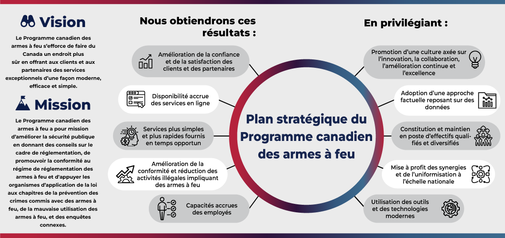

<!-- 
Rapport du commissaire aux armes à feu 2025
-->

<section>
  <h2>Sur cette page</h2>
  <ul class="mrgn-bttm-lg">
  <li><a href="#s1">Message du commissaire</a></li>
  <li><a href="#s2">Message de la directrice générale du Programme canadien des armes à feu</a></li>
  <li><a href="#s3">2025 en chiffres</a></li>
  <li><a href="#s4">Programme canadien des armes à feu</a></li>
  <li><a href="#s5">Points saillants en 2025</a></li>
  <li><a href="#s6">Promouvoir la conformité au régime de réglementation des armes à feu</a></li>
  <li><a href="#s7">Soutien aux organismes d'application de la loi</a></li>
  <li><a href="#s8">Regard vers l'avenir</a></li>
  </ul>
  </section>
  
  

  
Renseignements sur la publication<!-- et formats substituts-->

  
Rapport du commissaire aux armes à feu 2025

  
© Sa Majesté le Roi du chef du Canada, représenté par le ministre de la Sécurité publique, 2026 
  ISSN: 2371-6290

  <ul class="small">
  <li>Numéro de catalogue PS96E-PDF</li>
  <li>ISSN 1927-6923</li>
  </ul>
  <!-- 
<a href="/sites/default/files/doc/FILE.pdf">2025 Commissioner of Firearms Report (PDF, XXX&#160;KB)</a>
 -->
  <!-- 
<a href="https://publications.gc.ca/site/eng/9.949188/publication.html">Available from GC&nbsp;Publications</a>
 -->
  <!-- 
<a href="https://">Available from the Open Government Portal</a>
 -->
  

  

    
Liste des acronymes et abréviations

    <dl class="dl-horizontal mrgn-bttm-0">
      <dt><abbr>PCAF</abbr></dt>
      <dd>Programme canadien des armes à feu</dd>
      <dt><abbr>GRC</abbr></dt>
      <dd>Gendarmerie royale du Canada</dd>
    </dl>
  

  
  

  
Liste des graphiques

  <ul>
  <li><a href="#c1">Graphique 1&#160;: Renouvellements des permis d'armes à feu, de 2021 à 2025.</a></li>
  <li><a href="#c2">Graphique 2&#160;: Renouvellements des permis d'armes à feu prohibées et à autorisation restreinte pour particulier en possession d'une arme à feu enregistrée de 2021 à 2025</a></li>
  <li><a href="#c3">Graphique 3&#160;: Nombre de particuliers visés par une interdiction de posséder des armes à feu, de 2021 à 2025</a></li>
  </ul>
  

  
  

  
Liste des figures

  <ul>
  <li><a href="#f1">Figure 1&#160;: Plan stratégique du Programme canadien des armes à feu</a></li>
  </ul>
  

  
  

  
Liste des tableaux

  <ul>
  <li><a href="#t1">Tableau 1&#160;: Permis d'armes à feu pour particulier, par type et par province ou territoire, 2025</a></li>
  <li><a href="#t2">Tableau 2&#160;: Nombre de titulaires de permis de possession et d'acquisition et de titulaires de permis pour mineur, de 2021 à 2025</a></li>
  <li><a href="#t3">Tableau 3&#160;: Nombre de permis pour particulier délivrés en 2025 (y compris les nouveaux permis et les renouvellements)</a></li>
  <li><a href="#t4">Tableau 4&#160;: Permis de possession et d'acquisition et permis pour mineur, par province ou territoire, 2025</a></li>
  <li><a href="#t5">Tableau 5&#160;: Privilèges du permis de possession et d'acquisition par province ou territoire, 2025</a></li>
  <li><a href="#t6">Tableau 6&#160;: Nombre de refus de demande de permis d'armes à feu, de 2021 à 2025</a></li>
  <li><a href="#t7">Tableau 7&#160;: Motifs de refus d'une demande de permis d'armes à feu, 2025</a></li>
  <li><a href="#t8">Tableau 8&#160;: Nombre de révocations de permis d'armes à feu, de 2021 à 2025</a></li>
  <li><a href="#t9">Tableau 9&#160;: Motifs de révocation des permis d'armes à feu, 2025</a></li>
  <li><a href="#t10">Tableau 10&#160;: Armes à feu enregistrées au nom de particuliers ou d'entreprises, selon la catégorie, de 2021 à 2025</a></li>
  <li><a href="#t11">Tableau 11&#160;: Armes à feu enregistrées au nom de particuliers ou d'entreprises au Canada en 2025, selon la catégorie et province ou territoire</a></li>
  <li><a href="#t12">Tableau 12&#160;: Nombre de refus de demandes d'enregistrement et de révocations, de 2021 à 2025</a></li>
  <li><a href="#t13">Tableau 13&#160;: Vérifications de permis menées en 2025</a></li>
  <li><a href="#t14">Tableau 14&#160;: Autorisations de transport, 2025</a></li>
  <li><a href="#t15">Tableau 15&#160;: Permis d'armes à feu pour entreprise valides, de 2021 à 2025</a></li>
  <li><a href="#t16">Tableau 16&#160;: Installations de champs de tir et clubs de tir, 2025</a></li>
  </ul>
  

  
  

  
Coordonnées

  <dl>
  <dt>Programme canadien des armes à feu de la GRC</dt>
  <dd>
  Ottawa (Ontario)&nbsp; K1A&nbsp;0R2 
  1-800-731-4000 (sans frais) 
  <a href="mailto:cfp-pcaf@rcmp-grc.gc.ca">cfp-pcaf@rcmp-grc.gc.ca</a> 
  <a href="/fr/armes-feu">Armes à feu - GRC.ca</a>
  </dd>
  <dt>Relations avec les médias de la GRC</dt>
  <dd>
  1-613-843-5999 
  <a href="mailto:rcmp.hqmediarelations-dgrelationsmedias.grc@rcmp-grc.gc.ca">rcmp.hqmediarelations-dgrelationsmedias.grc@rcmp-grc.gc.ca</a>
  </dd>
  </dl>
  

  
  <section id="s1">
  <h2>Message du commissaire</h2>
  
  

  

  <figure>
  
  <figcaption>
  <b>Mike Duheme</b> 
  Commissaire de la GRC et commissaire aux armes à feu
  </figcaption>
  </figure>
  

  

  
  
Je suis ravi de vous présenter l'édition 2025 du rapport du commissaire aux armes à feu. Le présent rapport annuel donne un aperçu des efforts déployés par les responsables du Programme canadien des armes à feu en ce qui a trait à la délivrance de permis et à l'enregistrement des armes à feu ainsi que de son appui aux clients et aux partenaires.

  
Le Programme canadien des armes à feu contribue de façon essentielle au contrôle des armes à feu. Il applique la <cite>Loi sur les armes à feu</cite> et ses règlements, offre des services de soutien spécialisés aux organismes d'application de la loi, et fait la promotion de la sécurité dans le maniement des armes à feu.

  
Cette année, le Programme canadien des armes à feu a davantage mis l'accent sur la formation et la collaboration, et sur la recherche d'occasions de renforcer ses services. Ses responsables ont mené un sondage parmi les partenaires policiers canadiens et ont coanimé une conférence sur les groupes de travail intégrés sur les armes à feu destinée aux agents d'application de la loi et aux procureurs de la Couronne de partout au Canada, qui mettait l'accent sur le trafic et l'importation d'armes à feu. Le Programme a renforcé l'aide aux organismes d'application de la loi canadiens et étrangers dans le but de lutter contre le trafic d'armes à feu en fournissant des services de dépistage des armes à feu qui déterminent l'origine et la lignée des armes à feu saisies. Le Programme canadien des armes à feu a aussi appuyé les contrôleurs des armes à feu provinciaux et territoriaux lors de la mise en œuvre de nouveaux outils législatifs, y compris des lois relatives à la suspension temporaire des permis et des pouvoirs accrus de révocation et de refus de permis.

  
En mai 2025, la directrice générale du Programme canadien des armes à feu, Kellie Paquette, a été reçue membre de l'Ordre du mérite des corps policiers par la gouverneure générale du Canada, pour ses contributions exceptionnelles aux services policiers ainsi qu'à la sécurité et au développement communautaires. Sous sa direction, le Programme canadien des armes à feu continue d'aider les services de police à mieux détecter et cibler les crimes commis à l'aide d'une arme à feu ainsi qu'à réduire le nombre d'activités illégales pendant lesquelles une arme à feu est utilisée.

  
Ensemble, nous demeurons résolus à faire du Canada un endroit plus sûr.
 
  </section>
  
  <section id="s2">
  <h2>Message de la directrice générale du Programme canadien des armes à feu</h2>
  

  

  <figure>
  
  <figcaption>
  <b>Kellie Paquette</b> 
  Directrice générale, Programme canadien des armes à feu
  </figcaption>
  </figure>
  

  

  
  
Le présent rapport présente en détail le travail exceptionnel que le Programme canadien des armes à feu a accompli en collaboration avec ses partenaires fédéraux, provinciaux, territoriaux, autochtones et internationaux en 2025.

  
Il s'efforce d'offrir des services exceptionnels à ses clients et à ses partenaires d'une façon moderne, efficace et simple. En 2025, le Programme canadien des armes à feu a continué de moderniser les services à la clientèle, avec des efforts accrus visant à élargir l'utilisation de l'automatisation et à accroître le recours aux services numériques dans le cadre d'une initiative de réduction de la lourdeur de la réglementation.
  
  
Les contrôleurs des armes à feu œuvrent quotidiennement dans des collectivités partout au Canada pour fournir de l'information et des ressources au public afin de promouvoir la sécurité dans le maniement des armes à feu. Les instructeurs offrent une formation complète sur le maniement sécuritaire des armes à feu aux personnes qui cherchent à obtenir un permis d'armes à feu. Nous avons mis davantage l'accent sur la formation pour tenir compte des préoccupations en matière d'accessibilité, de peuples autochtones et de santé mentale ainsi que des changements législatifs liés à la violence entre partenaires intimes. Nos efforts visent à réduire les risques liés aux armes à feu dans les cas de violence conjugale et à protéger nos collectivités et nos populations vulnérables contre la violence liée aux armes à feu.
  
  
Je suis très fière de la collaboration entre les contrôleurs des armes à feu, le directeur de l'enregistrement des armes à feu, les agents d'application de la loi, et des efforts de tous les employés du Programme canadien des armes à feu, alors que nous collaborons pour innover et améliorer la manière dont nous appliquons la <cite>Loi sur les armes à feu</cite> et améliorons la sécurité publique pour tous les Canadiens.

  </section>
  
  <section id="s3">
  <h2>2025 en chiffres</h2>
  
  <section id="s3-1">
  <h3>Permis et l'enregistrement des armes à feu</h3>
  
Il y avait <b>2&#160;473&#160;661</b> titulaires de permis d'armes à feu.

  <ul>
  <li><b>1&#160;626&#160;754</b> titulaires de permis de possession d'arme à feu sans restriction</li>
  <li><b>14&#160;984</b> titulaires de permis pour mineur</li>
  <li><b>794&#160;768</b> titulaires de permis permettant la possession d'armes à feu à autorisation restreinte</li>
  <li><b>37&#160;155</b> titulaires de permis permettant la possession d'armes à feu à autorisation prohibées</li>
  </ul>
  
Il y avait <b>3&#160;766</b> entreprises d'armes à feu titulaires de permis, sans compter les musées.

  
Il y avait <b>269</b> transporteurs titulaires de permis.

  
Il y avait <b>1&#160;253&#160;010</b> armes à feu enregistrées.

  
Au total, <b>421&#160;022</b> numéros de référence ont demandé la cession d'armes à feu sans restriction. De ce nombre, <b>417&#160;748</b> ont été accordées et <b>3&#160;274</b> ne l'ont pas été.

  </section>
  
  <section id="s3-2">
  <h3>Tableau de référence des armes à feu</h3>
  
Le <a href="/fr/armes-feu/tableau-reference-armes-feu">Tableau de référence des armes à feu</a> contient plus de <b>211&#160;000</b> enregistrements individuels.

  
<b>3&#160;382</b> nouveaux enregistrements ont été ajoutés et <b>1&#160;491</b> enregistrements ont été mis à jour.

  </section>
  
  <section id="s3-3">
  <h3>Soutien aux organismes d'application de la loi</h3>
  
Au total, il y avait <b>&#160;826</b> armes à feu dépistées et <b>3&#160;885</b> armes à feu utilisées à des fins criminelles repérées.

  
<b>25&#160;780</b> requêtes en ligne effectuées chaque jour dans le Registre canadien des armes à feu.

  </section>
  
  <section id="s3-4">
  <h3>Aide et renseignements pour le public</h3>
  
Messages sécurisés échangés avec les clients au moyen du portail MonPCAF&#160;:

  <ul>
  <li><b>134&#160;643</b> messages envoyés</li>
  <li><b>46&#160;644</b> messages reçus</li>
  </ul>
  
Mises à jour des avis aux clients relativement aux demandes&#160;: <b>1&#160;327&#160;512</b>

  
Courrier entrant et demandes par courriel&#160;:

  <ul>
  <li><b>266&#160;692</b> envois postaux reçus</li>
  <li><b>18&#160;238</b> demandes de renseignement reçues par courriel</li>
  </ul>
  
<b>911&#160;203</b> appels téléphoniques reçus par le Programme canadien des armes à feu

  
Site Web du Programme canadien des armes à feu (version anglaise)&#160;:

  <ul>
  <li>Nombre total de visites&#160;: <b>12&#160;567&#160;885</b></li>
  <li>Nombre d'utilisateurs actifs&#160;: <b>2&#160;002&#160;458</b></li>
  </ul>
  
Site Web du Programme canadien des armes à feu (version française)&#160;:

  <ul>
  <li>Nombre total de visites&#160;: <b>2&#160;455&#160;935</b></li>
  <li>Nombre d'utilisateurs actifs&#160;: <b>64 &#160;534</b></li>
  </ul>
  
Utilisateurs autorisés sur MonPCAF&#160;: <b>518&#160;100</b>

  
Services Web pour les particuliers&#160;: 

  <ul>
  <li>Nombre total de vues&#160;: <b>2,8 millions</b></li>
  <li>Nombre d'utilisateurs actifs&#160;: <b>471&#160;120</b></li>
  </ul>
  
Services Web pour les entreprises&#160;:

  <ul>
  <li>Nombre d'utilisateurs qui ont ouvert une séance&#160;: <b>321&#160;571</b></li>
  <li>Nombre d'utilisateurs actifs&#160;: <b>1&#160;182</b></li>
  </ul>
  
Tableau de référence des armes à feu (site Web anglais)&#160;:

  <ul>
  <li>Nombre total de vues&#160;: <b>165&#160;715</b></li>
  <li>Nombre d'utilisateurs actifs&#160;: <b>50&#160;803</b></li>
  </ul>
  
Tableau de référence des armes à feu (site Web français)&#160;:

  <ul>
  <li>Nombre total de vues&#160;: <b>21&#160;466</b></li>
  <li>Nombre d'utilisateurs actifs&#160;: <b>5&#160;821</b></li>
  </ul>
  </section>
  </section>
  
  <section id="s4">
  <h2>Programme canadien des armes à feu </h2>
  
Le Programme canadien des armes à feu a pour mission d'améliorer la sécurité publique en fournissant des conseils sur le cadre de réglementation, en favorisant la conformité au régime de réglementation des armes à feu et en appuyant les organismes d'application de la loi au chapitre de la prévention des crimes commis avec des armes à feu, de la mauvaise utilisation des armes à feu et des enquêtes connexes.

  
Dans le cadre de sa mission, le Programme canadien des armes à feu&#160;:

  <ul>
  <li>favorise la possession et l'utilisation légales d'armes à feu au Canada en réglementant la délivrance des permis et l'enregistrement des armes à feu, et fournit aux utilisateurs d'armes à feu un service de qualité et un traitement équitable tout en assurant la protection des renseignements confidentiels;</li>
  <li>reconnaît que son efficacité passe par la participation des propriétaires et utilisateurs d'armes à feu, des entreprises d'armes à feu, des organismes d'application de la loi, des provinces et des territoires, des organismes fédéraux, des collectivités autochtones, des instructeurs en matière de sécurité et des vérificateurs des armes à feu;</li>
  <li>s'engage à s'améliorer et à innover continuellement afin d'offrir un service et une expérience utilisateur de niveau supérieur;</li>
  <li>suscite la participation de ses clients et des intervenants dans le cadre de l'examen et de l'élaboration des politiques et de la communication des renseignements cruciaux sur ses exigences et ses résultats;</li>
  <li>gère ses ressources de manière efficace pour optimiser celles-ci;</li>
  <li>présente des rapports clairs et précis sur le rendement et la gestion des ressources du programme.</li>
  </ul>
  
  <section id="s4-1">
  <h3>Notre vision</h3>
  
Le Programme canadien des armes à feu s'efforce de faire du Canada un endroit encore plus sûr en offrant aux clients et aux partenaires des services exceptionnels d'une façon moderne, efficace et simple.

  
  <figure id="f1" class="panel panel-default mrgn-bttm-lg">
  <figcaption class="panel-heading">Figure 1 <b>Plan stratégique du Programme canadien des armes à feu</b></figcaption>
  

  
  

  <footer class="panel-footer">
  

  
Version textuelle

  
Le graphique présente le plan stratégique du Programme canadien des armes à feu. Il illustre la mission et la vision du Programme, puis les secteurs sur lesquels le Programme se concentrera ainsi les résultats attendus.

  <section>
  <h4>Vision</h4>
  
Le Programme canadien des armes à feu s'efforce de faire du Canada un endroit encore plus sûr en offrant aux clients et aux partenaires des services exceptionnels d'une façon moderne, efficace et simple.

  </section>
  <section>
  <h4>Mission</h4>
  
Le Programme canadien des armes à feu a pour mission d'améliorer la sécurité publique en fournissant des conseils sur le cadre de réglementation, en favorisant la conformité au régime de réglementation des armes à feu et en appuyant les organismes d'application de la loi au chapitre de la prévention des crimes commis avec des armes à feu, de la mauvaise utilisation des armes à feu et des enquêtes connexes.

  </section>

  <section>
  <h4>Principaux secteurs ciblés</h4>
  
Le graphique énumère cinq secteurs sur lesquels le Programme se concentrera sur&#160;:

  <ul>
  <li>la promotion d'une culture axée sur l'innovation, la collaboration, l'amélioration continue et l'excellence</li>
  <li>adoption d'une approche fondée sur des données probantes</li>
  <li>constitution et le maintien en poste d'effectifs qualifiés et diversifiés</li>
  <li>mise à profit des synergies et de l'uniformisation à l'échelle nationale</li>
  <li>utilisation des outils et des technologies modernes</li>
  </ul>

  </section>
  <section>
  <h4>Résultats</h4>
  
Le graphique énumère les résultats que le Programme s'attend à obtenir&#160;:

  <ul>
  <li>augmentation de la confiance et de la satisfaction des clients et des partenaires</li>
  <li>disponibilité accrue des services en ligne</li>
  <li>services plus simples et plus rapides fournis en temps opportun</li>
  <li>amélioration de la conformité et réduction des activités illégales impliquant des armes à feu</li>
  <li>capacités accrues des employés</li>
  </ul>
  </section>
  

  </footer>
  </figure>
  </section>
  
  <section id="4-2">
  <h3>Travailler avec nos partenaires</h3>
  
Le Programme collabore avec divers partenaires nationaux et internationaux&#160;:

  <ul>
  <li><b>Sécurité publique Canada</b> en offrant un soutien stratégique et en transmettant des renseignements techniques liés aux armes à feu;</li>
  <li><b>Agence des services frontaliers du Canada et Affaires mondiales Canada </b> en présentant une orientation technique sur les questions liées aux armes à feu pour les questions internationales et transfrontalières;</li>
  <li><b>Ministère de la Justice et Sécurité publique Canada</b> en appuyant l'élaboration de politiques juridiques dans le domaine des armes à feu;</li>
  <li><b>Relations Couronne-Autochtones et Affaires du Nord Canada et Services aux Autochtones Canada</b> il les soutient en ce qui concerne la
  législation sur les armes à feu et les enjeux connexes qui présentent un intérêt particulier pour les Autochtones;</li>
  <li><b>Organismes d'application de la loi municipaux, provinciaux et territoriaux</b> en leur offrant un soutien dans le cadre d'enquêtes menant à des poursuites contre des personnes impliquées dans la contrebande, le trafic et l'utilisation criminelle d'armes à feu;</li>
  <li><b>Partenaires internationaux</b> en collaborant avec des organismes d'application de la loi des États-Unis et d'INTERPOL pour aider à réduire le déplacement illégal d'armes à feu au-delà des frontières, et il communique le Tableau de référence des armes à feu à 196 pays.</li>
  </ul>
  </section>
  </section>
  
  <section id="s5">
  <h2>Points saillants en 2025</h2>
  
  <section id="s5-1">
  <h3>Les services en ligne MonPCAF</h3>
  
En tant qu'<a href="https://www.securitepublique.gc.ca/cnt/trnsprnc/cts-rgltns/rgltry-rd-tp-rdctn/prgrss-rprt-fr.aspx#a4.1">Initiative de réduction de la lourdeur de la réglementation</a>, la Solution de services en ligne du Programme canadien des armes à feu améliore la prestation de services aux clients et réduire le fardeau administratif, tout en renforçant les résultats en matière de conformité et de sécurité publique.

  
Le Programme canadien des armes à feu continue de migrer en ligne d'autres demandes sur papier. L'utilisation de nos services en ligne a continué de croître constamment en 2025, ce qui nous a aidés à nous adapter, pendant l'interruption de travail à Postes Canada. Le nombre de nouvelles demandes de permis de possession et d'acquisition présentées par la poste a diminué de 60&#160;% depuis 2022.

  
Au total, 56,4&#160;% des nouvelles demandes de permis de possession et d'acquisition ont été faites en ligne en 2025. Le nombre réduit d'envois postaux aide
  le Programme canadien des armes à feu à atteindre ses objectifs et ses résultats escomptés en matière de durabilité pour ce qui est des économies opérationnelles et de la diminution des coûts.

  
Depuis 2021, nous avons lancé 16 services en ligne par l'intermédiaire de <a href="https://firearms-armes-a-feu.rcmp-grc.ca/fr/">MonPCAF</a>. Les commentaires des utilisateurs ont été positifs — lors d'un récent sondage, 81&#160;% des répondants ont indiqué que les services de MonPCAF étaient très positifs ou positifs.

  
Les clients peuvent maintenant utiliser le libre-service en allant en ligne pour mener les transactions suivantes&#160;:

  <ul>
  <li>Demande de permis de possession et d'acquisition (clients effectuant une première demande)</li>
  <li>Demande de permis pour entreprise (clients effectuant une première demande)</li>
  <li>Demande de permis pour transporteur (clients effectuant une première demande)</li>
  <li>Demande de permis pour mineur (clients effectuant une première demande)</li>
  <li>demandes présentées en vertu du <cite>Règlement d'adaptation visant les armes à feu des peuples autochtones du Canada</cite></li>
  <li>Demande de permis temporaire d'emprunt d'armes à feu pour non-résident</li>
  <li>demande d'approbation pour un club de tir</li>
  <li>demande d'approbation pour un champ de tir</li>
  <li>demande pour devenir un instructeur de maniement des armes à feu</li>
  <li>demande pour devenir un vérificateur de maniement des armes à feu</li>
  <li>présentation de rapports sur le Cours canadien de sécurité dans le maniement des armes à feu et le Cours canadien de sécurité dans le maniement des armes à feu à autorisation restreinte</li>
  <li>présentation d'une preuve d'emploi avec une demande de permis</li>
  <li>demande relative à la dispense des droits applicables aux permis d'armes à feu</li>
  <li>déclaration d'exemption de photo</li>
  <li>services liés aux organismes responsables de la prestation de formation de sécurité</li>
  <li>messagerie protégée bidirectionnelle MonPCAF</li>
  </ul>

  
Les demandes en ligne sont plus précises, réduisent le suivi des clients et sont traitées plus rapidement que les demandes sur papier. Le Programme canadien des armes à feu continue d'inciter les propriétaires d'armes à feu à utiliser les nombreux programmes et services en ligne pour gagner du temps.

  
Il favorise également l'utilisation d'outils d'intelligence artificielle et d'améliorations apportées à l'aide de l'intelligence artificielle afin de réduire la saisie manuelle des données et à accroître la productivité grâce à l'automatisation de la saisie des décisions judiciaires.

  </section>
  
  <section id="s5-2">
  <h3>Soutien à l'application de la loi</h3>
  
En 2025, le Programme canadien des armes à feu a continué de collaborer avec des partenaires pour appuyer ses efforts visant à accroître la conformité et à réduire les activités illégales avec armes à feu.

  
Le Programme des procureurs de la Couronne a collaboré avec le ministère du Procureur général de l'Ontario pour organiser une conférence nationale (le forum de 2025 sur les mégaprocès liés au crime organisé et au trafic d'armes à feu), qui comportait un programme éducatif interdisciplinaire intensif destiné aux forces de l'ordre et aux procureurs de la Couronne partout au Canada ainsi qu'aux partenaires internationaux.
  
  
Une formation spécialisée a été offerte aux procureurs et aux enquêteurs spécialisés en armes à feu pour améliorer les résultats dans les dossiers complexes liés aux armes à feu, et elle portait principalement sur le trafic des armes à feu, l'importation et les armes à feu fabriquées par des particuliers. L'un des objectifs principaux était de rassembler des experts afin qu'ils discutent des pratiques actuelles et de pointe parmi les agents d'application de la loi et les procureurs qui ciblent le crime organisé impliquant des armes à feu.
  
  
Le groupe Services spécialisés de soutien en matière d'armes à feu ont appuyé les forces de l'ordre en Nouvelle-Écosse lors du premier cas d'impression 3D d'une arme fabriquée en métal au Canada. Ils ont rédigé des rapports d'experts sur la fabrication illégale pour appuyer la poursuite. Leurs activités d'inspection ont contribué à l'obtention d'un résultat positif.
  
  
Le groupe Soutien aux enquêtes sur Internet en matière d'armes à feu a collaboré avec un contrôleur des armes à feu dans le cadre d'un projet pilote servant à appuyer un meilleur dépistage des problèmes de santé mentale des titulaires de permis et des demandeurs.
  
  
Le Centre national de dépistage des armes à feu a mené un examen interne exhaustif afin de moderniser ses flux de travail et d'améliorer la prestation de ses services. Ces efforts ont contribué à une réduction de 77&#160;% de l'attente avant le début du dépistage et à une réduction de 56&#160;% du temps de traitement au deuxième semestre de 2025.

  </section>
  
  <section id="s5-3">
  <h3>Ancien projet de loi C-21</h3>
  
Le 7 mars 2025, un nouveau régime de suspension de permis («&#160;loi du drapeau jaune&#160;») est entré en vigueur. Celle-ci permet au contrôleur des armes à feu de suspendre temporairement le permis d'armes à feu d'un particulier ou d'une entreprise pendant une période maximale de 30 jours lorsqu'il soupçonne que le titulaire n'est plus admissible au permis. Le titulaire d'un permis suspendu peut continuer de posséder des armes à feu, mais ne peut ni les utiliser, ni en acquérir, ni en importer.

  
Des pouvoirs élargis en matière d'inadmissibilité à un permis et de révocation de permis sont entrés en vigueur le 4 avril 2025. Toute personne reconnue coupable d'une infraction perpétrée avec usage, tentative ou menace de violence contre son partenaire intime ou tout membre de sa famille se verra inadmissible à détenir un permis d'armes à feu. Ces pouvoirs permettent aussi à un contrôleur des armes à feu de révoquer le permis d'armes à feu d'une personne s'il a des motifs raisonnables de soupçonner le titulaire de violence familiale ou de harcèlement criminel.

  </section>
  
  <section id="s5-4">
  <h3>Interdiction visant les armes à feu</h3>
  
Le <a href="/fr/armes-feu/ce-que-vous-devez-savoir-au-sujet-linterdiction-du-gouvernement-du-canada-datee-du-7-mars-2025">7 mars 2025</a>, le gouvernement a annoncé une interdiction des armes à feu. Le <a href="/fr/armes-feu/tableau-reference-armes-feu">Tableau de référence des armes à feu</a>, tenu à jour par le Programme canadien des armes à feu, a été mis à jour afin de refléter la nouvelle classification de ces armes à feu en tant qu'armes prohibées. Cela était en plus des armes à feu déjà prohibées le <a href="/fr/armes-feu/ce-que-vous-devez-savoir-au-sujet-linterdiction-du-gouvernement-du-canada-datee-du-5-decembre-2024">5 décembre 2024</a>, et le <a href="/fr/armes-feu/ce-que-vous-devez-savoir-sur-linterdiction-certaines-armes-feu-et-certains-dispositifs">1 mai 2020</a>. Le 16 octobre 2025, le gouvernement a prolongé les décrets d'amnistie jusqu'au 30 octobre 2026 pour ces armes à feu prohibées. Des décrets d'amnistie sont en place pour éviter que les propriétaires actuels soient tenus criminellement responsables, le temps qu'ils prennent des mesures pour se conformer à la loi.

  </section>
  
  <section id="s5-5">
  <h3>Santé mentale</h3>
  
Les contrôleurs des armes à feu et le Programme canadien des armes à feu ont continué d'accorder la priorité à la prise en compte de la santé mentale lors de la délivrance des permis d'armes à feu. Nous examinons les recommandations d'un groupe de travail constitué d'experts pour fournir des directives renforcées, dans le but d'aider les contrôleurs des armes à feu dans le cadre des enquêtes liées à la délivrance, au refus ou à la révocation de permis d'armes à feu lorsque l'admissibilité continue des titulaires de permis ayant des problèmes de santé mentale pourrait être un facteur, et pour inciter une approche normalisée à travers tout le Canada.

  
Par ailleurs, le Programme canadien des armes à feu a appuyé un contrôleur des armes à feu en menant un projet pilote visant à utiliser des outils d'enquête afin d'améliorer le dépistage des troubles de santé mentale chez les demandeurs de permis d'armes à feu.

  </section>
  
  <section id="s5-6">
  <h3>Mobilisation des Autochtones</h3>
  
Le Programme canadien des armes à feu est résolu à établir et à maintenir des relations positives avec les peuples autochtones et à travailler avec eux pour assurer <a href="/fr/armes-feu/permis/peuples-autochtones">la sécurité dans le maniement des armes à feu dans les collectivités des Premières Nations, des Inuits et des Métis</a>. En 2025, le PCAF a augmenté le nombre de préposés aux armes à feu et d'instructeurs spécialisés en matière d'armes à feu résidant au sein de ces trois territoires. Il a proposé des cours sur la sécurité dans le maniement des armes à feu réservés aux jeunes et aux femmes et a également accru les efforts de mobilisation, et nous sommes ravis du nombre croissant de demandes dans le cadre du <a href="/fr/armes-feu/financement-pour-securite-dans-maniement-armes-feu-en-collectivite-autochtone">Programme de financement de la sécurité dans le maniement des armes à feu dans les collectivités autochtones</a>. Nous sommes impatients d'appuyer plusieurs activités visant à promouvoir l'utilisation et le maniement sécuritaires des armes à feu.

  </section>
  
  <section id="s5-7">
  <h3>Comité national de contrôle des armes à feu</h3>
  
La nomination de la directrice générale du Programme canadien des armes à feu en tant que co-présidente du comité sur les armes à feu de l'Association canadienne des chefs de police donne d'autres occasions d'harmoniser les efforts entre les différents partenaires afin de réduire les infractions liées aux armes à feu et leurs répercussions au sein de nos communautés.

  </section>
  
  <section id="s5-8">
  <h3>Communication de renseignements</h3>
  
L'ancien projet de loi C-21 a modifié l'article 88.1 de la <cite>Loi sur les armes à feu</cite> de façon à mettre en place un mécanisme permettant la communication aux organismes d'application de la loi de renseignements précis sur le permis et l'enregistrement dans des cas particuliers. S'il existe des motifs raisonnables de croire qu'une personne utilise ou a utilisé un permis pour céder, ou offrir de céder, une arme à feu en vue d'en faire le trafic, le commissaire aux armes à feu, le directeur de l'enregistrement des armes à feu et les contrôleurs des armes à feu peuvent communiquer, à un organisme d'application de la loi, les renseignements précisés par la <cite>Loi sur les armes à feu</cite>.

  
L'ancien projet de loi C-21 a également modifié l'article 93(1.1) de la Loi de façon à rendre obligatoire l'inclusion dans le rapport annuel du commissaire aux armes à feu des renseignements sur les communications faites en vertu de l'article 88.1.

  
Le présent rapport porte sur la période du 1 janvier au 31 décembre 2025. Au cours de cette période, les renseignements sur les permis et les enregistrements qui suivent ont été communiqués aux organismes d'application de la loi conformément au paragraphe 88.1 de la <cite>Loi sur les armes à feu</cite>&#160;:

  
  <section id="s5-8-1">
  <h4>Communications de renseignements sur les permis et l'enregistrement des armes à feu faites, en vertu du paragraphe 99(1) ou 100(1) du <cite>Code criminel</cite>, à un organisme d'application de la loi à l'appui d'une enquête ou d'une poursuite judiciaire (du 1 janvier au 31 décembre 2025)</h4>
  <ul>
  <li>Commissaire aux armes à feu&#160;: 0</li>
  <li>Directeur de l'enregistrement des armes à feu&#160;: 0</li>
  <li>Contrôleurs des armes à feu&#160;: 105</li>
  </ul>
  </section>
  </section>
  </section>
  
  <section id="s6">
  <h2>Promouvoir la conformité au régime de réglementation des armes à feu</h2>
  
Le Programme canadien des armes à feu applique la <cite>Loi sur les armes à feu</cite> et ses règlements, ce qui comprend la délivrance de permis aux particuliers et aux entreprises par l'entremise des <a href="/fr/armes-feu/communiquer-avec-controleur-armes-feu">contrôleurs des armes à feu</a>, et l'enregistrement des armes à feu avec restrictions et des armes à feu prohibées par l'entremise du directeur de l'enregistrement des armes à feu. Les <a href="/fr/armes-feu/modification-frais-service">droits de demande</a> pour les permis figurent sur le site Web du Programme canadien des armes à feu.

  
Les programmes nationaux d'éducation en matière de sécurité des armes à feu du Programme canadien des armes à feu sont essentiels à l'utilisation, à la manipulation et à l'entreposage sécuritaires des armes à feu. En collaboration avec les organismes partenaires et les gouvernements provinciaux et territoriaux, le Programme diffuse de l'information sur la sécurité aux propriétaires et utilisateurs d'armes à feu, aux entreprises, aux fabricants et au grand public.

  
  <section id="s6-1">
  <h3>Surveillance de la délivrance des permis et de l'enregistrement des armes à feu</h3>
  
La délivrance des permis et l'enregistrement des armes à feu relèvent de la responsabilité du Programme canadien des armes à feu envers le public. Ces services permettent aux particuliers canadiens et aux entreprises, y compris les fabricants, les magasins de détail et les musées, de demander des permis pour posséder, transporter, acheter, vendre ou exposer des armes à feu ou des munitions et de demander des certificats d'enregistrement.

  
Les contrôleurs des armes à feu sont chargés de surveiller certains aspects de la <cite>Loi sur les armes à feu</cite> dans leur province ou territoire de compétence et ont les pouvoirs discrétionnaires suivants&#160;:

  <ul>
  <li>approuver et refuser les demandes de permis pour les particuliers et les entreprises;</li>
  <li>approuver et refuser les autorisations de transport et certaines demandes de port d'armes à feu;</li>
  <li>approuver les clubs et les champs de tir;</li>
  <li>inspecter les entreprises d'armes à feu et les champs de tir;</li>
  <li>surveiller l'admissibilité continue des titulaires de permis d'armes à feu;</li>
  <li>révoquer les permis d'armes à feu, les autorisations et les approbations.</li>
  </ul>

  
Il incombe aux contrôleurs des armes à feu de surveiller la prestation du <a href="/fr/armes-feu/securite-formation-transport-et-entreposage-armes-feu/cours-securite">Cours canadien de sécurité dans le maniement des armes à feu</a> et du <a href="/fr/armes-feu/securite-formation-transport-et-entreposage-armes-feu/cours-securite">Cours canadien de sécurité dans le maniement des armes à feu à autorisation restreinte</a>.

  
Le directeur de l'enregistrement des armes à feu est chargé de surveiller certains aspects de la <cite>Loi sur les armes à feu</cite> pour l'ensemble des provinces et des territoires et a les pouvoirs suivants&#160;:

  <ul>
  <li>approuver et refuser les demandes d'enregistrement et de cession pour les particuliers et les entreprises;</li>
  <li>approuver et refuser les demandes de permis de transporteur;</li>
  <li>émettre et refuser les demandes de vérification de permis;</li>
  <li>offrir un soutien technique pour la vérification des armes à feu;</li>
  <li>délivrer, refuser et révoquer les désignations pour les vérificateurs d'armes à feu;</li>
  <li>vérifier l'exactitude des renseignements sur la classification des armes à feu;</li>
  <li>traiter les demandes de modification de la description des armes à feu;</li>
  <li>traiter les demandes de neutralisation, de destruction, d'exportation et de statut d'arme à feu historique;</li>
  <li>délivrer les numéros d'identification des agences de services publics;</li>
  <li>traiter les demandes et les inventaires d'armes à feu des agences de services publics.</li>
  </ul>
  
En date du 31 décembre 2025, le Canada comptait&#160;:

  <ul>
  <li>2&#160;458&#160;677 permis de possession et d'acquisition valides et 14&#160;984 permis d'armes à feu pour mineur valides (<a href="#t1">tableau 1</a>).</li>
  <li>1&#160;253&#160;010 armes à feu enregistrées. Seules les armes à feu prohibées ou à autorisation restreinte doivent être enregistrées (<a href="#t10">tableau 10</a>).</li>
  <li>3&#160;766 entreprises d'armes à feu titulaires d'un permis, sans compter les musées et les transporteurs. De ce nombre, 1&#160;359 entreprises étaient titulaires d'un permis de vente de munitions seulement (<a href="#t15">tableau 15</a>).</li>
  </ul>
  
Les tableaux qui suivent comprennent des données sur la délivrance des permis et l'enregistrement des armes à feu.

  
Le tableau 1 présente une répartition des permis d'armes à feu pour particulier, selon le type et la province ou le territoire en 2025.

  
  <table class="table table-bordered table-condensed" id="t1">
  <caption class="text-left">Tableau 1&#160;: Permis d'armes à feu pour particulier, par type et par province ou territoire, 2025</caption>
  <thead>
  <tr class="active">
  <th scope="col">Province ou territoire</th>
  <th scope="col" class="text-right">Permis de possession et d'acquisition</th>
  <th scope="col" class="text-right">Permis pour mineur</th>
  <th scope="col" class="text-right">Total</th>
  </tr>
  </thead>
  <tbody>
  <tr>
  <th scope="row" data-label="Province ou territoire">Alberta</th>
  <td data-label="Permis de possession et d'acquisition" class="text-right nowrap">385&#160;449</td>
  <td data-label="Permis pour mineur" class="text-right nowrap">3&#160;406</td>
  <td data-label="Total" class="text-right nowrap">388&#160;855</td>
  </tr>
  <tr>
  <th scope="row" data-label="Province ou territoire">Colombie-Britannique</th>
  <td data-label="Permis de possession et d'acquisition" class="text-right nowrap">377&#160;271</td>
  <td data-label="Permis pour mineur" class="text-right nowrap">1&#160;667</td>
  <td data-label="Total" class="text-right nowrap">378&#160;938</td>
  </tr>
  <tr>
    <th scope="row" data-label="Province ou territoire">Île-du-Prince-Édouard</th>
    <td data-label="Permis de possession et d'acquisition" class="text-right nowrap">7&#160;532</td>
    <td data-label="Permis pour mineur" class="text-right nowrap">31</td>
    <td data-label="Total" class="text-right nowrap">7&#160;563</td>
  </tr>
  <tr>
  <th scope="row" data-label="Province ou territoire">Manitoba</th>
  <td data-label="Permis de possession et d'acquisition" class="text-right nowrap">105&#160;185</td>
  <td data-label="Permis pour mineur" class="text-right nowrap">846</td>
  <td data-label="Total" class="text-right nowrap">106&#160;031</td>
  </tr>
  <tr>
  <th scope="row" data-label="Province ou territoire">Nouveau-Brunswick</th>
  <td data-label="Permis de possession et d'acquisition" class="text-right nowrap">77&#160;820</td>
  <td data-label="Permis pour mineur" class="text-right nowrap">290</td>
  <td data-label="Total" class="text-right nowrap">78&#160;110</td>
  </tr>
  <tr>
    <th scope="row" data-label="Province ou territoire">Nouvelle-Écosse</th>
    <td data-label="Permis de possession et d'acquisition" class="text-right nowrap">80&#160;469</td>
    <td data-label="Permis pour mineur" class="text-right nowrap">726</td>
    <td data-label="Total" class="text-right nowrap">81&#160;195</td>
  </tr>
  <tr>
    <th scope="row" data-label="Province ou territoire">Nunavut</th>
    <td data-label="Permis de possession et d'acquisition" class="text-right nowrap">3&#160;412</td>
    <td data-label="Permis pour mineur" class="text-right nowrap">32</td>
    <td data-label="Total" class="text-right nowrap">3&#160;444</td>
  </tr>
  <tr>
    <th scope="row" data-label="Province ou territoire">Ontario</th>
    <td data-label="Permis de possession et d'acquisition" class="text-right nowrap">705&#160;303</td>
    <td data-label="Permis pour mineur" class="text-right nowrap">5&#160;964</td>
    <td data-label="Total" class="text-right nowrap">711&#160;267</td>
  </tr>
  <tr>
    <th scope="row" data-label="Province ou territoire">Québec</th>
    <td data-label="Permis de possession et d'acquisition" class="text-right nowrap">502&#160;111</td>
    <td data-label="Permis pour mineur" class="text-right nowrap">584</td>
    <td data-label="Total" class="text-right nowrap">502&#160;695</td>
  </tr>
  <tr>
    <th scope="row" data-label="Province ou territoire">Saskatchewan</th>
    <td data-label="Permis de possession et d'acquisition" class="text-right nowrap">123&#160;175</td>
    <td data-label="Permis pour mineur" class="text-right nowrap">723</td>
    <td data-label="Total" class="text-right nowrap">123&#160;898</td>
  </tr>
  <tr>
  <th scope="row" data-label="Province ou territoire">Terre-Neuve-et-Labrador</th>
  <td data-label="Permis de possession et d'acquisition" class="text-right nowrap">75&#160;826</td>
  <td data-label="Permis pour mineur" class="text-right nowrap">614</td>
  <td data-label="Total" class="text-right nowrap">76&#160;440</td>
  </tr>
  <tr>
  <th scope="row" data-label="Province ou territoire">Territoires du Nord-Ouest</th>
  <td data-label="Permis de possession et d'acquisition" class="text-right nowrap">6&#160;049</td>
  <td data-label="Permis pour mineur" class="text-right nowrap">21</td>
  <td data-label="Total" class="text-right nowrap">6&#160;070</td>
  </tr>
  <tr>
  <th scope="row" data-label="Province ou territoire">Yukon</th>
  <td data-label="Permis de possession et d'acquisition" class="text-right nowrap">9&#160;075</td>
  <td data-label="Permis pour mineur" class="text-right nowrap">80</td>
  <td data-label="Total" class="text-right nowrap">9&#160;155</td>
  </tr>
  <tr class="active">
  <th scope="row" data-label="Province ou territoire">Canada</th>
  <td data-label="Permis de possession et d'acquisition" class="text-right nowrap">2&#160;458&#160;677</td>
  <td data-label="Permis pour mineur" class="text-right nowrap">14&#160;984</td>
  <td data-label="Total" class="text-right nowrap">2&#160;473&#160;661</td>
  </tr>
  </tbody>
  </table>
  
  
Le tableau 2 présente une répartition des permis de possession et d'acquisition d'une année à l'autre depuis 2021.

  
  <table class="table table-bordered table-condensed" id="t2">
  <caption class="text-left">Tableau 2&#160;: Nombre de titulaires de permis de possession et d'acquisition et de titulaires de permis pour mineur, de 2021 à 2025</caption>
  <thead>
  <tr class="active">
  <th scope="col" class="text-right nowrap">2021</th>
  <th scope="col" class="text-right nowrap">2022</th>
  <th scope="col" class="text-right nowrap">2023</th>
  <th scope="col" class="text-right nowrap">2024</th>
  <th scope="col" class="text-right nowrap">2025</th>
  </tr>
  </thead>
  <tbody>
  <tr>
  <td data-label="2021" class="text-right nowrap">2&#160;245&#160;842</td>
  <td data-label="2022" class="text-right nowrap">2&#160;272&#160;760</td>
  <td data-label="2023" class="text-right nowrap">2&#160;364&#160;726</td>
  <td data-label="2024" class="text-right nowrap">2&#160;425&#160;627</td>
  <td data-label="2025" class="text-right nowrap">2&#160;473&#160;661</td>
  </tr>
  </tbody>
  </table>
  
  
Le tableau 3 présente une répartition du nombre de permis pour particulier délivrés en 2025, y compris les nouveaux permis et les renouvellements.

  
  <table class="table table-bordered table-condensed" id="t3">
  <caption class="text-left">Tableau 3&#160;: Nombre de permis pour particulier délivrés en 2025 (y compris les nouveaux permis et les renouvellements)</caption>
  <thead>
  <tr class="active">
  <th scope="col">Type de permis</th>
  <th scope="col" class="text-right nowrap">2025</th>
  </tr>
  </thead>
  <tbody>
  <tr>
  <th scope="row" data-label="Type de permis">Permis de possession et d'acquisition</th>
  <td data-label="2025" class="text-right nowrap">482&#160;839</td>
  </tr>
  <tr>
  <th scope="row" data-label="Type de permis">Permis pour mineur</th>
  <td data-label="2025" class="text-right nowrap">6&#160;906</td>
  </tr>
  <tr>
  <th scope="row" data-label="Type de permis">Total</th>
  <td data-label="2025" class="text-right nowrap">489&#160;745</td>
  </tr>
  </tbody>
  </table>
  
  

  
Notes de tableau 3

  
Les chiffres dans ce tableau incluent les titulaires de permis à l'extérieur du Canada.

  

  
  
Le tableau 4 présente une répartition du nombre de permis de possession et d'acquisition ainsi que de permis pour mineur nouveaux et renouvelés, approuvés par province ou territoire en 2025.

<table class="provisional gc-table table table-bordered table-condensed" id="t4">
  <caption class="text-left">Tableau 4&#160;: Permis de possession et d'acquisition et permis pour mineur, par province ou territoire, 2025</caption>
  <thead>
  <tr class="active">
  <th rowspan="2" scope="col">Province ou territoire</th>
  <th colspan="3" scope="colgroup" class="text-center">Permis de possession et d'acquisition (PPA)</th>
  <th colspan="3" scope="colgroup" class="text-center">Permis pour mineur</th>
  <th colspan="3" scope="colgroup" class="text-center">Total</th>
  </tr>
  <tr class="active">
  <th scope="col" class="text-right">Nouveaux</th>
  <th scope="col" class="text-right">Renouvelle&shy;ments</th>
  <th scope="col" class="text-right">Total PPA</th>
  <th scope="col" class="text-right">Nouveaux</th>
  <th scope="col" class="text-right">Renouvelle&shy;ments</th>
  <th scope="col" class="text-right">Mineur - Total</th>
  <th scope="col" class="text-right">Nouveaux</th>
  <th scope="col" class="text-right">Renouvelle&shy;ments</th>
  <th scope="col" class="text-right">Total</th>
  </tr>
  </thead>
  <tbody>
  <tr>
  <th scope="row" data-label="Province ou territoire">Alberta</th>
  <td data-label="PPA - Nouveaux" class="text-right nowrap">23&#160;542</td>
  <td data-label="PPA - Renouvellements" class="text-right nowrap">52&#160;067</td>
  <td data-label="PPA - Total" class="text-right nowrap">75&#160;609</td>
  <td data-label="Mineur - Nouveaux" class="text-right nowrap">1&#160;376</td>
  <td data-label="Mineur - Renouvellements" class="text-right nowrap">83</td>
  <td data-label="Mineur - Total" class="text-right nowrap">1&#160;459</td>
  <td data-label="Nouveaux - Total" class="text-right nowrap">24&#160;918</td>
  <td data-label="Renouvellements - Total" class="text-right nowrap">52&#160;150</td>
  <td data-label="Total" class="text-right nowrap">77&#160;068</td>
  </tr>
  <tr>
  <th scope="row" data-label="Province ou territoire">Colombie-Britannique</th>
  <td data-label="PPA - Nouveaux" class="text-right nowrap">23&#160;645</td>
  <td data-label="PPA - Renouvellements" class="text-right nowrap">52&#160;157</td>
  <td data-label="PPA - Total" class="text-right nowrap">75&#160;802</td>
  <td data-label="Mineur - Nouveaux" class="text-right nowrap">723</td>
  <td data-label="Mineur - Renouvellements" class="text-right nowrap">48</td>
  <td data-label="Mineur - Total" class="text-right nowrap">771</td>
  <td data-label="Nouveaux - Total" class="text-right nowrap">24&#160;368</td>
  <td data-label="Renouvellements - Total" class="text-right nowrap">52&#160;205</td>
  <td data-label="Total" class="text-right nowrap">76&#160;573</td>
  </tr>
  <tr>
    <th scope="row" data-label="Province ou territoire">Île-du-Prince-Édouard</th>
    <td data-label="PPA - Nouveaux" class="text-right nowrap">564</td>
    <td data-label="PPA - Renouvellements" class="text-right nowrap">1&#160;023</td>
    <td data-label="PPA - Total" class="text-right nowrap">1&#160;587</td>
    <td data-label="Mineur - Nouveaux" class="text-right nowrap">10</td>
    <td data-label="Mineur - Renouvellements" class="text-right nowrap">1</td>
    <td data-label="Mineur - Total" class="text-right nowrap">11</td>
    <td data-label="Nouveaux - Total" class="text-right nowrap">574</td>
    <td data-label="Renouvellements - Total" class="text-right nowrap">1&#160;024</td>
    <td data-label="Total" class="text-right nowrap">1&#160;598</td>
  </tr>
  <tr>
  <th scope="row" data-label="Province ou territoire">Manitoba</th>
  <td data-label="PPA - Nouveaux" class="text-right nowrap">6&#160;439</td>
  <td data-label="PPA - Renouvellements" class="text-right nowrap">14&#160;211</td>
  <td data-label="PPA - Total" class="text-right nowrap">20&#160;650</td>
  <td data-label="Mineur - Nouveaux" class="text-right nowrap">439</td>
  <td data-label="Mineur - Renouvellements" class="text-right nowrap">20</td>
  <td data-label="Mineur - Total" class="text-right nowrap">459</td>
  <td data-label="Nouveaux - Total" class="text-right nowrap">6&#160;878</td>
  <td data-label="Renouvellements - Total" class="text-right nowrap">14&#160;231</td>
  <td data-label="Total" class="text-right nowrap">21&#160;109</td>
  </tr>
  <tr>
  <th scope="row" data-label="Province ou territoire">Nouveau-Brunswick</th>
  <td data-label="PPA - Nouveaux" class="text-right nowrap">4&#160;290</td>
  <td data-label="PPA - Renouvellements" class="text-right nowrap">10&#160;753</td>
  <td data-label="PPA - Total" class="text-right nowrap">15&#160;043</td>
  <td data-label="Mineur - Nouveaux" class="text-right nowrap">122</td>
  <td data-label="Mineur - Renouvellements" class="text-right nowrap">4</td>
  <td data-label="Mineur - Total" class="text-right nowrap">126</td>
  <td data-label="Nouveaux - Total" class="text-right nowrap">4&#160;412</td>
  <td data-label="Renouvellements - Total" class="text-right nowrap">10&#160;757</td>
  <td data-label="Total" class="text-right nowrap">15&#160;169</td>
  </tr>
  <tr>
    <th scope="row" data-label="Province ou territoire">Nouvelle-Écosse</th>
    <td data-label="PPA - Nouveaux" class="text-right nowrap">4&#160;342</td>
    <td data-label="PPA - Renouvellements" class="text-right nowrap">11&#160;232</td>
    <td data-label="PPA - Total" class="text-right nowrap">15&#160;574</td>
    <td data-label="Mineur - Nouveaux" class="text-right nowrap">303</td>
    <td data-label="Mineur - Renouvellements" class="text-right nowrap">22</td>
    <td data-label="Mineur - Total" class="text-right nowrap">325</td>
    <td data-label="Nouveaux - Total" class="text-right nowrap">4&#160;645</td>
    <td data-label="Renouvellements - Total" class="text-right nowrap">11&#160;254</td>
    <td data-label="Total" class="text-right nowrap">15&#160;899</td>
  </tr>
  <tr>
    <th scope="row" data-label="Province ou territoire">Nunavut</th>
    <td data-label="PPA - Nouveaux" class="text-right nowrap">349</td>
    <td data-label="PPA - Renouvellements" class="text-right nowrap">403</td>
    <td data-label="PPA - Total" class="text-right nowrap">752</td>
    <td data-label="Mineur - Nouveaux" class="text-right nowrap">15</td>
    <td data-label="Mineur - Renouvellements" class="text-right nowrap">0</td>
    <td data-label="Mineur - Total" class="text-right nowrap">15</td>
    <td data-label="Nouveaux - Total" class="text-right nowrap">364</td>
    <td data-label="Renouvellements - Total" class="text-right nowrap">403</td>
    <td data-label="Total" class="text-right nowrap">767</td>
  </tr>
  <tr>
    <th scope="row" data-label="Province ou territoire">Ontario</th>
    <td data-label="PPA - Nouveaux" class="text-right nowrap">40&#160;325</td>
    <td data-label="PPA - Renouvellements" class="text-right nowrap">93&#160;439</td>
    <td data-label="PPA - Total" class="text-right nowrap">133&#160;764</td>
    <td data-label="Mineur - Nouveaux" class="text-right nowrap">2&#160;217</td>
    <td data-label="Mineur - Renouvellements" class="text-right nowrap">175</td>
    <td data-label="Mineur - Total" class="text-right nowrap">2&#160;392</td>
    <td data-label="Nouveaux - Total" class="text-right nowrap">42&#160;542</td>
    <td data-label="Renouvellements - Total" class="text-right nowrap">93&#160;614</td>
    <td data-label="Total" class="text-right nowrap">136&#160;156</td>
  </tr>
  <tr>
    <th scope="row" data-label="Province ou territoire">Québec</th>
    <td data-label="PPA - Nouveaux" class="text-right nowrap">27&#160;039</td>
    <td data-label="PPA - Renouvellements" class="text-right nowrap">74&#160;732</td>
    <td data-label="PPA - Total" class="text-right nowrap">101&#160;771</td>
    <td data-label="Mineur - Nouveaux" class="text-right nowrap">334</td>
    <td data-label="Mineur - Renouvellements" class="text-right nowrap">7</td>
    <td data-label="Mineur - Total" class="text-right nowrap">341</td>
    <td data-label="Nouveaux - Total" class="text-right nowrap">27&#160;373</td>
    <td data-label="Renouvellements - Total" class="text-right nowrap">74&#160;739</td>
    <td data-label="Total" class="text-right nowrap">102&#160;112</td>
  </tr>
  <tr>
    <th scope="row" data-label="Province ou territoire">Saskatchewan</th>
    <td data-label="PPA - Nouveaux" class="text-right nowrap">5&#160;873</td>
    <td data-label="PPA - Renouvellements" class="text-right nowrap">18&#160;080</td>
    <td data-label="PPA - Total" class="text-right nowrap">23&#160;953</td>
    <td data-label="Mineur - Nouveaux" class="text-right nowrap">286</td>
    <td data-label="Mineur - Renouvellements" class="text-right nowrap">10</td>
    <td data-label="Mineur - Total" class="text-right nowrap">296</td>
    <td data-label="Nouveaux - Total" class="text-right nowrap">6&#160;159</td>
    <td data-label="Renouvellements - Total" class="text-right nowrap">18&#160;090</td>
    <td data-label="Total" class="text-right nowrap">24&#160;249</td>
  </tr>
  <tr>
  <th scope="row" data-label="Province ou territoire">Terre-Neuve-et-Labrador</th>
  <td data-label="PPA - Nouveaux" class="text-right nowrap">3&#160;143</td>
  <td data-label="PPA - Renouvellements" class="text-right nowrap">11&#160;093</td>
  <td data-label="PPA - Total" class="text-right nowrap">14&#160;236</td>
  <td data-label="Mineur - Nouveaux" class="text-right nowrap">309</td>
  <td data-label="Mineur - Renouvellements" class="text-right nowrap">23</td>
  <td data-label="Mineur - Total" class="text-right nowrap">332</td>
  <td data-label="Nouveaux - Total" class="text-right nowrap">3&#160;452</td>
  <td data-label="Renouvellements - Total" class="text-right nowrap">11&#160;116</td>
  <td data-label="Total" class="text-right nowrap">14&#160;568</td>
  </tr>
  <tr>
  <th scope="row" data-label="Province ou territoire">Territoires du Nord-Ouest</th>
  <td data-label="PPA - Nouveaux" class="text-right nowrap">515</td>
  <td data-label="PPA - Renouvellements" class="text-right nowrap">804</td>
  <td data-label="PPA - Total" class="text-right nowrap">1&#160;319</td>
  <td data-label="Mineur - Nouveaux" class="text-right nowrap">4</td>
  <td data-label="Mineur - Renouvellements" class="text-right nowrap">1</td>
  <td data-label="Mineur - Total" class="text-right nowrap">5</td>
  <td data-label="Nouveaux - Total" class="text-right nowrap">519</td>
  <td data-label="Renouvellements - Total" class="text-right nowrap">805</td>
  <td data-label="Total" class="text-right nowrap">1&#160;324</td>
  </tr>
  <tr>
  <th scope="row" data-label="Province ou territoire">Yukon</th>
  <td data-label="PPA - Nouvceaux" class="text-right nowrap">652</td>
  <td data-label="PPA - Renouvellements" class="text-right nowrap">1&#160;346</td>
  <td data-label="PPA - Total" class="text-right nowrap">1&#160;998</td>
  <td data-label="Mineur - Nouveaux" class="text-right nowrap">23</td>
  <td data-label="Mineur - Renouvellements" class="text-right nowrap">6</td>
  <td data-label="Mineur - Total" class="text-right nowrap">29</td>
  <td data-label="Nouveaux - Total" class="text-right nowrap">675</td>
  <td data-label="Renouvellements - Total" class="text-right nowrap">1&#160;352</td>
  <td data-label="Total" class="text-right nowrap">2&#160;027</td>
  </tr>
  <tr class="active">
  <th scope="row" data-label="Province ou territoire">Canada</th>
  <td data-label="PPA - Nouveaux" class="text-right nowrap">140&#160;718</td>
  <td data-label="PPA - Renouvellements" class="text-right nowrap">341&#160;340</td>
  <td data-label="PPA - Total" class="text-right nowrap">482&#160;058</td>
  <td data-label="Mineur - Nouveaux" class="text-right nowrap">6&#160;161</td>
  <td data-label="Mineur - Renouvellements" class="text-right nowrap">400</td>
  <td data-label="Mineur - Total" class="text-right nowrap">6&#160;561</td>
  <td data-label="Nouveaux - Total" class="text-right nowrap">146&#160;879</td>
  <td data-label="Renouvellements - Total" class="text-right nowrap">341&#160;740</td>
  <td data-label="Total" class="text-right nowrap">488&#160;619</td>
  </tr>
  </tbody>
  </table>
  

  

  
Notes de tableau 4

  
Les chiffres dans ce tableau n'incluent pas les titulaires de permis à l'extérieur du Canada.

  

  
  
Les armes à feu appartiennent à l'une des trois catégories définies au paragraphe 84(1) du <cite>Code criminel</cite>&#160;:

  <ul>
  <li>arme à feu sans restriction — généralement des fusils de chasse et des carabines;</li>
  <li>armes à feu à autorisation restreinte — surtout des armes de poing;</li>
  <li>armes à feu prohibées — certaines armes de poing; des armes à feu entièrement automatiques ou des armes à feu automatiques modifiées; toute arme à feu prohibée par le Règlement; et toute arme à feu semi-automatique (à l'exception des armes de poing) qui tire des cartouches à percussion centrale, qui a été conçue avec un chargeur amovible ayant une capacité de six cartouches ou plus et qui a été conçue ou fabriquée le 15 décembre 2023 ou après cette date.</li>
  </ul>
  
En 2025, il y avait&#160;:

  <ul>
  <li>1&#160;626&#160;754 permis de possession et d'acquisition pour des armes à feu sans restriction;</li>
  <li>794&#160;768 pour des armes à feu à autorisation restreinte;</li>
  <li>37&#160;155 pour des armes à feu prohibées.</li>
  </ul>
  
Le tableau 5 présente une répartition du nombre de permis de possession et d'acquisition en 2025, par province ou territoire.

  
  <table class="table table-bordered table-condensed" id="t5">
  <caption class="text-left">Tableau 5&#160;: Privilèges du permis de possession et d'acquisition par province ou territoire, 2025</caption>
  <thead>
  <tr class="active">
  <th scope="col">Province ou territoire</th>
  <th scope="col" class="text-right">Sans restriction</th>
  <th scope="col" class="text-right">À autorisation restreinte</th>
  <th scope="col" class="text-right">Prohibée</th>
  <th scope="col" class="text-right">Total - permis de possession et d'acquisition</th>
  </tr>
  </thead>
  <tbody>
  <tr>
  <th scope="row" data-label="Province ou territoire">Alberta</th>
  <td data-label="Sans restriction" class="text-right nowrap">199&#160;850</td>
  <td data-label="À autorisation restreinte" class="text-right nowrap">180&#160;238</td>
  <td data-label="Prohibée" class="text-right nowrap">5&#160;361</td>
  <td data-label="Total - permis de possession et d'acquisitions" class="text-right nowrap">385&#160;449</td>
  </tr>
  <tr>
  <th scope="row" data-label="Province ou territoire">Colombie-Britannique</th>
  <td data-label="Sans restriction" class="text-right nowrap">191&#160;688</td>
  <td data-label="À autorisation restreinte" class="text-right nowrap">179&#160;199</td>
  <td data-label="Prohibée" class="text-right nowrap">6&#160;384</td>
  <td data-label="Total - permis de possession et d'acquisitions" class="text-right nowrap">377&#160;271</td>
  </tr>
  <tr>
    <th scope="row" data-label="Province ou territoire">Île-du-Prince-Édouard</th>
    <td data-label="Sans restriction" class="text-right nowrap">5&#160;468</td>
    <td data-label="À autorisation restreinte" class="text-right nowrap">1&#160;921</td>
    <td data-label="Prohibée" class="text-right nowrap">143</td>
    <td data-label="Total - permis de possession et d'acquisitions" class="text-right nowrap">7&#160;532</td>
  </tr>
  <tr>
  <th scope="row" data-label="Province ou territoire">Manitoba</th>
  <td data-label="Sans restriction" class="text-right nowrap">72&#160;493</td>
  <td data-label="À autorisation restreinte" class="text-right nowrap">31&#160;366</td>
  <td data-label="Prohibée" class="text-right nowrap">1&#160;326</td>
  <td data-label="Total - permis de possession et d'acquisitions" class="text-right nowrap">105&#160;185</td>
  </tr>
  <tr>
  <th scope="row" data-label="Province ou territoire">Nouveau-Brunswick</th>
  <td data-label="Sans restriction" class="text-right nowrap">63&#160;206</td>
  <td data-label="À autorisation restreinte" class="text-right nowrap">13&#160;249</td>
  <td data-label="Prohibée" class="text-right nowrap">1&#160;365</td>
  <td data-label="Total - permis de possession et d'acquisitions" class="text-right nowrap">77&#160;820</td>
  </tr>
  <tr>
    <th scope="row" data-label="Province ou territoire">Nouvelle-Écosse</th>
    <td data-label="Sans restriction" class="text-right nowrap">58&#160;888</td>
    <td data-label="À autorisation restreinte" class="text-right nowrap">19&#160;956</td>
    <td data-label="Prohibée" class="text-right nowrap">1&#160;625</td>
    <td data-label="Total - permis de possession et d'acquisitions" class="text-right nowrap">80&#160;469</td>
  </tr>
  <tr>
    <th scope="row" data-label="Province ou territoire">Nunavut</th>
    <td data-label="Sans restriction" class="text-right nowrap">3&#160;124</td>
    <td data-label="À autorisation restreinte" class="text-right nowrap">281</td>
    <td data-label="Prohibée" class="text-right nowrap">7</td>
    <td data-label="Total - permis de possession et d'acquisitions" class="text-right nowrap">3&#160;412</td>
  </tr>
  <tr>
    <th scope="row" data-label="Province ou territoire">Ontario</th>
    <td data-label="Sans restriction" class="text-right nowrap">434&#160;491</td>
    <td data-label="À autorisation restreinte" class="text-right nowrap">257&#160;727</td>
    <td data-label="Prohibée" class="text-right nowrap">13&#160;085</td>
    <td data-label="Total - permis de possession et d'acquisitions" class="text-right nowrap">705&#160;303</td>
  </tr>
  <tr>
    <th scope="row" data-label="Province ou territoire">Québec</th>
    <td data-label="Sans restriction" class="text-right nowrap">440&#160;487</td>
    <td data-label="À autorisation restreinte" class="text-right nowrap">56&#160;369</td>
    <td data-label="Prohibée" class="text-right nowrap">5&#160;255</td>
    <td data-label="Total - permis de possession et d'acquisitions" class="text-right nowrap">502&#160;111</td>
  </tr>
  <tr>
    <th scope="row" data-label="Province ou territoire">Saskatchewan</th>
    <td data-label="Sans restriction" class="text-right nowrap">77&#160;404</td>
    <td data-label="À autorisation restreinte" class="text-right nowrap">43&#160;740</td>
    <td data-label="Prohibée" class="text-right nowrap">2&#160;031</td>
    <td data-label="Total - permis de possession et d'acquisitions" class="text-right nowrap">123&#160;175</td>
  </tr>
  <tr>
  <th scope="row" data-label="Province ou territoire">Terre-Neuve-et-Labrador</th>
  <td data-label="Sans restriction" class="text-right nowrap">67&#160;948</td>
  <td data-label="À autorisation restreinte" class="text-right nowrap">7&#160;462</td>
  <td data-label="Prohibée" class="text-right nowrap">416</td>
  <td data-label="Total - permis de possession et d'acquisitions" class="text-right nowrap">75&#160;826</td>
  </tr>
  <tr>
  <th scope="row" data-label="Province ou territoire">Territoires du Nord-Ouest</th>
  <td data-label="Sans restriction" class="text-right nowrap">4&#160;903</td>
  <td data-label="À autorisation restreinte" class="text-right nowrap">1&#160;116</td>
  <td data-label="Prohibée" class="text-right nowrap">30</td>
  <td data-label="Total - permis de possession et d'acquisitions" class="text-right nowrap">6&#160;049</td>
  </tr>
  <tr>
  <th scope="row" data-label="Province ou territoire">Yukon</th>
  <td data-label="Sans restriction" class="text-right nowrap">6&#160;804</td>
  <td data-label="À autorisation restreinte" class="text-right nowrap">2&#160;144</td>
  <td data-label="Prohibée" class="text-right nowrap">127</td>
  <td data-label="Total - permis de possession et d'acquisitions" class="text-right nowrap">9&#160;075</td>
  </tr>
  <tr class="active">
  <th scope="row" data-label="Province ou territoire">Canada</th>
  <td data-label="Sans restriction" class="text-right nowrap">1&#160;626&#160;754</td>
  <td data-label="À autorisation restreinte" class="text-right nowrap">794&#160;768</td>
  <td data-label="Prohibée" class="text-right nowrap">37&#160;155</td>
  <td data-label="Total - permis de possession et d'acquisitions" class="text-right nowrap">2&#160;458&#160;677</td>
  </tr>
  </tbody>
  </table>
  

  
Notes de tableau 5

  
Les titulaires de permis de possession et d'acquisition peuvent obtenir plusieurs privilèges. Les chiffres dans ce tableau représentent les privilèges maximaux qu'un client possède. Ces chiffres ne comprennent pas les permis pour mineur.

  

  
  
En 2025, 1&#160;353 demandes de permis d'armes à feu ont été refusées pour divers motifs de sécurité publique (tableaux 6 et 7). La <cite>Loi sur les armes à feu</cite> confère aux contrôleurs des armes à feu le pouvoir de refuser une demande de permis d'armes à feu sur la base de l'évaluation du niveau de risque que le particulier peut représenter pour la sécurité publique.

  
Le tableau 6 présente une répartition du nombre de refus de demande de permis d'armes à feu de 2021 à 2025.

  <table class="table table-bordered table-condensed" id="t6">
  <caption class="text-left">Tableau 6&#160;: Nombre de refus de demande de permis d'armes à feu, de 2021 à 2025</caption>
  <thead>
  <tr class="active">
  <th scope="col">Année</th>
  <th scope="col" class="text-right">Refus</th>
  </tr>
  </thead>
  <tbody>
  <tr>
  <th scope="row" data-label="Année">2021</th>
  <td data-label="Refus" class="text-right nowrap">1&#160;227</td>
  </tr>
  <tr>
  <th scope="row" data-label="Année">2022</th>
  <td data-label="Refus" class="text-right nowrap">923</td>
  </tr>
  <tr>
  <th scope="row" data-label="Année">2023</th>
  <td data-label="Refus" class="text-right nowrap">920</td>
  </tr>
  <tr>
  <th scope="row" data-label="Année">2024</th>
  <td data-label="Refus" class="text-right nowrap">1&#160;469</td>
  </tr>
  <tr>
  <th scope="row" data-label="Année">2025</th>
  <td data-label="Refus" class="text-right nowrap">1&#160;353</td>
  </tr>
  </tbody>
  </table>
  
  
Comme le prévoit le mandat de promotion de la sécurité publique du Programme canadien des armes à feu, les demandeurs de permis d'armes à feu sont soumis à un contrôle qui permet d'évaluer leur admissibilité à détenir un permis d'armes à feu.
   
  
Après la délivrance du permis d'armes à feu, l'admissibilité continue des titulaires est contrôlée pendant toute la durée de validité du permis. Tout renseignement préoccupant signalé à un contrôleur des armes à feu peut amener celui-ci à mettre en doute l'admissibilité d'un particulier à détenir un permis. Le permis de ce particulier peut alors faire l'objet d'un examen. En 2025, les contrôleurs des armes à feu ont reçu en moyenne 185 avis par jour.

  
Le tableau 7 présente une répartition des motifs de refus d'une demande de permis d'armes à feu en 2025.
 
  <table class="table table-bordered table-condensed" id="t7">
  <caption class="text-left">Tableau 7&#160;: Motifs de refus d'une demande de permis d'armes à feu, 2025</caption>
  <thead>
  <tr class="active">
  <th scope="col">Motif de refus</th>
  <th scope="col" class="text-right">Nombre de refus</th>
  </tr>
  </thead>
  <tbody>
  <tr>
  <th scope="row" data-label="Motifs de refus">Risque pour autrui</th>
  <td data-label="Nombre de refus" class="text-right nowrap">483</td>
  </tr>
  <tr>
  <th scope="row" data-label="Motifs de refus">Fausse déclaration</th>
  <td data-label="Nombre de refus" class="text-right nowrap">334</td>
  </tr>
  <tr>
  <th scope="row" data-label="Motifs de refus">Interdiction ou période probatoire imposée par un tribunal</th>
  <td data-label="Nombre de refus" class="text-right nowrap">320</td>
  </tr>
  <tr>
  <th scope="row" data-label="Motifs de refus">Risque potentiel pour soi</th>
  <td data-label="Nombre de refus" class="text-right nowrap">257</td>
  </tr>
  <tr>
  <th scope="row" data-label="Motifs de refus">Santé mentale</th>
  <td data-label="Nombre de refus" class="text-right nowrap">149</td>
  </tr>
  <tr>
  <th scope="row" data-label="Motifs de refus">Violence conjugale</th>
  <td data-label="Nombre de refus" class="text-right nowrap">117</td>
  </tr>
  <tr>
  <th scope="row" data-label="Motifs de refus">Comportement violent</th>
  <td data-label="Nombre de refus" class="text-right nowrap">107</td>
  </tr>
  <tr>
  <th scope="row" data-label="Motifs de refus">Utilisation et entreposage non sécuritaires d'armes à feu</th>
  <td data-label="Nombre de refus" class="text-right nowrap">49</td>
  </tr>
  <tr>
  <th scope="row" data-label="Motifs de refus">Infractions en matière de drogue</th>
  <td data-label="Nombre de refus" class="text-right nowrap">31</td>
  </tr>
  <tr>
  <th scope="row" data-label="Motifs de refus">Inadmissibilité au permis de possession et d'acquisition</th>
  <td data-label="Nombre de refus" class="text-right nowrap">5</td>
  </tr>
  </tbody>
  </table>
  

  
Notes de tableau 7

  
Le refus d'une demande de permis d'armes à feu peut reposer sur plus d'un motif. La somme des motifs de refus dépasse donc le total annuel de demandes de permis refusées. En vertu des modifications apportées à l'article 6.1 de la <cite>Loi sur les armes à feu</cite> le 7 mars 2025, une personne ne peut obtenir de permis si elle a été condamnée pour une infraction commise en recourant à la violence, en proférant des menaces de violence ou en tentant d'exercer de la violence à l'encontre de son partenaire intime ou d'un membre de sa famille.

  

  
  
En vertu de la <cite>Loi sur les armes à feu</cite>, les contrôleurs des armes à feu sont autorisés à révoquer un permis d'arme à feu en se fondant sur leur évaluation du risque que présente le titulaire du permis pour la sécurité publique. En 2025, 5&#160;263 permis d'armes à feu ont été révoqués (tableaux 8 et 9).

  
Tout comme dans le cas du refus d'une demande de permis, le particulier peut contester la révocation de son permis en demandant à un tribunal provincial de tenir une audience de renvoi, à moins que la révocation ne résulte d'une ordonnance d'interdiction de posséder des armes à feu imposée par un tribunal. Par conséquent, certaines de ces révocations peuvent avoir été renvoyées devant les tribunaux ou renversées par ceux-ci depuis la révocation initiale.

  
Le tableau 8 présente une répartition du nombre de révocations de permis d'armes à feu de 2021 à 2025.

  <table class="table table-bordered table-condensed" id="t8">
  <caption class="text-left">Tableau 8&#160;: Nombre de révocations de permis d'armes à feu, de 2021 à 2025</caption>
  <thead>
  <tr class="active">
  <th scope="col">Année</th>
  <th scope="col" class="text-right">Révocations</th>
  </tr>
  </thead>
  <tbody>
  <tr>
  <th scope="row" data-label="Année">2021</th>
  <td data-label="Révocations" class="text-right nowrap">3&#160;096</td>
  </tr>
  <tr>
  <th scope="row" data-label="Année">2022</th>
  <td data-label="Révocations" class="text-right nowrap">3&#160;315</td>
  </tr>
  <tr>
  <th scope="row" data-label="Année">2023</th>
  <td data-label="Révocations" class="text-right nowrap">3&#160;127</td>
  </tr>
  <tr>
  <th scope="row" data-label="Année">2024</th>
  <td data-label="Révocations" class="text-right nowrap">4&#160;318</td>
  </tr>
  <tr>
  <th scope="row" data-label="Année">2025</th>
  <td data-label="Révocations" class="text-right nowrap">5&#160;263</td>
  </tr>
  </tbody>
  </table>
  
  
Le tableau 9 présente une répartition des motifs des révocations de permis d'armes à feu en 2025.

  
  <table class="table table-bordered table-condensed" id="t9">
  <caption class="text-left">Tableau 9&#160;: Motifs de révocation des permis d'armes à feu, 2025</caption>
  <thead>
  <tr class="active">
  <th scope="col">Motif des révocation</th>
  <th scope="col" class="text-right">Nombre de révocations</th>
  </tr>
  </thead>
  <tbody>
  <tr>
  <th scope="row" data-label="Motifs des révocation">Interdiction ou période probatoire imposée par un tribunal</th>
  <td data-label="Nombre de révocations" class="text-right nowrap">1&#160;694</td>
  </tr>
  <tr>
  <th scope="row" data-label="Motifs des révocation">Risque potentiel pour autrui</th>
  <td data-label="Nombre de révocations" class="text-right nowrap">1&#160;198</td>
  </tr>
  <tr>
  <th scope="row" data-label="Motifs des révocation">Personne soupçonnée de violence conjugale ou de harcèlement criminel</th>
  <td data-label="Nombre de révocations" class="text-right nowrap">1&#160;146</td>
  </tr>
  <tr>
  <th scope="row" data-label="Motifs des révocation">Risque potentiel pour soi</th>
  <td data-label="Nombre de révocations" class="text-right nowrap">1&#160;004</td>
  </tr>
  <tr>
  <th scope="row" data-label="Motifs des révocation">Santé mentale</th>
  <td data-label="Nombre de révocations" class="text-right nowrap">507</td>
  </tr>
  <tr>
  <th scope="row" data-label="Motifs des révocation">Violence conjugale</th>
  <td data-label="Nombre de révocations" class="text-right nowrap">360</td>
  </tr>
  <tr>
  <th scope="row" data-label="Motifs des révocation">Comportement violent</th>
  <td data-label="Nombre de révocations" class="text-right nowrap">244</td>
  </tr>
  <tr>
  <th scope="row" data-label="Motifs des révocation">Utilisation et entreposage non sécuritaires d'armes à feu</th>
  <td data-label="Nombre de révocations" class="text-right nowrap">207</td>
  </tr>
  <tr>
  <th scope="row" data-label="Motifs des révocation">Fausse déclaration</th>
  <td data-label="Nombre de révocations" class="text-right nowrap">86</td>
  </tr>
  <tr>
  <th scope="row" data-label="Motifs des révocation">Infractions en matière de drogue</th>
  <td data-label="Nombre de révocations" class="text-right nowrap">54</td>
  </tr>
  <tr>
  <th scope="row" data-label="Motifs des révocation">Inadmissibilité au permis de possession et d'acquisition</th>
  <td data-label="Nombre de révocations" class="text-right nowrap">27</td>
  </tr>
  <tr>
  <th scope="row" data-label="Motifs des révocation">Inadmissible&#160;: reconnu coupable de violence conjugale ou familiale</th>
  <td data-label="Nombre de révocations" class="text-right nowrap">12</td>
  </tr>
  </tbody>
  </table>
  

  
Notes de tableau 9

  
La révocation d'un permis d'armes à feu peut reposer sur plus d'un motif. Par conséquent, la somme des motifs de révocation dépasse le total annuel de permis d'armes à feu révoqués. Avec l'entrée en vigueur des modifications à l'alinéa 70.1(1) de la <cite>Loi sur les armes à feu</cite> le 4 avril 2025, un contrôleur des armes à feu doit révoquer un permis d'armes à feu dans les 24 heures s'il a des motifs raisonnables de soupçonner qu'un particulier a commis un acte de violence conjugale ou de harcèlement criminel. Suite aux  modifications à l'article 6.1 de la <cite>Loi sur les armes à feu</cite> entrées en vigueur le 7 mars 2025, le permis ne peut être délivré à un particulier qui a été reconnu coupable d'une infraction commise avec usage, tentative ou menace de violence contre un partenaire intime ou un membre de sa famille.

  

  
  
Toutes les armes à feu à autorisation restreinte et toutes les armes à feu prohibées que détiennent des particuliers et des entreprises doivent être enregistrées au Canada.

  
En date du 31 décembre 2025, un total de 1&#160;253&#160;010 armes à feu à autorisation restreinte et armes à feu prohibées étaient enregistrées au nom de particuliers et d'entreprises au Canada (tableaux 10 et 11).

  
Le tableau 10 présente une répartition du nombre d'armes à feu enregistrées au nom d'un particulier et d'une entreprise selon la catégorie, de 2021 à 2025.

  
  <table class="table table-bordered table-condensed" id="t10">
  <caption class="text-left">Tableau 10&#160;: Armes à feu enregistrées au nom de particuliers ou d'entreprises, selon la catégorie, de 2021 à 2025</caption>
  <thead>
  <tr class="active">
  <th scope="col">Catégorie d'arme à feu</th>
  <th scope="col" class="text-right nowrap">2021</th>
  <th scope="col" class="text-right nowrap">2022</th>
  <th scope="col" class="text-right nowrap">2023</th>
  <th scope="col" class="text-right nowrap">2024</th>
  <th scope="col" class="text-right nowrap">2025</th>
  </tr>
  </thead>
  <tbody>
  <tr>
  <th scope="row" data-label="Catégorie d'arme à feu">À autorisation restreinte</th>
  <td data-label="2021" class="text-right nowrap">1&#160;045&#160;608</td>
  <td data-label="2022" class="text-right nowrap">1&#160;119&#160;857</td>
  <td data-label="2023" class="text-right nowrap">1&#160;126&#160;751</td>
  <td data-label="2024" class="text-right nowrap">1&#160;105&#160;102</td>
  <td data-label="2025" class="text-right nowrap">1&#160;088&#160;514</td>
  </tr>
  <tr>
  <th scope="row" data-label="Catégorie d'arme à feu">Prohibée</th>
  <td data-label="2021" class="text-right nowrap">162&#160;262</td>
  <td data-label="2022" class="text-right nowrap">165&#160;975</td>
  <td data-label="2023" class="text-right nowrap">169&#160;470</td>
  <td data-label="2024" class="text-right nowrap">163&#160;974</td>
  <td data-label="2025" class="text-right nowrap">164&#160;496</td>
  </tr>
  <tr class="active">
  <th scope="row" data-label="Catégorie d'arme à feu">Total</th>
  <td data-label="2021" class="text-right nowrap">1&#160;207&#160;870</td>
  <td data-label="2022" class="text-right nowrap">1&#160;285&#160;832</td>
  <td data-label="2023" class="text-right nowrap">1&#160;296&#160;221</td>
  <td data-label="2024" class="text-right nowrap">1&#160;269&#160;076</td>
  <td data-label="2025" class="text-right nowrap">1&#160;253&#160;010</td>
  </tr>
  </tbody>
  </table>
  

  
Notes de tableau 10

  
Les chiffres dans ce tableau incluent les armes à feu enregistrées au nom d'un particulier ou d'une entreprise à l'extérieur du Canada.

  

  
  
Le tableau 11 présente une répartition du nombre d'armes à feu enregistrées au nom de particuliers ou d'entreprises au Canada en 2025, selon la catégorie et la province ou le territoire.

  
  <table class="table table-bordered table-condensed" id="t11">
  <caption class="text-left">Tableau 11&#160;: Armes à feu enregistrées au nom de particuliers ou d'entreprises au Canada en 2025, selon la catégorie et province ou territoire</caption>
  <thead>
  <tr class="active">
  <th scope="col">Province ou territoire</th>
  <th scope="col" class="text-right">À autorisation restreinte</th>
  <th scope="col" class="text-right">Prohibée</th>
  <th scope="col" class="text-right">Total</th>
  </tr>
  </thead>
  <tbody>
  <tr>
  <th scope="row" data-label="Province ou territoire">Alberta</th>
  <td data-label="À autorisation restreinte" class="text-right nowrap">224&#160;903</td>
  <td data-label="Prohibée" class="text-right nowrap">23&#160;246</td>
  <td data-label="Total" class="text-right nowrap">249&#160;149</td>
  </tr>
  <tr>
  <th scope="row" data-label="Province ou territoire">Colombie-Britannique</th>
  <td data-label="À autorisation restreinte" class="text-right nowrap">208&#160;462</td>
  <td data-label="Prohibée" class="text-right nowrap">23&#160;552</td>
  <td data-label="Total" class="text-right nowrap">232&#160;014</td>
  </tr>
  <tr>
    <th scope="row" data-label="Province ou territoire">Île-du-Prince-Édouard</th>
    <td data-label="À autorisation restreinte" class="text-right nowrap">3&#160;227</td>
    <td data-label="Prohibée" class="text-right nowrap">697</td>
    <td data-label="Total" class="text-right nowrap">3&#160;924</td>
  </tr>
  <tr>
  <th scope="row" data-label="Province ou territoire">Manitoba</th>
  <td data-label="À autorisation restreinte" class="text-right nowrap">36&#160;710</td>
  <td data-label="Prohibée" class="text-right nowrap">4&#160;520</td>
  <td data-label="Total" class="text-right nowrap">41&#160;230</td>
  </tr>
  <tr>
  <th scope="row" data-label="Province ou territoire">Nouveau-Brunswick</th>
  <td data-label="À autorisation restreinte" class="text-right nowrap">20&#160;591</td>
  <td data-label="Prohibée" class="text-right nowrap">3&#160;660</td>
  <td data-label="Total" class="text-right nowrap">24&#160;251</td>
  </tr>
  <tr>
    <th scope="row" data-label="Province ou territoire">Nouvelle-Écosse</th>
    <td data-label="À autorisation restreinte" class="text-right nowrap">28&#160;708</td>
    <td data-label="Prohibée" class="text-right nowrap">5&#160;116</td>
    <td data-label="Total" class="text-right nowrap">33&#160;824</td>
  </tr>
  <tr>
    <th scope="row" data-label="Province ou territoire">Nunavut</th>
    <td data-label="À autorisation restreinte" class="text-right nowrap">314</td>
    <td data-label="Prohibée" class="text-right nowrap">33</td>
    <td data-label="Total" class="text-right nowrap">347</td>
  </tr>
  <tr>
    <th scope="row" data-label="Province ou territoire">Ontario</th>
    <td data-label="À autorisation restreinte" class="text-right nowrap">390&#160;189</td>
    <td data-label="Prohibée" class="text-right nowrap">69&#160;485</td>
    <td data-label="Total" class="text-right nowrap">459&#160;674</td>
  </tr>
  <tr>
    <th scope="row" data-label="Province ou territoire">Québec</th>
    <td data-label="À autorisation restreinte" class="text-right nowrap">97&#160;193</td>
    <td data-label="Prohibée" class="text-right nowrap">24&#160;855</td>
    <td data-label="Total" class="text-right nowrap">122&#160;048</td>
  </tr>
  <tr>
    <th scope="row" data-label="Province ou territoire">Saskatchewan</th>
    <td data-label="À autorisation restreinte" class="text-right nowrap">61&#160;450</td>
    <td data-label="Prohibée" class="text-right nowrap">7&#160;002</td>
    <td data-label="Total" class="text-right nowrap">68&#160;452</td>
  </tr>
  <tr>
  <th scope="row" data-label="Province ou territoire">Terre-Neuve-et-Labrador</th>
  <td data-label="À autorisation restreinte" class="text-right nowrap">8&#160;901</td>
  <td data-label="Prohibée" class="text-right nowrap">1&#160;251</td>
  <td data-label="Total" class="text-right nowrap">10&#160;152</td>
  </tr>
  <tr>
  <th scope="row" data-label="Province ou territoire">Territoires du Nord-Ouest</th>
  <td data-label="À autorisation restreinte" class="text-right nowrap">1&#160;566</td>
  <td data-label="Prohibée" class="text-right nowrap">214</td>
  <td data-label="Total" class="text-right nowrap">1&#160;780</td>
  </tr>
  <tr>
  <th scope="row" data-label="Province ou territoire">Yukon</th>
  <td data-label="À autorisation restreinte" class="text-right nowrap">3&#160;198</td>
  <td data-label="Prohibée" class="text-right nowrap">307</td>
  <td data-label="Total" class="text-right nowrap">3&#160;505</td>
  </tr>
  <tr class="active">
  <th scope="row" data-label="Province ou territoire">Canada</th>
  <td data-label="À autorisation restreinte" class="text-right nowrap">1&#160;086&#160;412</td>
  <td data-label="Prohibée" class="text-right nowrap">163&#160;938</td>
  <td data-label="Total" class="text-right nowrap">1&#160;250&#160;350</td>
  </tr>
  </tbody>
  </table>
  

  
Notes de tableau 11

  
Les chiffres dans ce tableau n'incluent pas les armes à feu enregistrées à l'extérieur du Canada.

  

  
  
Le directeur de l'enregistrement des armes à feu a le pouvoir de refuser les demandes d'enregistrement d'armes à feu et de révoquer les certificats d'enregistrement si les critères d'admissibilité prévus par la <cite>Loi sur les armes à feu</cite> ne sont pas respectés.

  
En 2025, trois demandes d'enregistrement d'armes à feu ont été refusées et 9 529 certificats d'enregistrement d'armes à feu ont été révoqués (tableau 12).

  
Le tableau 12 présente une répartition du nombre de refus de demande d'enregistrement et de révocations, de 2021 à 2025.

  <table class="table table-bordered table-condensed" id="t12">
  <caption class="text-left">Tableau 12&#160;: Nombre de refus de demandes d'enregistrement et de révocations, de 2021 à 2025</caption>
  <thead>
  <tr class="active">
  <th scope="col">Année</th>
  <th scope="col" class="text-right">Demandes refusées</th>
  <th scope="col" class="text-right">Certificats révoqués</th>
  <th scope="col" class="text-right">Total</th>
  </tr>
  </thead>
  <tbody>
  <tr>
  <th scope="row" data-label="Année">2021</th>
  <td data-label="Demandes refusées" class="text-right nowrap">12</td>
  <td data-label="Certificats révoqués" class="text-right nowrap">8&#160;021</td>
  <td data-label="Total" class="text-right nowrap">8&#160;033</td>
  </tr>
  <tr>
  <th scope="row" data-label="Année">2022</th>
  <td data-label="Demandes refusées" class="text-right nowrap">11</td>
  <td data-label="Certificats révoqués" class="text-right nowrap">9&#160;124</td>
  <td data-label="Total" class="text-right nowrap">9&#160;135</td>
  </tr>
  <tr>
  <th scope="row" data-label="Année">2023</th>
  <td data-label="Demandes refusées" class="text-right nowrap">0</td>
  <td data-label="Certificats révoqués" class="text-right nowrap">8&#160;774</td>
  <td data-label="Total" class="text-right nowrap">8&#160;774</td>
  </tr>
  <tr>
  <th scope="row" data-label="Année">2024</th>
  <td data-label="Demandes refusées" class="text-right nowrap">1</td>
  <td data-label="Certificats révoqués" class="text-right nowrap">7&#160;658</td>
  <td data-label="Total" class="text-right nowrap">7&#160;659</td>
  </tr>
  <tr>
  <th scope="row" data-label="Année">2025</th>
  <td data-label="Demandes refusées" class="text-right nowrap">3</td>
  <td data-label="Certificats révoqués" class="text-right nowrap">9&#160;529</td>
  <td data-label="Total" class="text-right nowrap">9&#160;532</td>
  </tr>
  </tbody>
  </table>
  
  
Comme le prévoit la <cite>Loi sur les armes à feu</cite>, il incombe aux titulaires de permis d'armes à feu de faire renouveler leur permis avant qu'il n'expire. Le Programme canadien des armes à feu facilite ce processus en envoyant un avis de renouvellement aux titulaires de permis avant la date d'expiration du permis en vigueur et communique directement avec les particuliers possédant des armes à feu enregistrées. Cela inclut un appel téléphonique de rappel sur la conformité fait 90 jours après le début de la période de prolongation de six mois. Au besoin, des rappels sur la conformité sont suivis d'un appel téléphonique d'avertissement sur la conformité 30 jours après l'expiration de la période de prolongation.

  
En 2025, 6&#160;148 rappels et 2&#160;141 avertissements sur la conformité ont été envoyés.
   
  
En 2025, 365&#160;305 permis de possession et d'acquisition sont arrivés à échéance, en tout (graphique 1).
  
  
Parmi les permis expirés, 58&#160;464 étaient associés à des armes à feu à autorisation restreinte ou prohibée. Au total, 54&#160;227 permis ont été renouvelés (graphique 2).

  
Le graphique 1 présente une répartition du nombre de renouvellements des permis d'armes à feu, de 2021 à 2025.

  <figure id="c1" class="panel panel-default mrgn-bttm-lg">
  <figcaption class="panel-heading">Graphique 1 <b>Renouvellement des permis d'armes à feu, de 2021 à 2025</b></figcaption>
  

  <canvas id="chart-1" aria-describedby="c1-desc">
  
Pour afficher le contenu graphique, JavaScript doit être activé.

  </canvas>
  

  <footer class="panel-footer" id="c1-desc">
  <!-- 

  
Version textuelle
 -->
  <table class="provisional gc-table table table-bordered">
  <caption class="text-left">Renouvellement des permis d'armes à feu, de 2021 à 2025</caption>
  <thead>
  <tr class="active">
  <th scope="col">Année</th>
  <th scope="col" class="text-right">Pas renouvelés</th>
  <th scope="col" class="text-right">Renouvelés</th>
  </tr>
  </thead>
  <tbody>
  <tr>
  <th scope="row" data-label="Année">2021</th>
  <td data-label="Pas renouvelés" class="text-right">84&#160;217</td>
  <td data-label="Renouvelés" class="text-right">303&#160;863</td>
  </tr>
  <tr>
  <th scope="row" data-label="Année">2022</th>
  <td data-label="Pas renouvelés" class="text-right">65&#160;315</td>
  <td data-label="Renouvelés" class="text-right">281&#160;504</td>
  </tr>
  <tr>
  <th scope="row" data-label="Année">2023</th>
  <td data-label="Pas renouvelés" class="text-right">72&#160;669</td>
  <td data-label="Renouvelés" class="text-right">291&#160;744</td>
  </tr>
  <tr>
  <th scope="row" data-label="Année">2024</th>
  <td data-label="Pas renouvelés" class="text-right">83&#160;957</td>
  <td data-label="Renouvelés" class="text-right">344&#160;058</td>
  </tr>
  <tr>
  <th scope="row" data-label="Année">2025</th>
  <td data-label="Pas renouvelés" class="text-right">79&#160;184</td>
  <td data-label="Renouvelés" class="text-right">286&#160;121</td>
  </tr>
  </tbody>
  </table>
  <!-- 
 -->
  

  
Notes de graphique 1

  
Lorsqu'un permis est expiré, un avis de révocation de certificat d'enregistrement est envoyé à son titulaire immédiatement à la fin de la période de prolongation. Si un permis n'est pas renouvelé, il se peut que le titulaire du permis se soit défait de l'arme à feu, ait déménagé à l'extérieur du Canada ou soit décédé.

  

  </footer>
  </figure>
  
  
Le graphique 2 présente une répartition du nombre de renouvellements des permis d'armes à feu prohibées et à autorisation restreinte pour particulier en possession d'une arme à feu enregistrée de 2021 à 2025.

  
  <figure id="c2" class="panel panel-default mrgn-bttm-lg">
  <figcaption class="panel-heading">Graphique 2 <b>Renouvellements des permis d'armes à feu prohibées et à autorisation restreinte pour particulier en possession d'une arme à feu enregistrée, de 2021 à 2025</b></figcaption>
  

  <canvas id="chart-2" aria-describedby="c2-desc">
  
Pour afficher le contenu graphique, JavaScript doit être activé.

  </canvas>
  

  <footer class="panel-footer" id="c2-desc">
  <!-- 

  
Version textuelle
 -->
  <table class="provisional gc-table table table-bordered">
  <caption class="text-left">Renouvellements des permis d'armes à feu prohibées et à autorisation restreinte pour particulier en possession d'une arme à feu enregistrée, de 2021 à 2025</caption>
  <thead>
  <tr class="active">
  <th scope="col">Année</th>
  <th scope="col" class="text-right">Pas renouvelés</th>
  <th scope="col" class="text-right">Renouvelés</th>
  </tr>
  </thead>
  <tbody>
  <tr>
  <th scope="row" data-label="Année">2021</th>
  <td data-label="Pas renouvelés" class="text-right">4&#160;609</td>
  <td data-label="Renouvelés" class="text-right">51&#160;710</td>
  </tr>
  <tr>
  <th scope="row" data-label="Année">2022</th>
  <td data-label="Pas renouvelés" class="text-right">3&#160;712</td>
  <td data-label="Renouvelés" class="text-right">51&#160;082</td>
  </tr>
  <tr>
  <th scope="row" data-label="Année">2023</th>
  <td data-label="Pas renouvelés" class="text-right">4&#160;202</td>
  <td data-label="Renouvelés" class="text-right">56&#160;573</td>
  </tr>
  <tr>
  <th scope="row" data-label="Année">2024</th>
  <td data-label="Pas renouvelés" class="text-right">4&#160;250</td>
  <td data-label="Renouvelés" class="text-right">64&#160;370</td>
  </tr>
  <tr>
  <th scope="row" data-label="Année">2025</th>
  <td data-label="Pas renouvelés" class="text-right">4&#160;237</td>
  <td data-label="Renouvelés" class="text-right">54&#160;227</td>
  </tr>
  </tbody>
  </table>
  <!-- 
 -->
  

  
Notes de graphique 2

  
Lorsqu'un permis est expiré, un avis de révocation de certificat d'enregistrement est envoyé à son titulaire immédiatement à la fin de la période de prolongation. Si un permis n'est pas renouvelé, il se peut que le titulaire du permis se soit défait de l'arme à feu, ait déménagé à l'extérieur du Canada ou soit décédé.

  

  </footer>
  </figure>
  
  
En application de l'article 89 de la <cite>Loi sur les armes à feu</cite>, tout tribunal, juge ou juge de paix qui rend, modifie ou révoque une ordonnance d'interdiction de possession d'armes à feu doit en aviser le contrôleur des armes à feu de son territoire de compétence. Le contrôleur des armes à feu informe ensuite le directeur de l'enregistrement des armes à feu.
    
  
Les contrôleurs des armes à feu doivent vérifier si les demandeurs font l'objet d'une ordonnance d'interdiction. Une telle ordonnance interdit à un particulier de posséder légalement une arme à feu pendant une période donnée et entraîne le refus d'une demande de permis d'armes à feu ou la révocation d'un tel permis ainsi que de tout certificat d'enregistrement connexe.
   
  
En date du 31 décembre 2025, il était interdit à 549&#160;832 particuliers de posséder des armes à feu (graphique 3).

  
Le graphique 3 présente une répartition du nombre de personnes visées par une interdiction de posséder des armes à feu, de 2021 à 2025.

  
  <figure id="c3" class="panel panel-default mrgn-bttm-lg">
  <figcaption class="panel-heading">Graphique 3 <b>Nombre de particuliers visés par une interdiction de posséder des armes à feu, de 2021 à 2025</b></figcaption>
  

  <canvas id="chart-3" aria-describedby="c3-desc">
  
Pour afficher le contenu graphique, JavaScript doit être activé.

  </canvas>
  

  <footer class="panel-footer" id="c3-desc">
  <!-- 

  
Version textuelle
 -->
  <table class="provisional gc-table table table-bordered">
  <caption class="text-left">Nombre de particuliers visés par une interdiction de posséder des armes à feu, de 2021 à 2025</caption>
  <thead>
  <tr class="active">
  <th scope="col">Année</th>
  <th scope="col" class="text-right">Interdictions</th>
  </tr>
  </thead>
  <tbody>
  <tr>
  <th scope="row" data-label="Année">2021</th>
  <td data-label="Interdictions" class="text-right">489&#160;083</td>
  </tr>
  <tr>
  <th scope="row" data-label="Année">2022</th>
  <td data-label="Interdictions" class="text-right">495&#160;443</td>
  </tr>
  <tr>
  <th scope="row" data-label="Année">2023</th>
  <td data-label="Interdictions" class="text-right">511&#160;717</td>
  </tr>
  <tr>
  <th scope="row" data-label="Année">2024</th>
  <td data-label="Interdictions" class="text-right">529&#160;916</td>
  </tr>
  <tr>
  <th scope="row" data-label="Année">2025</th>
  <td data-label="Interdictions" class="text-right">549&#160;832</td>
  </tr>
  </tbody>
  </table>
  <!-- 
 -->
  

  
Notes de graphique 3

  
Les ordonnance d'interdiction visent une période précise et peuvent être reportées d'une année à l'autre. Les totaux représentent les ordonnances d'interdiction en cours et non seulement celles qui ont été nouvellement rendues.

  
Source&#160;: Centre d'information de la police canadienne

  

  </footer>
  </figure>
  </section>
  
  <section id="s6-2">
  <h3>Rapport sur l'ancien projet de loi C-71</h3>
  
L'ancien projet de loi C-71 a reçu la sanction royale en 2019 et a actualisé plusieurs aspects des dispositions législatives sur les armes à feu.

  
Depuis 2022, les particuliers et les entreprises qui souhaitent <a href="/fr/armes-feu/achat-et-vente-cession-darmes-feu#s2">céder une arme à feu sans restriction</a> doivent d'abord obtenir un numéro de référence auprès du directeur de l'enregistrement des armes à feu. En délivrant ce numéro de référence, le directeur de l'enregistrement confirme la validité du permis d'armes à feu de la personne qui reçoit l'arme à feu (un numéro de référence peut être obtenu par l'entremise des portails des <a href="/fr/armes-feu/services-web-pour-particuliers">services Web pour les particuliers</a> et des <a href="/fr/armes-feu/services-web-pour-entreprises">services Web pour les entreprises</a> du Programme canadien des armes à feu).

  
Le directeur de l'enregistrement des armes à feu ne recueille aucun renseignement sur les armes à feu sans restriction cédées.

  
Le tableau 13 présente une répartition du nombre de vérifications de permis menées en 2025.

  
  <table class="table table-bordered table-condensed" id="t13">
  <caption class="text-left">Tableau 13&#160;: Vérifications de permis menées en 2025</caption>
  <thead>
  <tr class="active">
  <th scope="col">Vérification de permis</th>
  <th scope="col" class="text-right nowrap">Total</th>
  </tr>
  </thead>
  <tbody>
  <tr>
  <th scope="row" data-label="Vérification de permis">Nombre de demandes de numéros de référence reçues en 2025</th>
  <td data-label="Total" class="text-right nowrap">421&#160;022</td>
  </tr>
  <tr>
  <th scope="row" data-label="Vérification de permis">Nombre de numéros de référence émis en 2025</th>
  <td data-label="Total" class="text-right nowrap">417&#160;748</td>
  </tr>
  <tr>
  <th scope="row" data-label="Vérification de permis">Nombre de demandes de numéro de référence non accordées en 2025</th>
  <td data-label="Total" class="text-right nowrap">3&#160;274</td>
  </tr>
  </tbody>
  </table>
  

  
Notes de tableau 13

  
Il se peut qu'un numéro de référence ne soit pas émis si un acheteur ne possède pas de permis de possession et d'acquisition valide.

  

  
  
Depuis 2022, les propriétaires d'armes à feu enregistrées qui sont titulaires d'un permis ont dû présenter une demande d'autorisation de transport à un contrôleur des armes à feu pour transporter une arme à feu à autorisation restreinte ou prohibée à tout endroit autre qu'un club de tir ou un champ de tir approuvé dans la province de résidence du propriétaire; ou le lieu d'entreposage de l'arme à feu après l'achat.

  
Du 1 janvier au 31 décembre 2025, 28&#160;052 autorisations de transport ont été délivrées à des titulaires de permis pour diverses raisons.

  
Le tableau 14 présente une répartition du nombre d'autorisations de transport délivrées en 2025.

  <table class="table table-bordered table-condensed" id="t14">
  <caption class="text-left">Tableau 14&#160;: Autorisations de transport, 2025</caption>
  <thead>
  <tr class="active">
  <th scope="col">Autorisations de transport</th>
  <th scope="col" class="text-right">Total</th>
  </tr>
  </thead>
  <tbody>
  <tr>
    <th scope="row" data-label="Autorisations de transport">Nombre total d'autorisations de transport délivrées à des titulaires de permis en 2025 (à l'exclusion des non-résidents visés par l'article 35)</th>
      <td data-label="Total">28&#160;052</td>
  </tr>
  </tbody>
  <tbody>
  <tr>
  <th colspan="2" scope="rowgroup">Voici la proportion du nombre total d'autorisations de transport délivrées à des titulaires de permis en 2025 aux fins suivantes&#160;:</th>
  </tr>
  <tr>
  <th scope="row" data-label="Autorisations de transport">le transport vers un armurier</th>
  <td data-label="Total">1&#160;054</td>
  </tr>
  <tr>
    <th scope="row" data-label="Autorisations de transport">le transport à destination ou en provenance d'un point d'entrée (y compris aux fins d'exportation ou d'importation)</th>
  <td data-label="Total">606</td>
  </tr>
  <tr>
  <th scope="row" data-label="Autorisations de transport">le transport dans le but d'offrir un cours sur la sécurité des armes à feu à autorisation restreinte approuvé par le Programme canadien des armes à feu</th>
  <td data-label="Total">192</td>
  </tr>
  <tr>
  <th scope="row" data-label="Autorisations de transport">le transport vers un agent d'application de la loi, un préposé aux armes à feu ou un contrôleur des armes à feu</th>
  <td data-label="Total">95</td>
  </tr>
  <tr>
  <th scope="row" data-label="Autorisations de transport">le transport vers une exposition d'armes à feu</th>
  <td data-label="Total">80</td>
  </tr>
  </tbody>
  </table>
  </section>
  
  <section id="s6-3">
  <h3>Maintien des normes nationales de formation sur la sécurité des armes à feu</h3>
  
Le Programme canadien des armes à feu appuie l'utilisation sécuritaire et responsable des armes à feu au Canada.

  
Pour être autorisés à acquérir des armes à feu au Canada, les particuliers doivent réussir le Cours canadien de sécurité dans le maniement des armes à feu avant de présenter une demande de permis de possession et d'acquisition. Le <a href="/fr/armes-feu/securite-formation-transport-et-entreposage-armes-feu/cours-securite">Cours canadien de sécurité dans le maniement des armes à feu</a> est un cours d'introduction qui s'adresse à tous les nouveaux utilisateurs d'armes à feu.
  
  
Le cours met l'accent sur l'entreposage, l'exposition, le transport, le maniement et l'utilisation sécuritaires des armes à feu, mais la sécurité ne se limite pas seule à des actions physiques sécuritaires. Le maniement sécuritaire suppose une connaissance des armes à feu, des munitions ainsi que des lois et règlements qui s'y rapportent.
  
  
Les personnes qui souhaitent acquérir des armes à feu à autorisation restreinte doivent aussi réussir le <a href="/fr/armes-feu/securite-formation-transport-et-entreposage-armes-feu/cours-securite">Cours canadien de sécurité dans le maniement des armes à feu à autorisation restreinte</a>.
  
  
Le Programme canadien des armes à feu est responsable de l'élaboration, de la mise en œuvre et de l'évaluation continue des normes nationales de sécurité des armes à feu, ainsi que du contenu des cours canadiens de sécurité dans le maniement des armes à feu. Nous recueillons régulièrement des commentaires sur les cours dans le cadre de notre intérêt soutenu à connaître l'opinion des instructeurs en maniement des armes à feu de toutes les régions du Canada.
  
  
Le Programme canadien des armes à feu demeure déterminé à concevoir des outils supplémentaires pour favoriser l'uniformité nationale et mieux soutenir les contrôleurs des armes à feu dans leur prise de décision concernant l'admissibilité des clients à détenir un permis d'armes à feu, en particulier lorsqu'il s'agit d'enquêtes liées à la santé mentale et d'évaluations de l'admissibilité d'une personne à obtenir ou à détenir un permis d'armes à feu lorsque la santé mentale est un facteur à prendre en compte.

  </section>
  
  <section id="s6-4">
  <h3>Réseau des vérificateurs</h3>
  
Le directeur de l'enregistrement des armes à feu approuve les vérificateurs des armes à feu. Pour pouvoir devenir un vérificateur autorisé, un membre du public doit posséder un permis d'armes à feu ou être un employé d'une entreprise ou d'un musée titulaire d'un permis d'armes à feu ou qui est parrainé par un champ ou un club de tir approuvé.

  
Le Programme canadien des armes à feu a mené une vérification de sa liste de vérificateurs autorisés en 2025. Il met également à jour le processus de demande et d'approbation pour les vérificateurs, pour appuyer son objectif global de moderniser ses systèmes et ses processus.

  </section>
  
  <section id="s6-5">
  <h3>Promotion de la conformité des entreprises d'armes à feu</h3>
  
Les entreprises constituent une partie importante de la clientèle du Programme canadien des armes à feu. Une entreprise, un musée ou un organisme qui fabrique, vend, possède, manipule, expose ou entrepose des armes à feu ou des munitions doit détenir un permis d'armes à feu pour entreprise valide. Les employés qui manipulent des armes à feu pour ces entreprises doivent également posséder un permis de possession et d'acquisition valide pour la catégorie d'armes à feu manipulées, et être inscrits comme employés sur le permis pour entreprise.
    
  
Toutes les armes à feu à autorisation restreinte et prohibées qu'une entreprise a en stock doivent être enregistrées.
   
  
Des inspections périodiques dans les entreprises sont effectuées pour vérifier les pratiques commerciales sécuritaires et légales, y compris l'entreposage et l'exposition des armes à feu.
   
  
En 2025, le Canada comptait 3&#160;766 entreprises d'armes à feu titulaires d'un permis délivré en vertu de la <cite>Loi sur les armes à feu</cite> (tableau 15), sans compter les transporteurs et les musées.
 
  <table class="table table-bordered table-condensed" id="t15">
  <caption class="text-left">Tableau 15&#160;: Permis d'armes à feu pour entreprise valides, de 2021 à 2025</caption>
  <thead>
  <tr class="active">
  <th scope="col">Année</th>
  <th scope="col" class="text-right">Permis pour entreprise</th>
  <th scope="col" class="text-right">Munitions seulement</th>
  <th scope="col" class="text-right">Tous les permis pour entreprise</th>
  </tr>
  </thead>
  <tbody>
  <tr>
  <th scope="row" data-label="Année">2021</th>
  <td data-label="Permis pour entreprise" class="text-right nowrap">2&#160;448</td>
  <td data-label="Munitions seulement" class="text-right nowrap">1&#160;710</td>
  <td data-label="Tous les permis pour entreprise" class="text-right nowrap">4&#160;158</td>
  </tr>
  <tr>
  <th scope="row" data-label="Année">2022</th>
  <td data-label="Permis pour entreprise" class="text-right nowrap">2&#160;428</td>
  <td data-label="Munitions seulement" class="text-right nowrap">1&#160;663</td>
  <td data-label="Tous les permis pour entreprise" class="text-right nowrap">4&#160;091</td>
  </tr>
  <tr>
  <th scope="row" data-label="Année">2023</th>
  <td data-label="Permis pour entreprise" class="text-right nowrap">2&#160;378</td>
  <td data-label="Munitions seulement" class="text-right nowrap">1&#160;658</td>
  <td data-label="Tous les permis pour entreprise" class="text-right nowrap">4&#160;036</td>
  </tr>
  <tr>
  <th scope="row" data-label="Année">2024</th>
  <td data-label="Permis pour entreprise" class="text-right nowrap">2&#160;386</td>
  <td data-label="Munitions seulement" class="text-right nowrap">1&#160;647</td>
  <td data-label="Tous les permis pour entreprise" class="text-right nowrap">4&#160;033</td>
  </tr>
  <tr>
  <th scope="row" data-label="Année">2025</th>
  <td data-label="Permis pour entreprise" class="text-right nowrap">2&#160;407</td>
  <td data-label="Munitions seulement" class="text-right nowrap">1&#160;359</td>
  <td data-label="Tous les permis pour entreprise" class="text-right nowrap">3&#160;766</td>
  </tr>
  </tbody>
  </table>
  

  
Notes de tableau 15

  
Les chiffres dans ce tableau n'incluent pas les musées et les transporteurs.

  

  </section>
  
  <section id="s6-6">
  <h3>Installations de champs de tir et clubs de tir</h3>
  
Il incombe aux contrôleurs des armes à feu d'approuver les <a href="/fr/armes-feu/clubs-et-champs-tir">installations de champs de tir et de clubs de tir</a> qui se trouvent dans leur territoire de compétence afin de s'assurer que les installations sont exploitées de manière sécuritaire et conformément à la <cite>Loi sur les armes à feu</cite>. Dans une installation de champs de tir, chaque champ de tir doit être approuvé par un contrôleur des armes à feu, selon les activités qui y sont exercées.

  
En date du 31 décembre 2025, il y avait 946 champs de tir et 767 clubs de tir au Canada. Une installation de champs de tir peut contenir un ou plusieurs champs de tir (axes de tir).

  
Le tableau 16 présente une répartition du nombre d'installations de champs de tir et de clubs de tir par province ou par territoire, en 2025.

  <table class="table table-bordered table-condensed" id="t16">
  <caption class="text-left">Tableau 16&#160;: Installations de champs de tir et clubs de tir, 2025</caption>
  <thead>
  <tr class="active">
  <th scope="col">Province ou territoire</th>
  <th scope="col" class="text-right">Installations de champs de tir</th>
  <th scope="col" class="text-right">Clubs de tir</th>
  </tr>
  </thead>
  <tbody>
  <tr>
  <th scope="row" data-label="Province ou territoire">Alberta</th>
  <td data-label="Installations de champs de tir" class="text-right nowrap">141</td>
  <td data-label="Clubs de tir" class="text-right nowrap">93</td>
  </tr>
  <tr>
  <th scope="row" data-label="Province ou territoire">Colombie-Britannique</th>
  <td data-label="Installations de champs de tir" class="text-right nowrap">140</td>
  <td data-label="Clubs de tir" class="text-right nowrap">131</td>
  </tr>
  <tr>
    <th scope="row" data-label="Province ou territoire">Île-du-Prince-Édouard</th>
    <td data-label="Installations de champs de tir" class="text-right nowrap">3</td>
    <td data-label="Clubs de tir" class="text-right nowrap">4</td>
  </tr>
  <tr>
  <th scope="row" data-label="Province ou territoire">Manitoba</th>
  <td data-label="Installations de champs de tir" class="text-right nowrap">66</td>
  <td data-label="Clubs de tir" class="text-right nowrap">67</td>
  </tr>
  <tr>
  <th scope="row" data-label="Province ou territoire">Nouveau-Brunswick</th>
  <td data-label="Installations de champs de tir" class="text-right nowrap">51</td>
  <td data-label="Clubs de tir" class="text-right nowrap">12</td>
  </tr>
  <tr>
    <th scope="row" data-label="Province ou territoire">Nouvelle-Écosse</th>
    <td data-label="Installations de champs de tir" class="text-right nowrap">71</td>
    <td data-label="Clubs de tir" class="text-right nowrap">50</td>
  </tr>
  <tr>
    <th scope="row" data-label="Province ou territoire">Nunavut</th>
    <td data-label="Installations de champs de tir" class="text-right nowrap">1</td>
    <td data-label="Clubs de tir" class="text-right nowrap">1</td>
  </tr>
  <tr>
    <th scope="row" data-label="Province ou territoire">Ontario</th>
    <td data-label="Installations de champs de tir" class="text-right nowrap">231</td>
    <td data-label="Clubs de tir" class="text-right nowrap">225</td>
  </tr>
  <tr>
    <th scope="row" data-label="Province ou territoire">Québec</th>
    <td data-label="Installations de champs de tir" class="text-right nowrap">88</td>
    <td data-label="Clubs de tir" class="text-right nowrap">57</td>
  </tr>
  <tr>
    <th scope="row" data-label="Province ou territoire">Saskatchewan</th>
    <td data-label="Installations de champs de tir" class="text-right nowrap">125</td>
    <td data-label="Clubs de tir" class="text-right nowrap">102</td>
  </tr>
  <tr>
  <th scope="row" data-label="Province ou territoire">Terre-Neuve-et-Labrador</th>
  <td data-label="Installations de champs de tir" class="text-right nowrap">16</td>
  <td data-label="Clubs de tir" class="text-right nowrap">14</td>
  </tr>
  <tr>
  <th scope="row" data-label="Province ou territoire">Territoires du Nord-Ouest</th>
  <td data-label="Installations de champs de tir" class="text-right nowrap">5</td>
  <td data-label="Clubs de tir" class="text-right nowrap">4</td>
  </tr>
  <tr>
  <th scope="row" data-label="Province ou territoire">Yukon</th>
  <td data-label="Installations de champs de tir" class="text-right nowrap">8</td>
  <td data-label="Clubs de tir" class="text-right nowrap">7</td>
  </tr>
  <tr class="active">
  <th scope="row" data-label="Province ou territoire">Canada</th>
  <td data-label="Installations de champs de tir" class="text-right nowrap">946</td>
  <td data-label="Clubs de tir" class="text-right nowrap">767</td>
  </tr>
  </tbody>
  </table>
  </section>
  </section>
  
  <section id="s7">
  <h2>Soutien aux organismes d'application de la loi</h2>
  
Le Programme canadien des armes à feu aide les organismes nationaux et internationaux d'application de la loi à prévenir les crimes liés aux armes à feu et à enquêter sur ceux-ci, ainsi qu'à communiquer de précieux conseils techniques et juridiques au système de justice canadien.

  
  <section id="s7-1">
  <h3>Équipe nationale de soutien à l'application de la <cite>Loi sur les armes à feu</cite></h3>
  
L'Équipe nationale de soutien à l'application de la <cite>Loi sur les armes à feu</cite> offre un soutien direct aux enquêteurs de l'application de la loi en ce qui concerne tous les aspects des enquêtes et des poursuites relatives aux armes à feu. Elle fournit des preuves sous forme d'opinion d'expert au tribunal et un soutien aux procureurs de la Couronne dans l'exercice du droit des armes à feu et son application.

  
L'Équipe travaille en partenariat avec l'Agence des services frontaliers du Canada pour soutenir les enquêtes sur les armes à feu illégales qui entrent au Canada par les postes frontaliers.
  
  
En 2025, elle a répondu à 10&#160;534 appels de service provenant d'organismes d'application de la loi canadiens et internationaux, de partenaires réglementaires ou de procureurs de la Couronne.
   
  
Elle a aussi fait une mise à jour complète de ses documents de formation pour appuyer l'application de la loi en première ligne et les procureurs de la Couronne en tenant compte des nouvelles tendances et des lois actuelles en matière d'armes à feu.

  
L'Équipe a formé près de 4 200 personnes dans le cadre de 200 séances de formation offertes partout au Canada.

  </section>
  
  <section id="s7-2">
  <h3>Programme des procureurs de la Couronne</h3>
  
Le Programme des procureurs de la Couronne est un projet conjoint entre le ministère du Procureur général de l'Ontario et la Direction des services d'enquête et d'application de la loi en matière d'armes à feu du Programme canadien des armes à feu.

  
Le Programme des procureurs de la Couronne vise à améliorer les résultats des poursuites relatives aux infractions liées aux armes à feu grâce à l'éducation, à la coordination et au réseautage. Le Programme a été établi pour renforcer la relation entre les procureurs et les organismes d'application de la loi dans le cadre des enquêtes, des examens et des poursuites en matière d'armes à feu.
  
  
Un comité national de procureurs pour les affaires liées aux armes à feu de chaque province a été créé. On y discute des tendances et de l'éducation, et on y échange des pratiques exemplaires sur les questions liées aux armes à feu.

  
En 2025, le Programme des procureurs de la Couronne a coprésenté la conférence du Groupe de travail intégré sur les armes à feu destinée aux agents d'application de la loi et aux procureurs de la Couronne partout au Canada. La conférence a offert une formation spécialisée sur les défis liés à la nature multifactorielle du trafic et de l'importation d'armes à feu, ainsi que sur les stratégies efficaces d'enquête et de procès.

  </section>
  
  <section id="s7-3">
  <h3>Centre national de dépistage des armes à feu</h3>
  
Le Centre national de dépistage des armes à feu du Canada aide les services de police de première ligne en offrant un vaste service de dépistage des armes à feu aux organismes d'application de la loi canadiens, américains et internationaux. Il s'agit du seul programme national qui retrace les armes à feu au pays et à l'étranger.

  
Pour toutes les demandes de dépistage, le Centre enquête sur l'historique d'une arme à feu, de sa fabrication ou de son introduction sur le marché par l'importateur dans la chaîne de distribution (grossistes et détaillants) afin d'identifier le dernier propriétaire ou la dernière entreprise connus.
  
  
Le Centre assure également la liaison avec divers partenaires internationaux d'application de la loi, dont le <i lang="en">U.S. Bureau of Alcohol, Tobacco, Firearms</i> et Système INTERPOL de gestion des données sur les armes illicites et du traçage des armes.

  
Le dépistage des armes à feu procure les avantages stratégiques suivants&#160;:

  <ul>
  <li>relier l'utilisation criminelle d'armes à feu à des vendeurs particuliers en déterminant les voies et les tendances du trafic;</li>
  <li>établir des liens entre un suspect et une arme à feu;</li>
  <li>signaler les trafiquants potentiels;</li>
  <li>aider à déterminer les tendances locales, provinciales et internationales en matière de criminalité;</li>
  <li>donner des pistes d'enquête inestimables;</li>
  <li>fournir des statistiques exactes aux décideurs chargés de l'application de la loi et aux fonctionnaires.</li>
  </ul>
  
Si on en fait la demande, le Centre peut fournir de la formation aux policiers de première ligne et aux groupes spécialisés d'exécution de la loi sur les avantages stratégiques et tactiques du dépistage des armes à feu et la façon dont il aide à résoudre des crimes.

  
En 2025, le Centre a effectué 6&#160;826 dépistages, dont 3&#160;885 concernaient des armes à feu ciblées comme des armes à feu ayant servi à commettre un crime.

  </section>
  
  <section id="s7-4">
  <h3>L'importance du dépistage d'armes à feu dans le cadre d'enquêtes sur la contrebande transfrontalière</h3>
  
Grâce au dépistage des armes à feu saisies, le Centre national de dépistage des armes à feu fournit à l'Agence des services frontaliers du Canada des renseignements précieux sur les tendances en matière de passage d'armes à feu à la frontière et sur la source de ces armes.

  
Le renseignement et les tendances issus de l'analyse de dépistage peuvent également permettre de cibler les prête-noms et les méthodes de contrebande, ce qui aide ainsi à concentrer les ressources frontalières sur les mouvements posant une grande menace.

  
En 2025, le Centre a dépisté 392 armes à feu pour l'Agence des services frontaliers du Canada.

  </section>
  
  <section id="s7-5">
  <h3>Services de soutien stratégique et opérationnel pour la lutte contre les infractions criminelles commises avec des armes à feu</h3>
  
La Section des services de soutien stratégique et opérationnel pour la lutte contre les infractions criminelles commises avec des armes à feu contribue des façons suivantes&#160;:

  <ul>
  <li>en fournissant des rapports d'analyse stratégique, des recherches et des données sur le portrait actuel des armes à feu au Canada</li>
  <li>en collaborant avec le Centre national de dépistage des armes à feu afin de mettre en place des outils de signalement et d'analyse qui contribuent à cibler et à produire des rapports sur les sources des armes à feu saisies;</li>
  <li>en appuyant les partenaires de la GRC qui réalisent des projets correspondant au mandat de <cite>l'Initiative pour prendre des mesures contre la violence liée aux armes à feu et aux gangs</cite>.</li>
  </ul>
  </section>
  
  <section id="s7-6">
  <h3>Services spécialisés de soutien en matière d'armes à feu</h3>
  
Le groupe Services spécialisés de soutien en matière d'armes à feu du
  Programme canadien des armes à feu est un centre d'expertise technique ayant pour mandat de fournir des services et du soutien à un large éventail de clients nationaux et internationaux.
  
  
Il offre des services comme la détection et la classification des armes à feu et des dispositifs connexes, la prestation d'une formation technique aux clients sur les armes à feu et les dispositifs connexes, ainsi que le suivi des tendances mondiales en matière d'armes à feu. Il exécute, entre autres, les tâches suivantes&#160;:

  <ul>
  <li>la gestion et l'entretien généraux du Tableau de référence des armes à feu;</li>
  <li>la photographie numérique des armes à feu et des dispositifs connexes;</li>
  <li>la prestation d'une formation aux partenaires et intervenants de l'application de la loi sur la détection et la classification des armes à feu et des dispositifs connexes, le Tableau de référence des armes à feu et les nouvelles tendances;</li>
  <li>l'inspection d'armes à feu et la production de rapports et d'affidavits;</li>
  <li>le soutien des audiences de renvoi et des procédures judiciaires;</li>
  <li>la tenue à jour de la collection nationale d'armes à feu;</li>
  <li>l'aide aux organismes d'application de la loi et aux ministères nationaux et internationaux pour la détection des armes à feu et d'autres mesures de soutien technique.</li>
  </ul>
  
Le groupe gère et tient à jour <a href="https://rcmp.ca/fr/armes-feu/tableau-reference-armes-feu">Tableau de référence des armes à feu</a>, à savoir un centre d'expertise global aux fins de l'identification et de la description d'armes à feu au Canada.

  
Outil de référence complet et à source unique, le Tableau de référence des armes à feu aide à cibler et à décrire les armes à feu. Il contient plus de 211&#160;000 dossiers individuels et est utilisé par les organismes nationaux et internationaux d'application de la loi, dont 196 pays membres d'INTERPOL.
    
  
En 2025, 3&#160;382 nouveaux enregistrements ont été ajoutés et 1&#160;491 enregistrements ont été mis à jour. Le Tableau se veut un outil documentaire administratif et non un instrument juridique.

  
Une version du Tableau est également <a href="/fr/armes-feu/tableau-reference-armes-feu#s2">accessible au public en format de document portable</a>.

  
Le groupe tient le Tableau à jour en effectuant des évaluations techniques des armes à feu fondées sur les catégories d'armes à feu établies dans le <cite>Code criminel</cite> et les règlements connexes.
 
  
Cette année, le groupe a reçu 6 284 demandes de renseignements par courriel et a poursuivi ses efforts continus d'élaboration et de prestation de cours sur les armes à feu destinés à divers partenaires canadiens chargés de l'application de la loi; il a également offert des séances en classe et des ateliers à l'intention des membres de la GRC. En 2025, 1&#160;623 particuliers ont reçu une formation spécialisée sur les armes à feu.
  
  </section>

  <section id="s7-7">
  <h3>Soutien aux enquêtes sur Internet en matière d'armes à feu</h3>
  
Le groupe Soutien aux enquêtes sur Internet en matière d'armes à feu mène des enquêtes en ligne de source ouverte pour aider les contrôleurs des armes à feu à évaluer l'admissibilité d'une personne à un permis d'armes à feu.

  
Le groupe offre également du soutien aux organismes d'application de la loi à l'échelle municipale, régionale, provinciale ou territoriale, fédérale et internationale dans le cadre de leurs enquêtes en cours sur les armes à feu.

  
En 2025, le groupe a mené des enquêtes sur Internet à partir de sources ouvertes pour donner suite à&#160;:

  <ul>
  <li>330 demandes des contrôleurs des armes à feu et d'autres organismes de réglementation;</li>
  <li>47 demandes d'organismes d'application de la loi.</li>
  </ul>
  
Cela représente une augmentation de 75&#160;% du nombre d'enquêtes, comparativement à 2024.

  </section>
  </section>
  
  <section id="s8">
  <h2>Regard vers l'avenir</h2>
  
  <section id="s8-1">
  <h3>Les services en ligne MonPCAF</h3>
  
En 2026, le Programme canadien des armes à feu migrera davantage de demandes sur papier en ligne afin de fournir plus d'options libre-service aux clients souhaitant faire des demandes de permis, renouveler leur permis ou mener d'autres transactions.

  
Nous ferons progresser les travaux visant à utiliser l'intelligence artificielle pour automatiser le traitement des ordonnances judiciaires qui interdisent à un particulier de posséder une arme à feu. Cela améliorera la sécurité publique en rendant les procédures de révocation et de refus de permis d'armes à feu plus efficaces.
  
  
Le Programme des armes à feu continuera également de mettre en œuvre et de déployer des outils modernes pour permettre une prestation des services plus rapide et plus précise, axée sur les utilisateurs. En 2025, nous avons terminé une validation de principe, et en 2026, nous continuerons d'examiner la meilleure façon d'intégrer la fonctionnalité de robot conversationnel à notre site Web et aux demandes en ligne ainsi que d'appuyer le centre d'appels.

  </section>
  
  <section id="s8-2">
  <h3>Le soutien aux organismes d'application de la loi</h3>
  
En 2026, le groupe Services spécialisés de soutien en matière d'armes à feu lancera un nouveau cours en ligne axé sur la fabrication illégale, tout en continuant de moderniser son équipement, ses logiciels et ses procédures.

  
Le Centre national de dépistage des armes à feu fera avancer les travaux visant à moderniser la technologie qu'il utilise dans le but d'accroître son efficacité opérationnelle.
   
  
L'Équipe nationale de soutien à l'application de la <cite>Loi sur les armes à feu</cite> poursuivra ses efforts visant à améliorer l'éducation des clients et la mobilisation au sujet du dépistage des armes à feu.
   
  
Le Programme des procureurs de la Couronne collaborera avec un comité national constitué de procureurs spécialistes des armes à feu pour naviguer la nouvelle jurisprudence et les questions complexes liées aux armes à feu. Il mènera aussi un examen de tous les documents de formation destinés aux procureurs et aux policiers en ce qui a trait aux infractions inscrites au <cite>Code criminel</cite> et découlant de la possession illégale d'armes à feu.

  </section>
  
  <section id="s8-3">
  <h3>Sécurité dans le maniement des armes à feu</h3>
  
En 2026, nous commencerons le déploiement, à l'échelle nationale, d'un nouveau programme sur la sécurité dans le maniement des armes à feu, notamment à de nouveaux documents de cours pour le Cours canadien de sécurité dans le maniement des armes à feu et le Cours canadien de sécurité dans le maniement des armes à feu à autorisation restreinte. Le matériel pédagogique mis à jour mettra davantage l'accent sur la sensibilisation et les responsabilités liées à la violence contre un partenaire intime et le suicide ainsi que sur les lois du «&#160;drapeau jaune&#160;» et du «&#160;drapeau rouge&#160;», sur une reconnaissance accrue de la diversité de nos clients ainsi que sur la possession, l'entreposage et le maniement responsables des armes à feu et des munitions.

  
Nous continuerons de mettre en œuvre l'examen des services dans le Nord, et nous attendons avec impatience la nomination d'un nouveau contrôleur des armes à feu pour le Nord et d'appuyer davantage de projets visant à favoriser la sécurité dans le maniement des armes à feu dans les collectivités autochtones et du Nord.

  </section>
  
  <section id="s8-4">
  <hgroup>
  <h3>Ancien projet de loi C-21</h3>
  
Renforcer le régime de réglementation des armes à feu — ordonnances de protection, consultation en prévision de la révision de la classification, modifications réglementaires du régime de classification

  </hgroup>
  
Le 4 décembre 2025, le ministre de la Sécurité publique s'est engagé à modifier le régime de réglementation des armes à feu, notamment&#160;:

  <ul>
  <li>en fournissant une définition plus précise des «&#160;ordonnances de protection&#160;» dans le contexte des refus de demandes de permis et de la révocation de permis en vertu de la <cite>Loi sur les armes à feu</cite>;</li>
  <li>en incluant l'obligation pour tous les fabricants et importateurs nationaux de communiquer les renseignements techniques avec le directeur de l'enregistrement des armes à feu avant de fabriquer ou d'importer un lot ou une expédition d'armes à feu;</li>
  <li>l'amorce d'un examen complet du régime de classification des armes à feu;</li>
  <li>l'examen des lois sur les chargeurs de cartouches.</li>
  </ul>
  </section>
  
  <section id="s8-5">
  <h3>Projet de règlement modifiant le <cite>Règlement sur les permis d'armes à feu</cite></h3>
  
Les consultations publiques se poursuivent concernant la définition des termes «&#160;ordonnance de protection&#160;» et «&#160;autorité compétente&#160;», ainsi que d'autres éléments destinés à faciliter la prise de décision des contrôleurs des armes à feu quant à la délivrance d'un permis temporaire aux fins de la chasse ou du piégeage de subsistance.

  </section>
  
  <section id="s8-6">
  <h3><cite>Règlement sur le marquage des armes à feu</cite></h3>
  
L'entrée en vigueur du <cite>Règlement sur le marquage des armes à feu</cite> prévue pour le 1 décembre 2025 a été reportée au 1 décembre 2027, afin que l'industrie dispose davantage de temps de préparation pour prendre des mesures visant à se conformer au régime lors de l'entrée en vigueur du Règlement.
   
  
Cette disposition obligera les fabricants canadiens à estampiller ou à graver de façon permanente toutes les armes à feu fabriquées au Canada ou qui y sont importées afin d'appuyer le dépistage des armes à feu illégales et d'aider les forces de l'ordre dans le cadre de leurs enquêtes à ce sujet.

  </section>
  </section>

